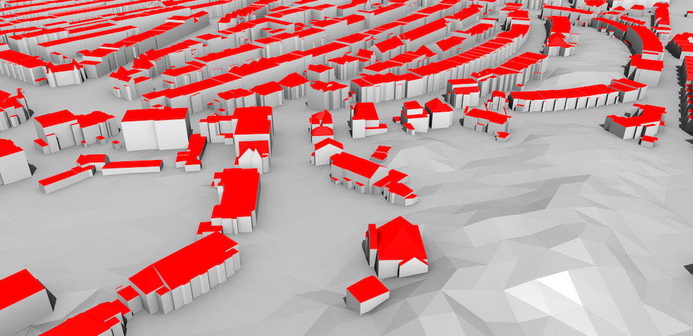

# What is CityJSON?

## Table of contents
{: .no_toc .text-delta }

1. TOC
{:toc}


{: width="800px"}
<br>*Excerpt of the 3D city model (LOD2) of The Hague, Netherlands (open dataset).*<br/><br/>


## Overview

CityJSON is a [JSON-based](http://json.org) encoding for a subset of the [CityGML](https://www.citygml.org>) data model (version 2.0.0), which is an open standardised data model and exchange format to store digital 3D models of cities and landscapes.
CityGML is an official standart of the [Open Geospatial Consortium](http://www.opengeospatial.org).

CityJSON defines ways to describe most of the common 3D features and objects found in cities (such as buildings, roads, rivers, bridges, vegetation and city furniture) and the relationships between them.
It also defines different standard levels of detail (LoDs) for the 3D objects, which allows us to represent objects for different applications and purposes.

A CityJSON file represents both the geometry and the semantics of the city features of a given area, eg buildings, roads, rivers, the vegetation, and the city furniture.

The aim of CityJSON is to offer an alternative to the GML encoding of CityGML, which can be verbose and complex (and thus rather frustrating to work with). 
CityJSON aims at being easy-to-use, both for reading datasets, and for creating them.
It was designed with programmers in mind, so that tools and APIs supporting it can be quickly built.
It was also designed to be compact (it typically [compresses 7X the CityGML files publicly available](https://github.com/tudelft3d/cityjson/wiki/Compression-factor-for-a-few-open-CityGML-datasets)), and to be friendly for web and mobile development.

A CityJSON object, representing a city, is as 'flat' as possible, ie the hierarchy of CityGML has been flattened out and only the city objects which are 'leaves' of this hierarchy are implemented.
This considerably simplifies the storage of a city model, and furthermore does not mean that information is lost.

CityJSON supports the extension of the core modules in a structured way (new city objects and complex attributes), see the [page about Extensions]({{ site.baseurl }}/extensions/) to know how to create yours or to download an existing one.

By using CityJSON, you can build on the expertise on 3D city modelling that has accumulated over the years. 
There is now a growing number [software tools]({{ site.baseurl }}/software/) that support the format, and a long list of potential [applications]({{ site.baseurl }}/applications/).


## What can be stored in CityJSON?

CityJSON mainly describes the geometry, attributes, and semantics of different kinds of 3D city objects. 
These can be supplemented with textures and/or colours in order to give a better impression of their appearance. 
Specific relationships between different objects can also be stored using CityGML, e.g. that a building is decomposed into three parts, or that a building has a both a carport and a balcony.

The types of objects stored in CityJSON/CityGML are grouped into different modules. 
These are:

* __Appearance__: textures and materials for other types
* __Bridge__: bridge-related structures, possibly split into parts
* __Building__: the exterior and possibly the interior of buildings with individual surfaces that represent doors, windows, etc.
* __CityFurniture__: benches, traffic lights, signs, etc.
* __CityObjectGroup__: groups of objects of other types
* __Generics__: other types that are not explicitly covered
* __LandUse__: areas that reflect different land uses, such as urban, agricultural, etc.
* __Relief__: the shape of the terrain
* __Transportation__: roads, railways and squares
* __Tunnel__: tunnels, possibly split into parts
* __Vegetation__: areas with vegetation or individual trees
* __WaterBody__: lakes, rivers, canals, etc.

It is also possible to extend this list with new classes and attributes by defining [Extensions]({{ site.baseurl }}/extensions/).
There are already a few Extensions defined, and those can be reused.
<!-- e.g. for representing the 3D topographic objects in the Netherlands, for energy estimation in an urban context, and for estimating solar potential. -->


## How are objects stored in CityJSON?

CityJSON datasets consist of a set of plain text files (JSON files) and possibly some accompanying image files that are used as textures. 
Each text file can represent a part of the dataset, such as a specific region, a specific type of object (such as a set of roads), or a predefined LOD.

The structure of a CityJSON file is a fairly simple to understand and can be easily read by humans, a simple example would look like this:

```js
{
  "type": "CityJSON",
  "version": "1.0",
  "extensions": { "Noise": "https://someurl.org/noise.json" },
  "metadata": { "referenceSystem": "urn:ogc:def:crs:EPSG::7415" },
  "CityObjects": {
    "id-1": {
      "type": "Building",
      "attributes": { "roofType": "gable" },
      "geometry": [{
        "type": "Solid",
        "lod": 2,
        "boundaries": [...]
      }]
    },
    "id-56": {...}
  },
  "vertices": [
    [23.1, 2321.2, 11.0],
    [14.0, 2299.5, 14.0],
    ...
  ],
  "appearance": {
    "textures": [...]
  },
  "geometry-templates": {...}
}
```


## Which features of CityGML are supported?

Almost all of them, see the [CityGML compatibility page]({{ site.baseurl }}/citygml-compatibility/). 


## A JSON encoding of GML, huh?!?

While its name otherwise implies, CityGML is not only a GML encoding, but is actually an open standardised data model and it currently has 2 implementations:

  1. the GML encoding is the only official one, and is defined in the `official documentation <https://portal.opengeospatial.org/files/?artifact_id=47842>`_
  2. a database schema called `3DCityDB <http://www.3dcitydb.org>`_, which can be implemented both for `PostgreSQL <https://www.postgresql.org>`_ and `Oracle Spatial <https://www.oracle.com/database/spatial/index.html>`_. This is *not* an official standard.

CityJSON can be considered as the third implementation of the CityGML data model.


## Is CityJSON an official OGC standard?

No, and there are no concrete plans for CityJSON to become one.

CityJSON was started, and is maintained, by the [3D geoinformation group at TU Delft](https://3d.bk.tudelft.nl).
Others have since joined the development.