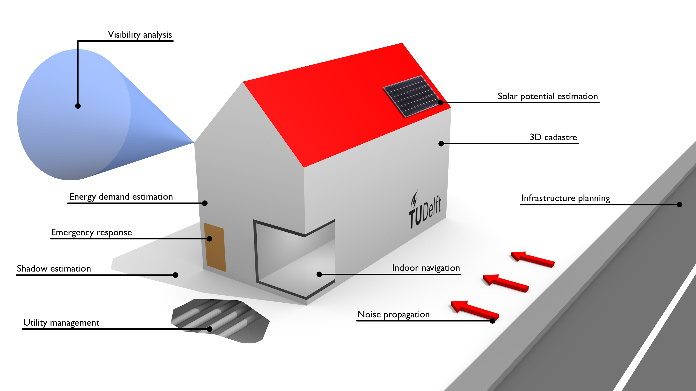

# Use cases of 3D city models

3D city models are nowadays used for many different applications, across a multitude of application domains.  

{: width="800px"}  

The following article gives a complete overview of the state of the art of the application of 3D city models (it is open access):

<i class="fa fa-file-pdf-o"></i> Biljecki F, Stoter J, Ledoux H, Zlatanova S, and Çöltekin A (2015). Applications of 3D City Models: State of the Art Review. *ISPRS International Journal of Geo-Information*, 4(4): 2842-2889. [[DOI]](http://doi.org/10.3390/ijgi4042842) [[PDF]](http://www.mdpi.com/2220-9964/4/4/2842/pdf)

In summary, 29 use cases, in which 3D city models provide added value, were found.
The list can be found below.
Please cite the article above when using the list in publications and presentations.

| Use case | Example of an application |
| --- | --- |
| Estimation of the solar irradiation | Determining the suitability of a roof surface for installing photovoltaic panels |
| Energy demand estimation | Assessing the return of a building energy retrofit |
| Aiding positioning | Map matching |
| Determination of the floorspace | Valuation of buildings | 
| Classifying building types | Semantic enrichment of data sets |
| Geo-visualisation and visualisation enhancement | Flight simulation |
| Visibility analysis | Finding the optimal location to place a surveillance camera |
| Estimation of shadows cast by urban features | Determination of solar envelopes |
| Estimation of the propagation of noise in an urban environment | Traffic planning |
| 3D cadastre | Property registration |
| Visualisation for navigation | Navigation |
| Urban planning | Designing green areas |
| Visualisation for communication of urban information to citizenry | Virtual tours |
| Reconstruction of sunlight direction | Object recognition |
| Understanding SAR images | Interpretation of radar data |
| Facility management | Managing utilities |
| Automatic scaffold assembly | Civil engineering |
| Emergency response | Planning evacuation |
| Lighting simulations | Planning lighting of landmarks |
| Radio-wave propagation | Optimising radio infrastructure |
| Computational fluid dynamics | Predicting air quality |
| Estimating the population in an area | Crisis management |
| Routing | Understanding accessibility |
| Forecasting seismic damage | Insurance |
| Flooding | Mitigating damage to utility management |
| Change detection | Urban inventory |
| Volumetric density studies | Urban studies |
| Forest management | Predicting tree growth |
| Archaeology | Visualising ancient sites |
