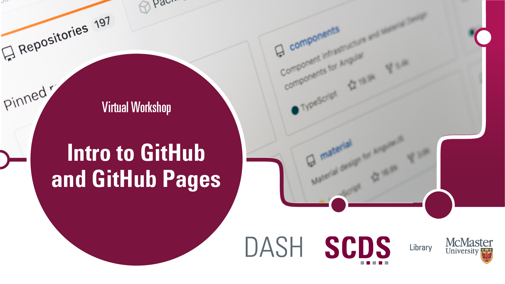

 

# Getting started with GitHub and GitHub Pages. 

Maybe you've heard of GitHub and would like to learn more about how it works. Maybe you've heard how it's possible to make easy and simple webpages using GitHub and GitHub Pages and want to try. Or maybe, you knew none of this but are intrigued nonetheless. In any of those cases, this tutorial is for you.  

In this tutorial, you will learn how to use a suite of related tools ([Markdown](https://www.markdownguide.org/getting-started/), [GitHub](https://github.com/), [GitHub Pages](https://pages.github.com/), and [GitHub Desktop](https://desktop.github.com/)) to create and manage repositories of files, and build simple websites with ease! 

## Prerequisites

- A [GitHub.com](https://github.com/) account.
- [GitHub Desktop](https://desktop.github.com/) installation (This will be covered in the [Preparation](preparation) page)

{: .warning }
> GitHub does not **officially** support GitHub Desktop for **Linux** users. The community made a [Linux compatible fork](https://github.com/shiftkey/desktop), but do keep in mind that it's unofficial. You will still be able to learn about Markdown, GitHub, and GitHub Pages without using GitHub Desktop. If you'd like to learn how to use GitHub with local development, [check out our module on Git](https://scds.github.io/dash-webinars/vcgit.html).

## Learning Objectives
By the end of this tutorial, you will be able to: 
- Describe the basics of versioning and version control software and communicate their value
- Explain the differences between Git and GitHub, and describe how they work together
- Use [Markdown](https://www.markdownguide.org/getting-started/) to format text in a simple yet effective manner
- Create a [GitHub](https://github.com/) repository
- Create, edit, and manage versions of files in a GitHub repository
- Use [GitHub Pages](https://pages.github.com/) to create simple static web pages using [Jekyll](https://jekyllrb.com/)
- Use [GitHub Desktop](https://desktop.github.com/) to sync files between your desktop/laptop's local repository and the GitHub remote repository
- Identify where you can find more information to experiment and learn on your own

## Duration
This module will take around 1 to 2 hours, however feel free to work at your own pace!

## Land Acknowledgement
McMaster University is situated in Ohròn:wakon which is the traditional territories of the Erie, Neutral, Huron-Wendat, Haudenosaunee and Mississaugas. This land is covered by the “Dish With One Spoon Wampum Belt Covenant”, an agreement between the Haudenosaunee confederacy and Anishinaabe nations to ensure those who live here take only what they need, leave enough in the dish for others, and keep the dish clean. This land is also covered by the Between the Lakes Treaty of 1792 and is very close to the 1784 Haldimand Treaty, which holds the land six miles to each side of the Grand River as a tract for Six Nations, which is currently not being honored. 

Many of us at the Sherman Centre took the First Nations' Information Governance Centre's OCAP course this past year which stands for Ownership, Control, Access, and Possession. We encourage you to learn [more about OCAP](https://fnigc.ca/ocap-training/take-the-course/) and Indigenous data management practices more broadly, including the [OCAS principles](https://u.mcmaster.ca/ocas-framework) endorsed by the Manitoba Métis Federation, the principles of [Inuit Qaujimajatuqangit](https://doi.org/10.1139/as-2020-0015), ᐃᓄᐃᑦ ᑕᐱᕇᑦ ᑲᓇᑕᒥ (Inuit Tapiriit Kanatami) [National Inuit Strategy on Research](https://www.itk.ca/national-strategy-on-research-launched/), and Global Indigenous Data Alliance’s [CARE principles](https://www.gida-global.org/care). 
