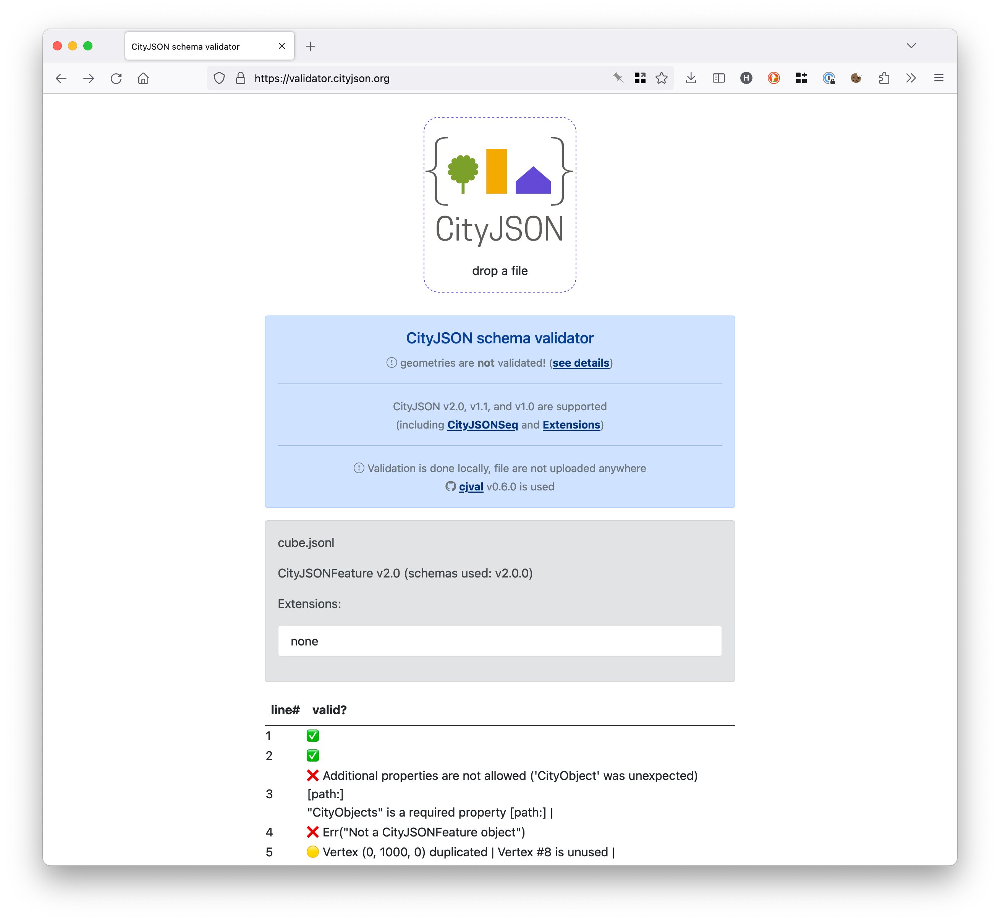

# CityJSONSeq (CityJSON Text Sequences)

## Table of contents
{: .no_toc .text-delta }

1. TOC
{:toc}

- - - 

The CityJSON Text Sequence---*CityJSONSeq* for short---is a format based on [JSON Text Sequences](https://datatracker.ietf.org/doc/html/rfc7464) and CityJSON, inspired by [GeoJSON Text Sequences](https://datatracker.ietf.org/doc/html/rfc8142).
The idea is to decompose a (often large) CityJSON file into its features (eg each building, each bridge, each road, etc.), to create several JSON objects (of type [`CityJSONFeature`](https://www.cityjson.org/specs/#text-sequences-and-streaming-with-cityjsonfeature)), and stream/store them in a JSON Text Sequence (for instance [ndjson -- newline delimited JSON](https://github.com/ndjson/ndjson-spec/)).


## CityJSONSeq specifications

We follow the specifications of *[ndjson -- newline delimited JSON](https://github.com/ndjson/ndjson-spec/)* and we add 2 constraints for handling CityJSON:

  1. each JSON Object must conform to the [JSON Data Interchange Format specifications](https://datatracker.ietf.org/doc/html/rfc8259) and be written as a UTF-8 string;
  2. each JSON Object must be followed by a new-line (LF: `'\n'`) character, and it may be preceded by a carriage-return (CR: `'\r'`);
  3. a JSON Object must not contain the new-line or carriage-return characters;
  4. the first JSON Object must be of type `'CityJSON'` (see below for details);
  5. the following JSON Objects are of type `'CityJSONFeature'`;

{: .highlight }
 **Suggested convention**: we recommend using the extension `.city.jsonl` when saving the JSON Objects to a file.


## CityJSONFeature

A `CityJSONFeature` object represents **one** feature in a CityJSON object, for instance a `"Building"` (with eventually its children `"BuildingPart"` and/or `"BuildingInstallation"`).
The idea is to decompose a large area into each of its features, and each feature is a stored as a `CityJSONFeature`.
Each feature is independent, and has its own list of vertices (which is thus local).

See the [full specifications for a CityJSONFeature](https://www.cityjson.org/specs/#text-sequences-and-streaming-with-cityjsonfeature).

```json
{
  "type": "CityJSONFeature",
  "id": "id-1", 
  "CityObjects": {
    "id-1": {
      "type": "Building", 
      "attributes": { 
        "roofType": "gabled roof"
      },
      "children": ["mypart"],
      "geometry": [...]
    },
    "mypart": {
      "type": "BuildingPart", 
      "parents": ["id-1"],
      "children": ["mybalcony"],
      "geometry": [...]
    },
    "mybalcony": {
      "type": "BuildingInstallation", 
      "parents": ["mypart"],
      "geometry": [...]
    }
  },
  "vertices": [...]
}
```


## Streaming 3D cities with CityJSONSeq

Since we want to have access to some properties, eg [`"transform"`](https://www.cityjson.org/specs/#transform-object) and the [CRS](https://www.cityjson.org/specs/#referencesystem-crs), those need to be known by the client/software parsing the stream.

The first JSON Object should therefore be of type `"CityJSON"` and contain the necessary information.
Notice that the properties `"CityObjects"` and `"vertices"` are mandatory (for the [JSON Object to be valid](https://www.cityjson.org/specs/#cityjson-object)) but should be respectively an empty JSON object and an empty array.
One example would be:
```json
{"type":"CityJSON","version":"2.0","transform": {"scale":[1.0,1.0,1.0],"translate": [0.0, 0.0, 0.0]},"metadata":{"referenceSystem":"https://www.opengis.net/def/crs/EPSG/0/7415"},"CityObjects":{},"vertices":[]}
```

The subsequent JSON Objects must all be of type `"CityJSONFeature"`, which means a CityJSONSeq with 3 features could look like this one:

```json
{"type":"CityJSON","version":"2.0","transform": {"scale":[1.0,1.0,1.0],"translate": [0.0, 0.0, 0.0]},"metadata":{"referenceSystem":"https://www.opengis.net/def/crs/EPSG/0/7415"},"CityObjects":{},"vertices":[]}
{"type":"CityJSONFeature","id":"a","CityObjects":{...},"vertices":[...]} 
{"type":"CityJSONFeature","id":"b","CityObjects":{...},"vertices":[...]} 
{"type":"CityJSONFeature","id":"c","CityObjects":{...},"vertices":[...]} 
```


## Reading and writing CityJSONSeq with cjseq

The software [cjseq](https://github.com/cityjson/cjseq) allows us to convert between CityJSON and CityJSONSeq (both directions).

We can create a CityJSONSeq stream (with the first line containing the metadata) this way:

```
cjseq cat -f myfile.city.json > myfile.city.jsonl
```

And conversely convert a stream to a CityJSON file:
```
cat myfile.city.jsonl | cjseq collect > myfile_2.city.json
```

cjseq has thus 2 commands: (1) cat; (2) collect.

## CityJSONSeq examples

| dataset | CityJSONSeq file | description |  
| ------- | ---------------- | ----------- |
| 3DBAG   | [3dbag_b2.city.jsonl](https://3d.bk.tudelft.nl/opendata/cityjson/cityjsonl/3dbag_b2.city.jsonl) | 2 buildings randomly selected from the 3DBAG, LoD2.2 only |
| Montréal   | [montréal_b4.city.jsonl](https://3d.bk.tudelft.nl/opendata/cityjson/cityjsonl/montréal_b4.city.jsonl) | 4 buildings randomly selected from the Montréal dataset | 


## Validating a stream 

### With the online validator

The [official schema-validator of CityJSON](https://validator.cityjson.org) accepts CityJSONSeq files, if they are structured as above ([3dbag_b2.city.jsonl](https://3d.bk.tudelft.nl/opendata/cityjson/cityjsonl/3dbag_b2.city.jsonl) and [montréal_b4.city.jsonl](https://3d.bk.tudelft.nl/opendata/cityjson/cityjsonl/montréal_b4.city.jsonl) are two examples).

You can just drop those files and the validator will indicate, *per line*, if the `CityJSONFeature` are valid, or not.

[](https://validator.cityjson.org)


### Locally with cjseqval

The official [schema-validator of CityJSON (called cjval)](https://github.com/cityjson/cjval) can validate CityJSONSeq streams with its binary `cjseqval`.
Each line is individually validated and errors reported:

```bash
cjseq cat -f myfile.city.json | cjseqval --verbose
l.1 ✅
l.2 ❌ {"attributes":{"function":"something"},"geometry":[{"boundaries":[[[[0,1,2,3]],[[4,5,0,3]],[[5,6,1,0]],[[6,7,2,1]],[[3,2,7,4]],[[7,6,5,4]]]],"lod":"1","type":"Solid"}],"type":"+99999GnericCityObject"} is not valid under any of the given schemas [path:/CityObjects/id-1] |
l.3 ✅
l.4 🟡 Vertex (0, 1000, 0) duplicated | Vertex #8 is unused |
l.5 ✅
l.6 ✅
```


## cjfview: a small viewer for CityJSONSeq files


The [cjfview GitHub repository](https://github.com/cityjson/cjfview/) has more details.


It reads a [CityJSONSeq file](https://cityjson.org/cityjsonl) from stdin.

```bash
cat ./data/b2.city.jsonl | python ./src/cjfview.py
```

```bash
cjio --suppress_msg Vienna_102081.city.json subset --random 5 export jsonl stdout | python ./src/cjfview.py
```
