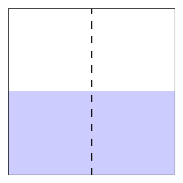
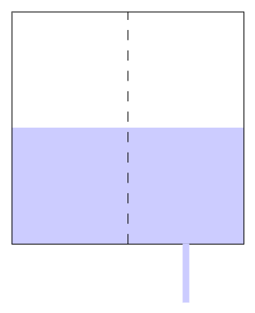

1. TOC
{:toc}


## Introduction

The rate law is a simple relation that describes the proportionality relation between the concentration of the reactants and the rate of reaction.

For example, for a hypothetical reaction:

$$
\ce{A(aq) + B(aq)-> C(aq)}
$$

The rate law could be described as:

$$
Rate = k[\ce{A}]^m[\ce{B}]^n
$$

where $$k$$, $$m$$, and $$n$$ are constants.

**Note that reactants that are in a solid or liquid state of matter are not counted, as they do not have a concentration.** 

This means that the rate law of a reaction like:

$$
\ce{A(s) + B(aq) -> C(aq)}
$$

would be 

$$
Rate = k[\ce{B}]^n
$$

We can derive this rate law from a series of simpler relations. First, we know that the rate of reaction goes up as the concentration of a reactant increases due to the increased chance of successful collisions. We can describe this as a general proportionality relation:

$$
Rate \propto [Reactant]^m
$$

We describe this relationship by saying that the reaction is $m$th order with respect to the reactant.

For example, for our hypothetical reaction, we know that for some constants $$m$$ and $$n$$:

$$
Rate \propto [\ce{A}]^m \\
Rate \propto [\ce{B}]^n
$$

We can combine these into one proportionality relation:

$$
Rate \propto [\ce{A}]^m[\ce{B}]^n
$$

which is equivalent to our rate law.

## Determining Rate Laws Experimentally

Given $$n+1$$ data points, where $$n$$ is the number of reactants, we can determine the rate law by solving a system of equations. In contest and in real life, these data points will be generally be selected so that this system of equations is easy to solve. For example, say we were given the following data points for our hypothetical reaction:

| Trial | Initial Concentration of A (M) | Initial Concentration of B (M) | Rate of Reaction (M/s) |
| ----- | ------------------------------ | ------------------------------ | ---------------------- |
| 1     | 0.1                            | 0.1                            | 0.2                    |
| 2     | 0.1                            | 0.3                            | 0.6                    |
| 3     | 0.2                            | 0.3                            | 2.4                    |

From these data points, we can write 3 equations:

$$
\begin{align}
Rate &= k[\ce{A}]^m[\ce{B}]^m \\
0.2 &= k(0.1\ M)^m(0.1\ M)^n &(1)\\
0.6 &= k(0.1\ M)^m(0.3\ M)^n &(2)\\
2.4 &= k(0.2\ M)^m(0.3\ M)^n &(3)
\end{align}
$$

Dividing equation $$(2)$$ by equation $$(1)$$ cancels out the variable $$m$$ and the variable $$k$$. This allows us to easily solve for $$n$$.

$$
3 = \frac{(0.3\ M)^n}{(0.1\ M)^n} \\
3 = 3^n \\
n = \log_3 (3) = 1
$$

From this, we see that the reaction is first order with respect to $$\ce{B}$$.

We can then divide equation $$(3)$$ by equation $(2)$, leaving only variable m:

$$
4 = \frac{(0.2\ M)^m}{(0.1\ M)^m} \\
4 = 2^m \\
m = \log_2 (4)= 2
$$

From this, we see that the reaction is second order with respect to $$\ce{A}$$.

We can now plug in a data point into the rate law to solve for $$k$$:

$$
0.2\ M/s = k(0.1\ M)^2(0.1\ M)^1 \\
k = 200\ s^{-1}M^{-2}
$$

We now have our rate law:

$$
Rate = (200 s^{-1}M^{-2})[\ce{A}]^2[\ce{B}]
$$

## Determining Rate Laws Theoretically

### Elementary Reactions

If a reaction occurs in a single collision, we call it an **elementary reaction**. In organic chemistry, we may also describe these reactions as **concerted**. We can describe the rate law easily for these reactions. For a general elementary reaction, described as:

$$
\ce{aA + bB ... -> cC + dD ...}
$$

the rate law can be described as:

$$
Rate = k[\ce{A}]^a[\ce{B}]^b...
$$

We can prove this intuitively or with math. 

#### Intuitively

The number of collisions is directly proportional to the rate. To find out the rate law, let us first think about a reaction which is caused by the collision by a molecule of A and a molecule of B. 

$$
\ce{A + B -> C}
$$

Intuitively, the number of collisions should be directly proportional to the number of molecules of A and B in a given space. This means the rate law will be $$Rate = k[A][B]$$. Now let us think of a reaction which is caused by the collision of two molecules of A. 

$$
\ce{2A -> C}
$$

We can imagine splitting the A molecules into two distinct groups which collide with each other:

$$
\ce{A_1 + A_2 -> C}
$$

This is essentially the first case: two distinct molecules are colliding with each other, so the rate will be proportional to both their concentrations. This leads us to the rate law: 

$$
Rate = k[\ce{A_1}][\ce{A_2}]
$$

However, since the A molecules aren't actually distinct, the rate law simplifies to:

$$
Rate = k[\ce{A}]^2
$$

In the general case, we get the desired formula of $$Rate = k[\ce{A}]^a[\ce{B}]^b...$$

#### Math

Some prerequisite math knowledge is needed to understand this: [Link to combinatorics lesson here]

First, we set an arbitrary volume for our reaction vessel. In our case, we will use $$1\ \text{L}$$. This is just to make calculations easier.

We will calculate the number of total possible collisions, as it will be proportional to the number of collisions per second and therefore the rate. We can think about this as a combinatorics problem; a collision is just choosing molecules from each reactant. 

For our first basic case, let's use this reaction:

$$
\ce{A + B -> C}
$$

Let's first imagine the reaction vessel had one A molecule and one B molecule. We can select one A molecule in $$\binom{1}{1} = 1$$ way and one B in molecule in $$\binom{1}{1} = 1$$ way. Therefore, the total number of possible collisions is $$1 * 1 = 1$$. Now, let's generalize to a case with $$x$$ A molecules and $$y$$ B molecules. We can select one A molecule in $$\binom{x}{1} = x$$ ways and one B molecule in $$\binom{y}{1} = y$$ ways.  Therefore, the total number of possible collisions is $$x*y$$. Since concentration is amount of substance in a certain amount of volume, and rate is proportional to the total number of possible collisions, we end up with $$Rate = k[\ce{A}][\ce{B}]$$.

For our next case, let's use this reaction:

$$
\ce{2A + 3B -> C}
$$

Let's imagine the reaction vessel had $$x$$ molecules of A and $$y$$ molecules of B. We select two molecules of A in $$\binom{x}{2}$$ ways and 3 molecules of B in $$\binom{y}{3}$$ ways. As $$x$$ increases, $$\binom{x}{2}$$ becomes more and more proportional to $$x^2$$. This is because $$\binom{x}{2} = \frac{(x)(x-1)}{2} \approx \frac{x^2}{2}$$ . Similarly, as $$y$$ increases, $$\binom{y}{3}$$ becomes more and more proportional to $$y^3$$. Since the number of molecules in a real reaction will likely be very large, we know that the total number of possible collisions is proportional to $$x^2 * y^3$$. Therefore, we end up with the rate law: $$Rate = k[\ce{A}]^2[\ce{B}]^3$$. 

In general, $$\binom{x}{n}$$ will become more proportional to $$x^n$$, leading to the general rate law. 

### Non-elementary Reactions

In the real world, many complex reactions do not occur in just one collision. They often through a series of elementary reactions known as a **mechanism**. In this case, the rate law can not be described with the general formula. 

#### Rate-determining Step

In every mechanism, there will be a step that is the slowest. If this step is significantly slower than the other steps, then we call it the **rate-determining step**. This means that the rate of the reaction is described by the rate law of this step. 

We can think about this intuitively. If we think about the reaction as a relay race, where the product of each step is passed as the reactant of the next, it becomes obvious. If Usain Bolt is in a relay race team with a tortoise, it doesn't matter how fast Usain Bolt runs his section. The majority of each relay lap will be spent during the tortoise's section, and so the tortoise's speed will essentially be the speed of the team. 

Therefore, if we are given the mechanism of a reaction and its slowest step, we can generally find a rate law for the whole reaction. For example, let's use this hypothetical reaction:

$$
\ce{A2 + 2B2 -> A2B4}
$$

Say that a mechanism has been determined by a chemist:

$$
\begin{align}
\ce{A2 &-> 2A} &(slow)\\
\ce{A + B2 &-> AB2} \\
\ce{AB2 + B2 + A&-> A2B4}
\end{align}
$$

Given that the first step is significantly slower than the rest, we know that the rate law of the entire reaction can be determined by the rate law of the first step. Using our knowledge on the rate law of elementary reactions, we determine that the rate law of the first step and therefore the entire reaction is:

$$
Rate = k_1[\ce{A2}]
$$

However, it is not always this easy to determine the rate law. If the slowest step were instead the second step for example:

$$
\begin{align}
\ce{A2 &-> 2A}\\
\ce{A + B2 &-> AB2} &(slow)\\
\ce{AB2 + B2 + A&-> A2B4}
\end{align}
$$

we would run into an issue. The rate law of the second step is:

$$
Rate = k_2[\ce{A}][\ce{B2}]
$$

But this rate law can not be simply used as the rate law for the entire reaction. This is because it contains the concentration of what is known as an **intermediate**, or something that only appears in the middle of a reaction, as it is produced in a step, and then used in a later step. From its definition, the rate law must describe the rate in terms of the concentrations of the reactants, so this can not be simply used.

#### Pre-equilibrium Approximation

Let's say the chemist revises his mechanism so that the first step is now reversible:

$$
\begin{align}
\ce{A2 &<-> 2A}\\
\ce{A + B2 &-> AB2} &(slow)\\
\ce{AB2 + B2 + A&-> A2B4}
\end{align}
$$

Recall that all this means is that both the forward and backward reaction can occur. We could also write this as:

$$
\begin{align}
\ce{A2 &-> 2A}\\
\ce{2A &-> A2} \\
\ce{A + B2 &-> AB2} &(slow)\\
\ce{AB2 + B2 + A &-> A2B2}
\end{align}
$$

On their own, reversible reactions tend to reach **equilibrium**. As a refresher, equilibrium is the state at which the rate of the forward reaction equals the rate of the reverse reaction. Using the rate laws of the forward and backward reaction, we can express what equilibrium of our reversible step would look like:

$$
Rate_{forward} = k_1[\ce{A2}] \\
Rate_{backward} = k_{-1}[\ce{A}]^2 \\
k_1[\ce{A2}] = k_{-1}[\ce{A}]^2 \\
[A] = \sqrt{\frac{k_1[\ce{A2}]}{k_{-1}}}
$$

Therefore, if the first step was at equilibrium, we would be able to write the concentration of the intermediate in terms of the concentration of the reactants, solving our earlier issue.  

Luckily for us, we can actually assume the first step is at equilibrium due to the **pre-equilibrium approximation**.

This approximation says that if a slow step uses a product or reactant in a fast reversible reaction, we can assume that **the reversible reaction is still in equilibrium**. 

We can think about this using an intuitive example.

Imagine there are two tanks of water divided by a plate that has many holes:



{: .centered }{: .zoom-65 }

This simulates our fast equilibrium reaction. The water goes from the left side to the right side at a rate equal to the rate water goes from the right side to the left side, meaning it is at equilibrium. 

Now let's poke a small hole in the right side. This will simulate the slow step following the reversible reaction.

{: .centered }{: .zoom-65 }



We see that the water levels of the two sides remain equal, as the rate at which the water leaves the right side is slow enough that equilibrium can still roughly be reached. 

Back to our example, we can therefore plug in our expression for $$[A]$$ into the rate law of the second step:

$$
Rate = k_2[\ce{A}][\ce{B2}] \\
[A] = \sqrt{\frac{k_1[\ce{A2}]}{k_{-1}}} \\
Rate = k_2\sqrt{\frac{k_1[\ce{A2}]}{k_{-1}}}[\ce{B2}] \\
Rate = k_2\sqrt{\frac{k_1}{k_{-1}}} [\ce{A_2}]^{1/2}[\ce{B2}] \\
Rate = k[\ce{A2}]^{1/2}[\ce{B2}]
$$

We now have the rate law of our reaction.

#### Steady-state Approximation

Let's say the chemist revises his mechanism again so that the third step is now the slowest:

$$
\begin{align}
\ce{A2 &<-> 2A}\\
\ce{A + B2 &-> AB2}\\
\ce{AB2 + B2 + A&-> A2B4} &(slow)
\end{align}
$$

Let's write out the rate law of the rate-determining third step:

$$
Rate = k_3[\ce{AB2}][\ce{B2}][\ce{A}]
$$

We once again run into the problem that there are intermediates in the rate expression.

In this case, we can no longer use the pre-equilibrium approximation. Instead, we use the **steady state approximation**. This approximation assumes that the intermediates in a reaction shouldn't build up, since intermediates are generally unstable and be in the final product. Because of this, **the rate that they are produced should equal the rate that they are consumed**.

Let's first do this for the intermediate $$\ce{AB2}$$.

The second step is the only step where $$\ce{AB2}$$ is produced, or in other words, in the products. Therefore, the rate of production of $$\ce{AB2}$$ is equal to the rate of reaction of the second step:

$$
Rate_{produced} = k_2[\ce{A}][\ce{B2}]
$$

The third step is the only step where $$\ce{AB2}$$ is consumed, or in other words, in the reactants. Therefore, the rate of consumption of $$\ce{AB2}$$ is equal to the rate of reaction of the third step:

$$
Rate_{consumed} = k_3[\ce{AB2}][\ce{B2}][\ce{A}]
$$

Since the rate at which it is consumed should equal the rate at which it is produced, we get the following relation:

$$
Rate_{produced} = Rate_{consumed} \\
k_2[\ce{A}][\ce{B2}] = k_3[\ce{AB2}][\ce{B2}][\ce{A}]
$$

This relation can be simplified to get an expression for $$[\ce{AB2}]$$.

$$
[\ce{AB2}] = \frac{k_2}{k_3}
$$

Now let's look at the intermediate $$\ce{A}$$.

$$\ce{A}$$ is only produced in the forward reaction of the first step. 

$$
Rate_{produced} = k_1[\ce{A2}]
$$

$$\ce{A}$$ is consumed in the reverse reaction of the first step, in the second step and in the third step.

$$
Rate_{consumed} = k_{-1}[\ce{A}]^2 + k_2[\ce{A}][\ce{B2}] + k_3[\ce{AB2}][\ce{B2}][\ce{A}]
$$

Once again, since the rate at which it is consumed should equal the rate at which it is produced, we get the following relation:

$$
Rate_{produced} = Rate_{consumed} \\ k_1[\ce{A2}] = k_{-1} [\ce{A}]^2 + k_2[\ce{A}][\ce{B2}] + k_3[\ce{AB2}][\ce{B2}][\ce{A}]
$$

Let's substitute our $$[\ce{AB2}]$$ term that we found earlier and simplify:

$$
k_1[\ce{A2}] = k_{-1} [\ce{A}]^2 + k_{ 2 }[\ce{A}][\ce{B2}] + k_3\frac{k_2}{k_3}[\ce{B2}][\ce{A}] \\ k_1[\ce{A2}] = k_{-1}[\ce{A}]^2 + 2k_{ 2 }[\ce{A}][\ce{B2}] \\ k_{-1}[\ce{A}]^2 + 2k_{ 2 }[\ce{A}][\ce{B2}] - k_1[\ce{A2}] = 0
$$

We can now solve for $$[\ce{A}]$$ using the quadratic formula. A lesson on how to solve quadratics is linked here: [Insert link to math lesson on quadratics here]

$$
[\ce{A}] = \frac{-2k_2 + \sqrt{(2k_2)^2 + 4k_{-1}k_1[\ce{A2}]}}{2k_{-1}} = \frac{-k_2 + \sqrt{{k_2}^2 + k_{-1}k_1[\ce{A2}]}}{k_{-1}}
$$

We will now plug these terms into the rate law of the rate-determining third step:

$$
Rate = k_3[\ce{AB2}][\ce{B2}][\ce{A}] \\
Rate = k_3\frac{k_2}{k_3}[\ce{B2}]\frac{-k_2 + \sqrt{{k_2}^2 + k_{-1}k_1[\ce{A2}]}}{k_{-1}} \\
Rate = k_2[\ce{B2}]\frac{-k_2 + \sqrt{{k_2}^2 + k_{-1}k_1[\ce{A2}]}}{k_{-1}}
$$

Now we have the rate law of our reaction!

