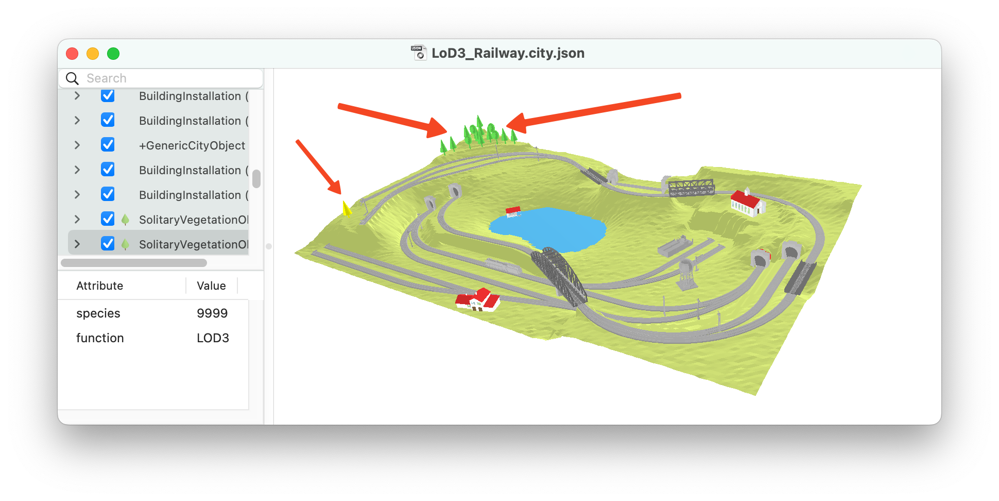

## Table of contents
{: .no_toc .text-delta }

1. TOC
{:toc}

---

## Simple geometries

  - [cube.city.json](https://3d.bk.tudelft.nl/opendata/cityjson/simplegeom/v2.0/cube.city.json) -- a unit cube
  - [tetra.city.json](https://3d.bk.tudelft.nl/opendata/cityjson/simplegeom/v2.0/tetra.city.json) -- a simple tetrahedron
  - [torus.city.json](https://3d.bk.tudelft.nl/opendata/cityjson/simplegeom/v2.0/torus.city.json) -- a unit cube with a genus of one
  - [msol.city.json](https://3d.bk.tudelft.nl/opendata/cityjson/simplegeom/v2.0/msol.city.json) -- one MultiSolid: 2 unit cubes that are not adjacent
  - [csol.city.json](https://3d.bk.tudelft.nl/opendata/cityjson/simplegeom/v2.0/csol.city.json) -- one CompositeSolid: 2 adjacent unit cubes
  - [twocube.city.json](https://3d.bk.tudelft.nl/opendata/cityjson/simplegeom/v2.0/twocube.city.json) -- one object as two geometries: 2 unit cubes adjacent (sharing a face)

For different City Objects (buildings, trees, roads, etc.) and different geometries, see the latest [CityJSON specifications](https://www.cityjson.org/specs/), and to understand how the hierarchical brackets work, see [this guide](https://www.cityjson.org/dev/geom-arrays/).

## With Geometry templates

Here are 2 files with [Geometry templates](https://www.cityjson.org/specs/#geometry-templates); [more details about Geometry templates](https://www.cityjson.org/dev/geom-templates/).

  - [geomtemplate.city.json](https://3d.bk.tudelft.nl/opendata/cityjson/simplegeom/v2.0/geomtemplate.city.json) -- one simple geometry template: a "cuboid tree" 
  - [LoD3_Railway.city.json](https://3d.bk.tudelft.nl/opendata/cityjson/3dcities/v2.0/LoD3_Railway.city.json) contains several trees on the hills, all those are Geometry templates.

## With Extensions

  - [cube.city.json](https://3d.bk.tudelft.nl/opendata/cityjson/simplegeom/v2.0/cube.city.json) -- a unit cube of type `"+GenericCityObject"`, which is defined in the Generic Extension ([see its schema](https://www.cityjson.org/extensions/download/generic.ext.json))
  - [noise_data.city.json](../tutorials/files/noise_data.city.json) is a demo file with the Noise extension (schema [noise.ext.json](../tutorials/files/noise.ext.json)), more details in [this tutorial]({{ '/tutorials/extension/' | prepend: site.baseurl }})

## Some randomly selected cities

{: .info }
Those files are openly available ([see a more exhaustive list](https://3d.bk.tudelft.nl/opendata/opencities/)) and they were converted to CityJSON v2.0 with [citygml-tools](https://github.com/citygml4j/citygml-tools) (if original encoding was CityGML-XML), and/or upgraded with `cjio upgrade`.
Please be aware that we simply converted the datasets, some datasets contain (geometrical) errors.



<table >
  <tr>
    <th>dataset</th>
    <th>CityGML-XML file (size)</th>
    <th>CityJSON file (size)</th>
    <th>textures</th>
    <th><a href="https://github.com/tudelft3d/val3dity">geometric validity</a></th>
    <th>details</th>
  </tr>
  
    <tr>
      <td><a href="{{ i.url }}">{{ i.name }}</a></td>
      <td><a href="https://3d.bk.tudelft.nl/opendata/cityjson/3dcities/citygml/{{ i.gml }}">[GML]</a> ({{ i.gml-size }}MB)</td>
      <td><a href="https://3d.bk.tudelft.nl/opendata/cityjson/3dcities/v2.0/{{ i.json }}">[JSON]</a> ({{ i.json-size }}MB)</td>
      <td>
        
          <a href="https://3d.bk.tudelft.nl/opendata/cityjson/3dcities/citygml/{{ i.textures }}">[ZIP]</a>
        
          none
        
      </td>
      <td>{{ i.validity }}</td>
      <td>{{ i.details }}</td>
    </tr>
  
</table>

<i class="fas fa-exclamation-circle"></i> On average CityJSON compresses ~7X a CityGML-XML file, and that without any loss of information ([see more details]({{ '/filesize/' | prepend: site.baseurl }})).

<i class="fas fa-exclamation-circle"></i> We performed the geometric validation with [val3dity](https://github.com/tudelft3d/val3dity) and report the overall result in the column 'validity'. To understand the errors, we suggest validating the files ([how to do this]({{ '/tutorials/validation/' | relative_url }})) yourself.

## Generating automatically your own CityJSON dataset

It is possible to generate automatically a 3D city model in CityJSON with [3dfier](https://github.com/tudelft3d/3dfier), just follow that simple [tutorial](https://tudelft3d.github.io/3dfier/generate_lod1.html).

## Every buildings (~10M) in the Netherlands

Every building in the Netherlands, automatically reconstructed.
Each building is available in 3 [levels-of-details](https://3d.bk.tudelft.nl/lod): LoD1.2, LoD1.3, and LoD2.2.

<a href="https://3dbag.nl"><i class="fas fa-external-link-alt"></i> https://3dbag.nl</a>

## The topography of the Netherlands in 3D

Every building (in LoD1.2), every canals, every road, every bridge, in 3D. In CityJSON.

<a href="https://www.pdok.nl/3d-basisvoorziening"><i class="fas fa-external-link-alt"></i> PDOK 3D Topografie</a>

<i class="fas fa-exclamation-circle"></i> Please be aware that the tiles are very big, and they will most likely bring [ninja](https://ninja.cityjson.org) or QGIS to their knees... The solution for the time being is to use a computer with 16GB+ of RAM, and use [cjio]({{ '/tutorials/getting-started/#manipulate-and-edit-it-with-cjio' | relative_url }}) to extract only the buildings for instance. 

<!-- ## Paid datasets $$$

  - [3dcityloader.com](https://3dcityloader.com/) offers an online service where you can download custom areas for a few cities. Areas up to 0.3km² are free of charge.
 -->

