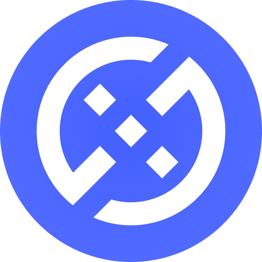
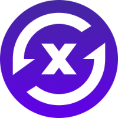
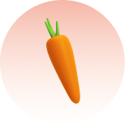
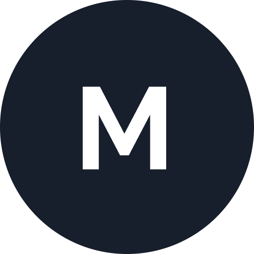

# Brand Assets
{: .no_toc }
___

## Table of contents
{: .no_toc .text-delta }

1. TOC
{:toc}

___

## Brand Guidelines
{: .no_toc }
Welcome to DXdao's brand asset page. These guidelines help DXdao and its products protect their brand image through appropriate external presentation. We ask that the following material be followed by all applications of the DXdao brand or its products. Any logos or images not found on this page should not be used, or confirmed with a relevant contributor in the [DXdao Discord](https://discord.gg/4QXEJQkvHH).

To get a better understanding of DXdao's history, intentions and principles, read the [DXdao Manifesto]().

## DXdao Brand Assets

||  This is a collection of DXdao brand assets, hosted through IPFS. When representing the collective or DXD token, such as when partnering with us, the below assets should be used. For convenience, a Google drive link containing all assets is available, but it should never be trusted above its decentralized counterparts. |
|-----------------------------------|--|
|     **Full Guidelines**  | [**Figma**](https://www.figma.com/proto/L1AKhFqUsJkCOgCOgtO9gk/DXdao-Brand-Guidelines?page-id=2%253A9&node-id=133%253A395&viewport=368%252C48%252C0.18&scaling=contain&starting-point-node-id=133%253A395&hide-ui=1), [**IPFS**](https://bafybeic6pog3yv5pxquc3t4cfqzjfv33rfs4ltltrhl2luqhc3zbxsyr6y.ipfs.dweb.link/?filename=DXdaoBrandGuidelines.pdf). These "Brand Guidelines" include proper use of the DXdao logo, typeface and color schemes. We request that this is adhered to at all times. If this link is having difficulty loading, the same guidelines can be found in the below Google drive. |
|     **Logos**                            | [DXdao Blue](DXdaoBlue.png), [DXdao Black](DXdaoBlack.png), [DXdao White](DXdaoWhite.png) |
|     **Logos with Typeface**                            | [DXdao Black Wide](DXdaoLogoBlackW.png), [DXdao Black Tall](DXdaoLogoBlackT.png), [DXdao White Wide](DXdaoLogoWhiteW.png), [DXdao White Tall](DXdaoLogoWhiteT.png), [DXdao Full Black](DXdaoBlackTypeface.png), [DXdao Full White](DXdaoWhiteTypeface.png)  |
|     **File Collection**                            | [DXdao Google Drive](https://drive.google.com/drive/folders/1RJAj9IXqWkBaAfXmi1XHqDX5wGunud9U?usp=sharing)  |

## Swapr Brand Assets

||  This is a collection of Swapr brand assets, hosted through IPFS. When representing the Swapr DEX or SWPR token, such as when partnering with us, the below assets should be used. For convenience, a Google drive link containing all assets is available, but it should never be trusted above its decentralized counterparts. |
|-----------------------------------|--|
|     **Logos**                               | [Swapr Purple](SwaprPurple.png), [Swapr Black](SwaprBlack.png), [Swapr Light](SwaprLight.png), [Swapr White with typeface](SwaprWhiteTypeface.png), [Swapr Black with Typeface](SwaprBlackTypeface.png)   |
|     **Logos with Typeface**                               | [Swapr White](SwaprWhiteTypeface.png), [Swapr Black](SwaprBlackTypeface.png)   |
|     **File Collection**                            | [Swapr Google Drive](https://drive.google.com/drive/folders/15jBufI95LgfN1M7E_osgtLlTMkOhHSQb?usp=sharing)  |

## Carrot Brand Assets

||  This is a collection of Carrot brand assets, hosted through IPFS. When representing Carrot, such as when partnering with us, the below assets should be used. For convenience, a Google drive link containing all assets is available, but it should never be trusted above its decentralized counterparts. |
|-----------------------------------|--|
|     **Logos**                               | [Carrot Orange](CarrotOrange.png), [Carrot Transparent](CarrotTransparent.png) |
|     **Banners**                               | [Carrot Banner](CarrotBanner.png) |
|     **File Collection**                            | [Carrot Google Drive](https://drive.google.com/drive/folders/1optA9_UVrdBL48Ijvgo0dBRBwxYQ9WkS?usp=sharing)  |

## Omen Brand Assets

||  This is a collection of Omen brand assets, hosted through IPFS. When representing Omen prediction markets or the OMN token, such as when partnering with us, the below assets should be used. For convenience, a Google drive link containing all assets is available, but it should never be trusted above its decentralized counterparts. |
|-----------------------------------|--|
|     **Logo**                               | [Omen Blue](OmenBlue.png) |
|     **File Collection**                            | [Omen Google Drive](https://drive.google.com/drive/folders/1pFwFxpYiC6hbo06MEBYechtbMNEZ2mTq?usp=sharing)  |

## Mesa Brand Assets

||  This is a collection of Mesa brand assets, hosted through IPFS. When representing Mesa the below assets should be used. For convenience, a Google drive link containing all assets is available, but it should never be trusted above its decentralized counterparts. |
|-----------------------------------|--|
|     **Logo**                               | [Mesa Black](MesaBlack.png) |