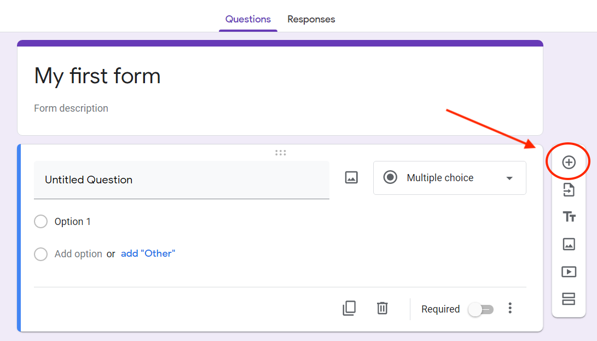

# Creating And Setting Up A Question

---

To create and set up a question for your form, follow these steps. If you want to have multiple questions in your form, repeat these steps.

## 1. Adding a question to your form

   

  If you have just followed the steps to set up your Google form, there should be a question already created.

  If you do not see the question, or if you want to create more than one question, click on the plus icon.

  

## 2. Setting up your question

  Click on `Untitled Question` to enter your question. For example, "What is your favourite ice-cream flavour?"
x 
  

### Selecting types of questions

  There are many different types of question that can be asked. The default type of question is set to multiple choice. To change the question type, click on `Multiple choice`. A menu with question types will appear. Click on option you want. For more information on question types, go to the `Type Of Questions` subsection.

 

### Mandatory questions

  Questions can either be optional, or required. By default, the questions are set to be optional (the toggle is white). To set a question to required, click on the toggle beside the `Required` on the bottom right of the question. The colour of the toggle should change from white to another colour. To change a question to optional, click on the toggle again. The colour should change back to white.

  

## 3. Setting up the options to your question

  {: height="8%" width="8%" style="float: left"}

  **Note:** This section will go over how to set up the options to a multiple choice, checkbox, or dropdown question. For other question types, refer to the "Type Of Questions" subsection.
   

### Adding an option

  Click on `Option 1` to set the first option. It is required to have at least 1 option per question. Enter the option. For example, "Vanilla" or "Chocolate".

  

### Adding additional options

  To add another option to the question, click on `Add option`. A new option will appear. Enter the option. Repeat until desired number of options are added.

  

### Removing an option

  To remove an option, click on the X symbol located to the right of the unwanted option. The option will disappear after.

  

### Allowing user-set options

  To allow users to enter their own option, click on `add "Other"`. This option is not availble for dropdown.

  

## 4. Previewing your questions

  After adding all desired options from step 3, you can preview the question, by clicking on {: height="4%" width="4%"} icon located on the top right of the page.

    

  This is what what you should see:

    

  By previewing the questions, you will be able to see all your questions as another user.

## 5. Removing a question

  To remove a question, click on the trash can symbol on the bottom of the question that should be deleted.

  

## Conclusion

You have now completed the first question to your form. Simply repeat these steps to add another question.