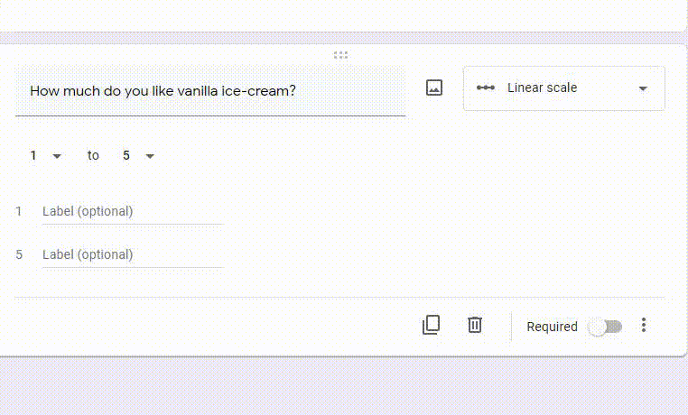
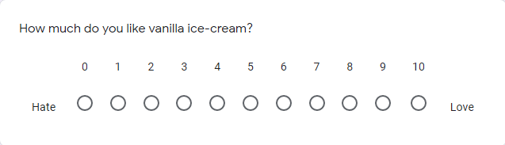
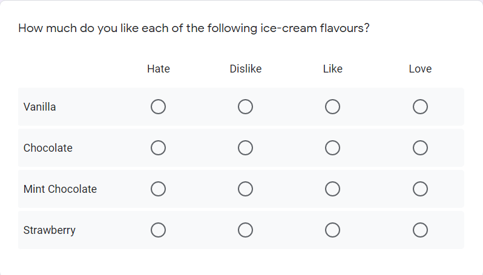
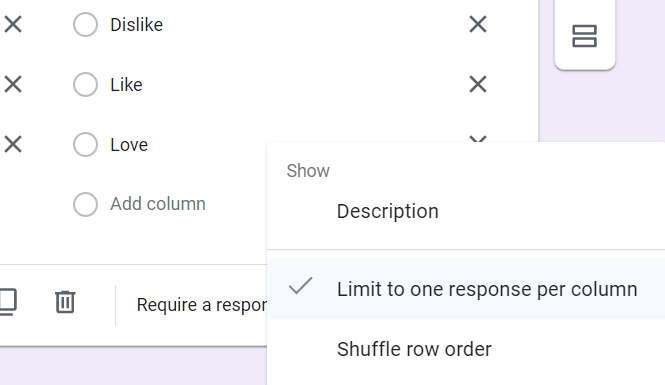
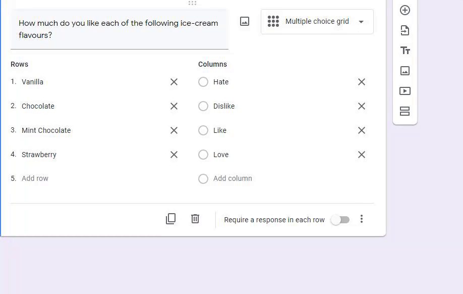

# Other Question Types

This section will include information for question types. Each question type is effective in collecting data in different ways. It is important to consider which type of question is most appropriate for the data you are trying to collect. Remember each question has different additional options to aid in your gathering of data.

Select the preferred question type before continuing. Refer to step 3 in the Adding and Setting a Question section in the [Creating And Setting Up A Question](./makingAQuestion.md) page.

---

## Table of Contents
{: .no_toc .text-delta }
* TOC
{:toc}

---

## Linear Scale

This option is suitable when you want your question to be rated on a predefined scale. Your scale can start at 0 or 1, and can end on a number from 2 to 10. You can optionally add a label to each end of the scale to add clarity.

<<<<<<< HEAD
### 1. Enter your question.

An example question: "How much do you like vanilla ice-cream?"

### 2. Click on the number that you want to change.
=======
**1. Enter your question.**

An example question: "How much do you like vanilla ice-cream?"

**2. Click on the number that you want to change.**
>>>>>>> e1871d8263fd5f278ac296cf6e2ab73d668b0c1c

The number on the left corresponds to the start of the scale, and the number on the right corresponds to the end of the scale.

<<<<<<< HEAD
### 3. (Optional) Click on `Label` to add a label to your scale.
=======
**3. (Optional) Click on `Label` to add a label to your scale.**
>>>>>>> e1871d8263fd5f278ac296cf6e2ab73d668b0c1c

It is recommended to add a label so users know what each end of the scale represents. For example, 0 is hate, and 10 is love.

A completed question should look like this in preview.

## Multiple Choice Grid and Checkbox Grid

Grid questions are a quick way to help you ask the same question for series of different items. They are set up with rows and columns. Each row represents a single item users are asked to answer for. Columns are the choices people can select from.

In a multiple choice grid, users can select only _one answer_ per row. Checkbox grid is similar to the multiple choice grid, except users can select _more than one answer_ per row.
<<<<<<< HEAD

### 1. Enter your question.
=======
  
**1. Enter your question.**
>>>>>>> e1871d8263fd5f278ac296cf6e2ab73d668b0c1c

An example question: "How much do you like each of the following ice-cream flavours?"

**2. Click on "Row 1" to edit the first row.**

For additional rows, click on "Add row" to start typing. An example following the sample question from step 1 would be "Vanilla" and "Chocolate".

**3. Click on "Column 1" to edit the first column.**

For additional columns, click on "Add column" to start typing. An example to the question on step 1 would be "Hate" or "Love".

A completed multiple choice grid question would look like this:

## Short Answers and Paragraph

These question types allow users to input their own answers instead of choosing from pre-set options.

The short answer question type is suitable for written responses in a few words. For example: "What is your name?" or "What is your email address?"

The paragraph question type is suitable for long written responses over one or more paragraphs. For example: "Do you like ice-cream? Why or why not?"

## Multiple Choice, Checkboxes, and Dropdown

These question types allow users to choose from a preset list of options that you make. For steps on how to add options for this type of question, refer to step 3 in the Adding and Setting a Question section in the [Creating And Setting Up A Question](./makingAQuestion.md) page.

The multiple choice question type is suitable when _only one_ option should be chosen.
The checkbox question type is suitable when _more than one_ option can be chosen.
The dropdown question type is suitable when _only one_ option should be chosen.

## Additional Options

Additional options are available help refine questions.
<<<<<<< HEAD

### Click on the three dots on the bottom right of the question.
=======
  
**Click on the three dots on the bottom right of the question.**
>>>>>>> e1871d8263fd5f278ac296cf6e2ab73d668b0c1c

A menu will appear.

{: height="8%" width="8%" style="float: left"}
**Note** Additional options vary by question. This beginners guide will describe the options shown in the image above.

### Description

Adding a description will help clarify your question. This option is available on most question types.

**Click on `Description`.**

A new area to input the description will appear. Click on `Description` in the new area to add details to your question.

### Shuffle Row Order

This option will randomize the row sequence for every user.

**Click `Shuffle row order`.**

### Limit the response per column

This option is only available for grid questions. Selecting this option will set a limit to one response per column. Each column may _only be selected once_ in the question. This is ideal for ranking and comparing rows against each other.

**Click on `Limit to one response per column`.**

A example of a completed multiple choice grid question with limit to one response per column set:

## Conclusion

Now that you have a better understanding of the different question types, we recommend learning how to [organize your questions by section.](../formsSections.md)
