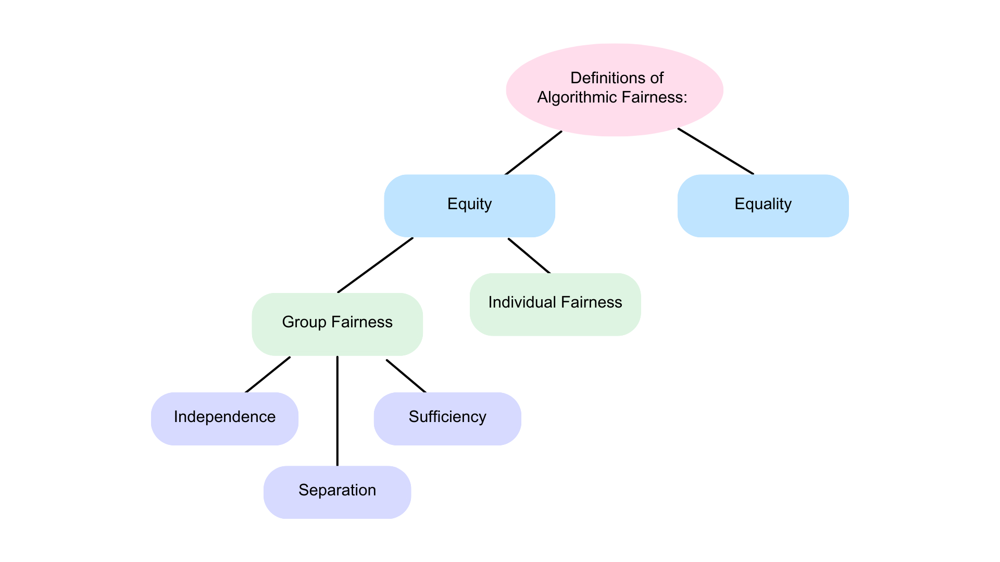

# 2.c.i - Algorithmic Fairness

* * *

When machines replace humans in [**making decisions with such great impact**](javascript:openPanel('high-impact-applications')), it is important for their outcomes to remain fair. But what is algorithmic fairness?

### <u> Procedural Equality vs. Equity </u>
One common criteria for fairness within the technical community is procedural equality.

- **Procedural Equality**: Everyone is subject to the same decision-making process. 

For example, ATS, or applicant tracking systems, are automated decision-making systems that employers use to screen resumes for hiring. Procedural equality is achieved when the system runs every application in the same way.

However, decision-making does not happen in a vacuum. Rather, it exists within a societal context of [**systems of oppression**](javascript:openPanel('systems-of-oppression')) such as racism and sexism that result in inequalities. 

A ‘procedurally fair’ algorithm falsely assumes that every applicant starts from the same point and thus replicates these inequalities.

The limitations of procedural equality leads us to the concept of [**equity**](javascript:openPanel('equity-equality')).

- **Equity**: Everyone is subject to a process that recognizes differences in opportunities and allocates outcomes accordingly. 

Within equity, there is a technical distinction between individual and group fairness. 

- **Individual fairness**: Individuals who are similar (with respect to some task) should be treated similarly (with respect to that task). E.g.: “individuals that have similar qualifications for this specific job should receive similar outcomes”

- **Group fairness**: Groups should be viewed as similar and be treated similarly, acknowledging that historically groups might have been treated differently and thus have different opportunities. 
Here are [**three criteria for group fairness**](javascript:openPanel('group-fairness')):

    - **Independence**: A person’s group membership should not affect their outcome. 

    - **Separation**: An individual’s group should not impact their outcomes depending on the “true outcome.”  That is, if we split the people into two parts – those screened in and those screened out –  then in each part the independence condition above should apply. This implies the probability of an error (false positive or false negative) should be the same for different groups. 

    - **Sufficiency**: Here, we want the output predictor (say the score produced by the screening tool) to mean the same thing regardless of which group an individual is from. So if a screener outputs a score of “7” on a scale of 1-10 for an individual, that should have the same relationship to the true outcome regardless of the individual’s group. 

All the fairness criteria above seem desirable. However, it is mathematically impossible to achieve both individual and group fairness. Within group fairness, it is also mathematically impossible to simultaneously achieve independence, separation, and sufficiency. 

The [**mathematical impossibility results**](javascript:openPanel('impossibility-of-fairness')) all look like this: construct a particular data distribution, and demonstrate that any method that satisfies one form of fairness cannot satisfy the other. What’s interesting is that the data distributions capture different beliefs about how skills are distributed in different populations.

In other words, the choice of an appropriate fairness measure relies on normative claims about the world in which the measure is being used. And a normative claim might not “match” the fairness measure if you’re not careful. 
