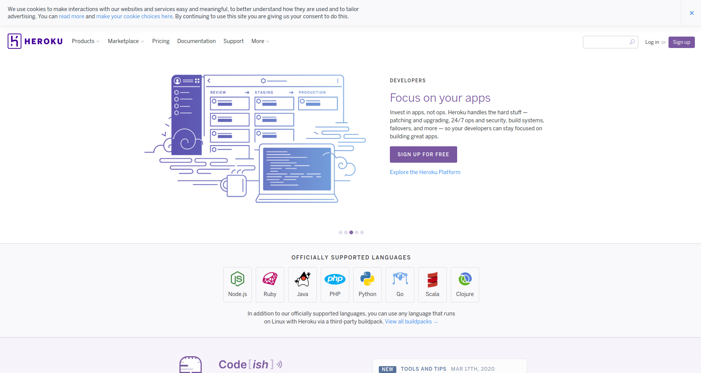
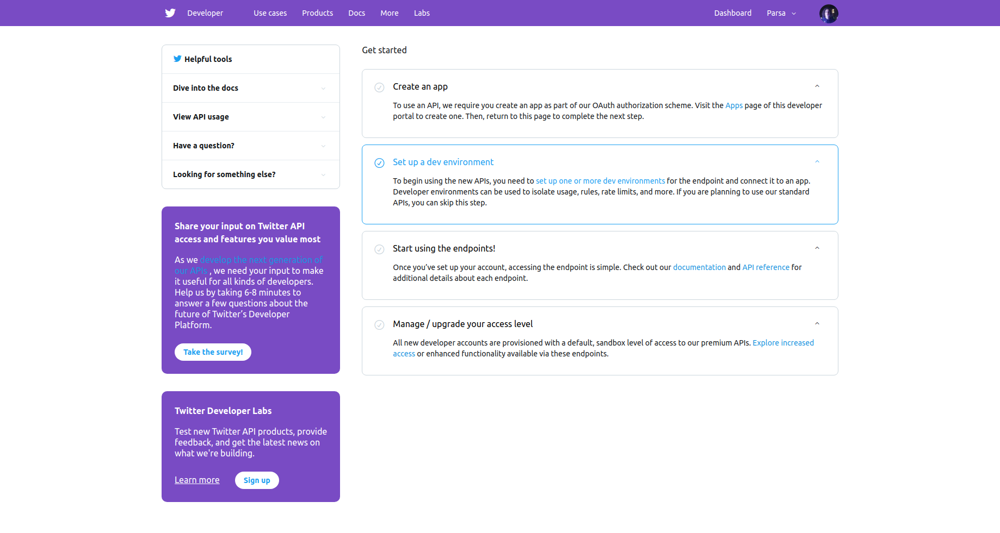
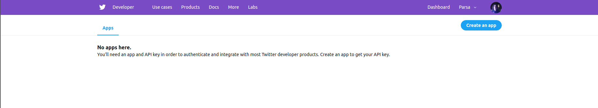

1.TOC
{:toc}

# Deploying our app to Heorku
To deploy our app, we will use [Heroku Cloud Application Platform](https://www.heroku.com/). [Heroku](https://www.heroku.com/) will allow us to deploy our NodeJs app quickly and without having to pay.

Create an account with [Heroku](https://www.heroku.com/), if you havn't already.
Once logged in, Heroku will take you to your apps page, where you can find the apps that are currently running on Heroku.
## Setting up Heroku CLI

### Downloading the CLI
Heroku CLI will allow us to deploy our app, from our termianl. Using the CLI is a quick and effective way to continuously deploy your web apps.
>Make sure you have Git installed, before you install Heroku CLI.
Download and install Heorku CLI:

- [MacOs](https://cli-assets.heroku.com/heroku.pkg "Heorku CLI Donwload for MacOS")
- [Windows](https://cli-assets.heroku.com/heroku-x64.exe "Heorku CLI Donwload for Windows")
- Ubuntu: Run `sudo snap install --classic heroku`

After installing the CLI, open terminal in your project directory.
run `rm -rf node_modules; npm install --production`
This will ensure that you only have the packages you need for production on you project, before you deploy your app.

This will generate a package.json file in our project.
`rm -rf node_modules; npm install --production`

### Installing Heroku's npm package
Then, we will install Heorku's npm package globally
`npm install -g heroku`

To verify the installation you can run this command:
`heroku --version`
You should see heroku/ in the output.

## Configuring Heroku settings
Heroku will require us to change a few settings in your package.json file. First, let's specify our engin.

### Setting up our app engin.
Add the lines below, to the end of your package.json file, to tell Heroku what engin you want, running your Node application.
~~~
"engines": {
    "node": "10.x"
  },
~~~
This will help Heroku, recognize the version of the Node you are using.

### Setting your npm start command
Inside your package.json, add this code to your scripts section:
~~~
    "start": "node server.js"
~~~

At the end, my package.json file is going to look like this:
~~~
{
  "name": "TwitterAPI",
  "version": "1.0.0",
  "main": "server.js",
  "scripts": {
    "test": "echo \"Error: no test specified\" && exit 1",
    "start": "node server.js"
  },
  "keywords": [],
  "author": "",
  "license": "ISC",
  "dependencies": {
    "express": "^4.17.1"
  },
  "engines": {
    "node": "10.x"
  },
  "devDependencies": {},
  "description": ""
}
~~~
## Pushing your app
Now, you will push your app to your Heroku repository.
### Preparing for deployment

Run `npm install` to install and update all of your dependencies.

Start your app locally using the command below:
~~~
heroku local web
~~~
This command is installed as a part of Heroku CLI.

### Loging into Heroku in CLI
After installing the CLI, run `heroku login`. This will open a browser windows, where you can login to your Heorku account. With logging in, you will be able to deploy your app from your command line.

### Deploying
Add, commit and push your code to Heroku:
~~~
git add .
git commit -m "Initial Commit"
heroku create
git push heroku master
~~~
If everything works out, your can open your deployed app using `heroku open`.

### Setting up an app
Twitter will email you a link, to confirm your email, for the developer account. After following the link email to you, you will be taken to your developer dashboard, where you can set up new apps, get API keys and set up your end points.

In the dashboard, click on Create an app

Click on the button to create an app, on the top corner of your page.

### Preparing your URL endpoints

Twitter will require a set of URL's from you. Those URL's will tell Twitter where to expect the requests to come from, and where to send them back. If requests are sent from any other URL, twitter will not authorize your program, even if the currect API key and token are used.
>Twitter will not accept local URL's(i.e. localhost/ ) as the URL for app.

We will need to set up and deploy our app, in order to have the URL's that twitter is expecting from us. We will make a simple Express app and we will deploy it to Heorku, to provide Twitter with the ened points it needs.
