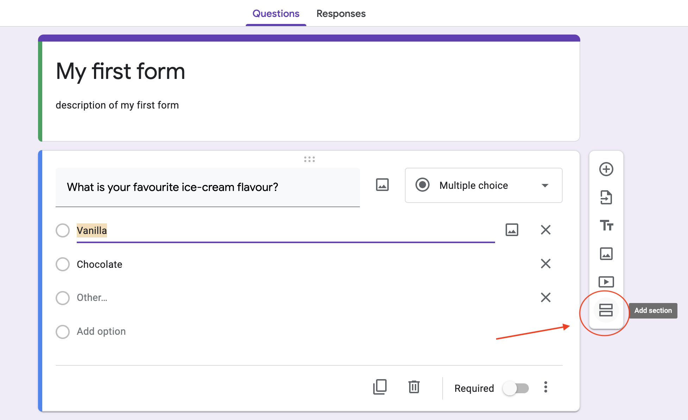
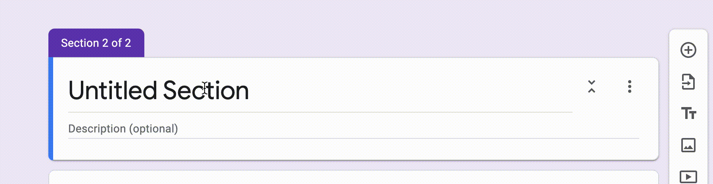
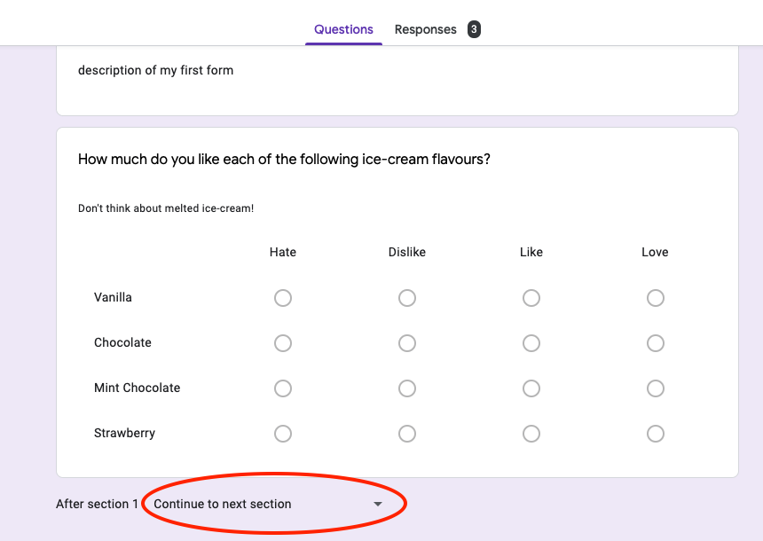
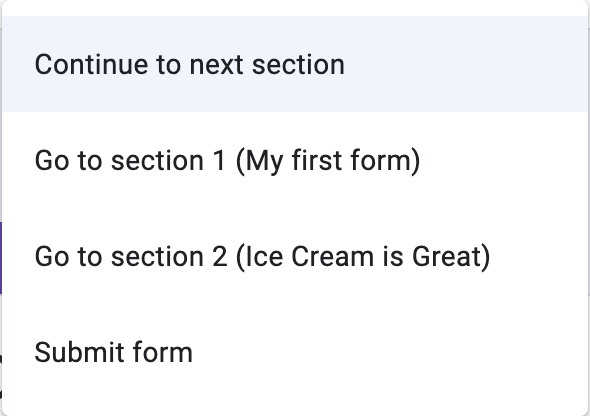

---

# Making and Using Sections

{: .no_toc }

---

After you have set up your form, you will now be able to create
different sections! Sections allow you to direct a user to another
group of questions based on their answers. You can also use this feature to censor future questions on your Google Form.

---

## 1. Create a new Section.

On the right hand side of the form, you will see a menu. Click on
the bottom icon to add a section.

## 2.	Rename your section

A new section should show up below. You may rename this by clicking on
`Untitled Section` and typing in your desired title.

## 3. Rename the Section Description

Under the title is the description of the section. This can be used to give your users additional information. To rename the section description, click on `Description (optional)`, similar to the previous step. Type in a description, if desired.

## 4. Add Questions in Your Sections

If you have already created a question and want to move it into your new section, click on the question's 6 dots and drag it under the section.

Otherwise, click on the section (or a question under the desired section), and add a question as you normally would.

## 5. Leading Sections

Google Forms allows the user to be led to another section or to the submit button. To add this feature to your form, scroll down to the bottom of the section, and click on the dropdown menu.

From the menu, select where you want your section to lead to.

{: height="8%" width="8%" style="float: left"}
**Note:** By default, the last section will automatically lead to the submit button. This ends the form for the user.

## Conclusion

This guide has shown you how to make sections in Google Forms. Use them to better organise your questions, or create complex surveys with them! Overall, your form will be be presented much nicer with the usage of sections.
