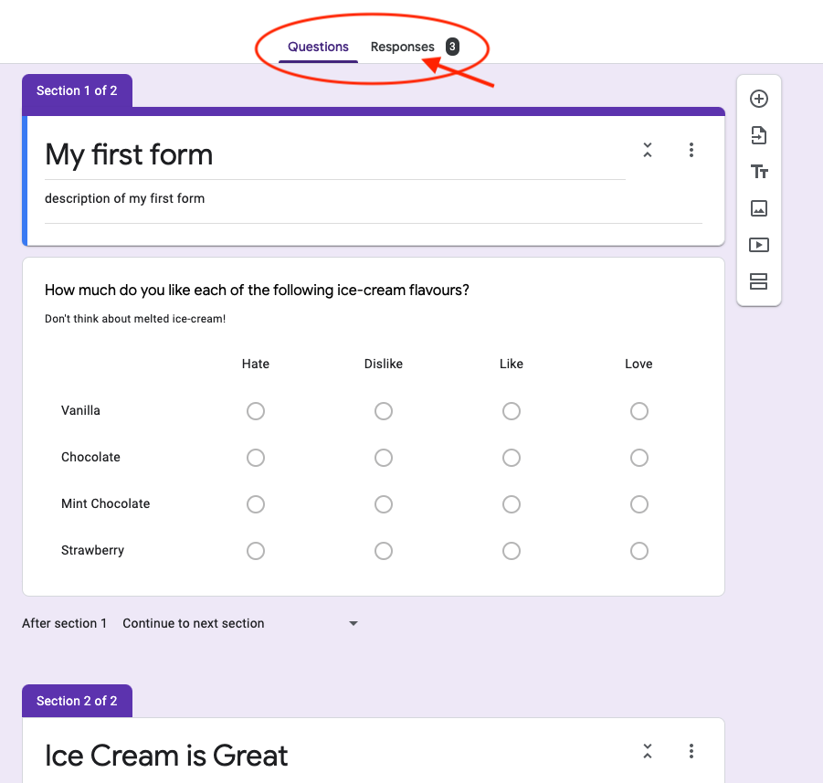
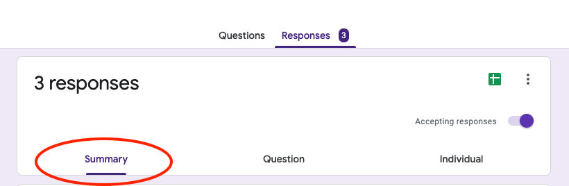
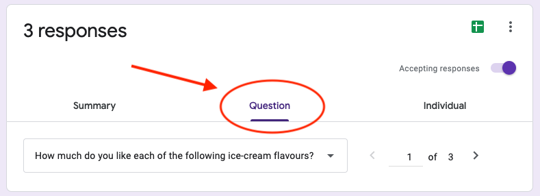

# Viewing Form Results

{: .no_toc }

---

Congrats, you've now got your form all set up! But how do we view the results? This guide will show you how to read through your results.

## 1. Click on the `Responses` Tab

Near the top of the page, you may have noticed two tabs: `Questions` and `Responses`. You may also notice a number beside `Responses`. This number indicates how many completed responses your form has received.

## 2. Viewing Results Summary

By default, you will be on the `Summary` tab. If your form has received any responses this page will display the general data for each question.

Depending on what type of question you created, the data may present itself as a graph, chart, list, or some other format.

## 3. Viewing Results by Question

If you would like to view the results for a single question, navigate to the `Question` tab. Select which question's results you want to view by clicking the left and right arrows to the bottom right of the `Question` tab.

## 4. View Each User's Response

To view a single user's form response,
