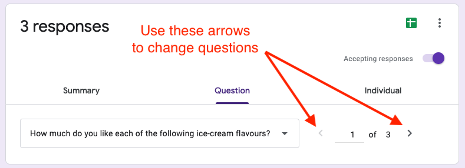
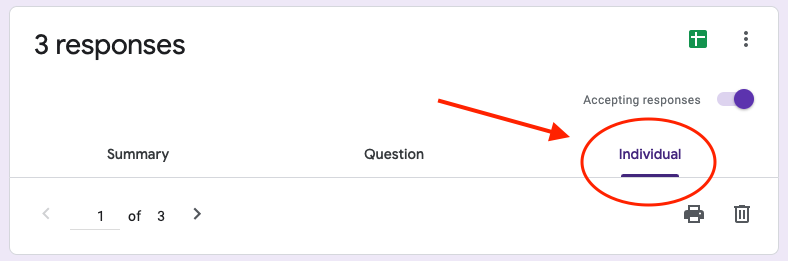
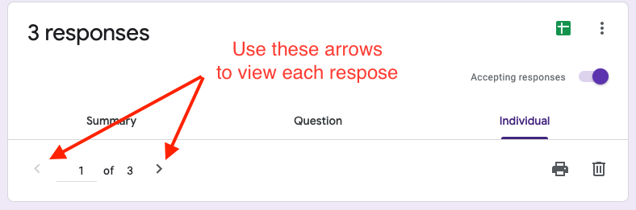

# Viewing Form Results

{: .no_toc }

---

Congrats, you've now got your form all set up! But how do we view the results? This guide will show you how to read through your results.

## 1. Click on the `Responses` Tab

Near the top of the page, you may have noticed two tabs: `Questions` and `Responses`. You may also notice a number beside `Responses`. This number indicates how many completed responses your form has received.

## 2. Viewing Results Summary

If this is your first time selecting the `Responses` tab, you will be in the `Summary` section by default. If your form has received any responses, this page will display the general data for each question.

Depending on what type of question you created, the data may present itself as a graph, chart, list, or some other format.

## 3. Viewing Results by Question

If you would like to view the results for a single question, navigate to the `Question` tab.

Select which question's results you want to view by clicking the left and right arrows to the bottom right of the `Question` tab.

## 4. View Each User's Response

To view a single user's response, click on the `Individual` tab. Under this tab, you will be able to see what a user answered for all the questions.

Use the arrows to look through each response.

## Conclusion

That's it! Now you are able to look through all your form responses.
