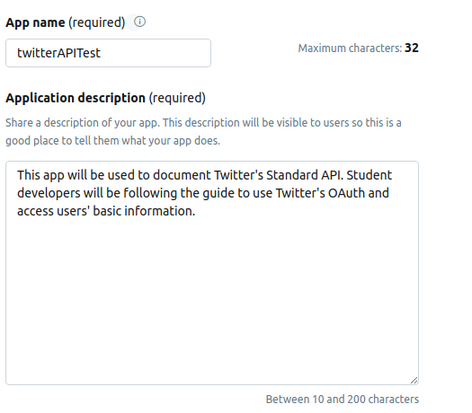
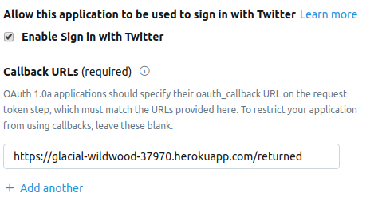
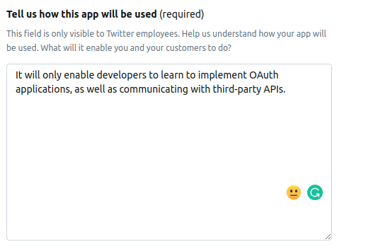
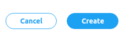
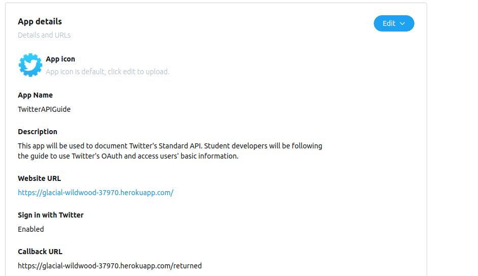

# Setting our endpoints in developer dashboard
Now that we created our `/` and `/returned` endpoints, we will have to submit those to Twitter, so that they know where to send the user off, once they have logged into their account.
## Dashboard
Go back to your dashboard at [developer.twitter.com](https://developer.twitter.com/), and Log-in if you need to.
### Going to apps page
Under your name, click on the "Apps" option.

### Create an app
Click on the button to create an app, on the top corner of your page.

## Entering the app information
You will have to lay out some information about the app that will be using Twitter's Basic API. This information will help Twitter trust your application and supply it with the information you will need. Make sure you write your responses consise and clear.
### Application name and description
Provide your application name and a breif description of what it will be aiming to accomplish.

### Base URL
Enter the URL for the root of your application. This will be the URL that Heorku has given us, when deploying.

### Callback URL
This is the endpoint, at which we will be expecting the user to be redirected back from Twitter to our application. In our app, this is our `/returned` endpoint.

> Make sure you include the entire URL concatinated with the endpoint inside the field( i.e. `https://glacial-wildwood-37970.herokuapp.com/returned`)

### Further Description
We will have to enter more description on how our app will be using the API. Write a more in depth explanation of how the app will work and what it aims to do.

### Create the app
Press create to submit the information.

Review the information in the confirmation page.

