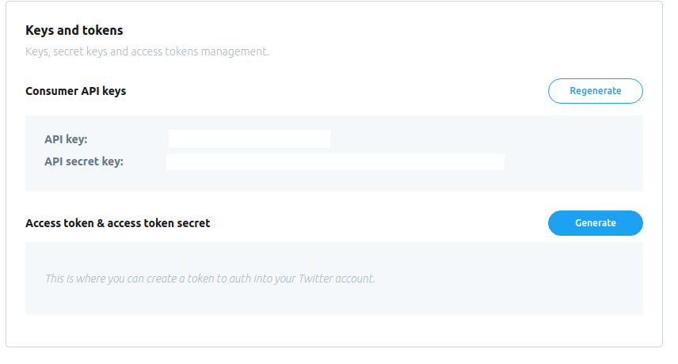

# Setting our endpoints in developer dashboard
Now that we created our `/` and `/returned` endpoints, we will have to submit those to Twitter, so that they know where to send the user off, once they have logged into their account.
## Dashboard
Go back to your dashboard at [developer.twitter.com](https://developer.twitter.com/), and Log-in if you need to.
### Going to apps page
Under your name, click on the "Apps" option.

### Create an app
Click on the button to create an app, on the top corner of your page.

## Entering the app information
You will have to lay out some information about the app that will be using Twitter's Standard API. This information will help Twitter trust your application and supply it with the information you will need. Make sure you write your responses consise and clear.
### Application name and description
Provide your application name and a breif description of what it will be aiming to accomplish.

### Base URL
Enter the URL for the root of your application. This will be the URL that Heorku has given us, when deploying.

### Callback URL
This is the endpoint, at which we will be expecting the user to be redirected to. In our app, this is our `/returned` endpoint.

> Make sure you include the entire URL concatinated with the endpoint inside the field( i.e. `https://glacial-wildwood-37970.herokuapp.com/returned`)

### Further Description
We will have to enter more description on how our app will be using the API. Write a more in depth explanation of how the app will work and what it aims to do.

### Creating the app
Press create to submit the information.

Review the information in the confirmation page.

### Getting your access token
Click on "Keys and tokens" on the top menu bar.

You will be able to see your API Key and API Secret Key in this page. 

Twitter will identify us from these keys, when we send any requests to the API.
> Warning: Keep these information safe and do not share them with anyone.

***

# Sending Setting up our OAuth 1.0

## What is OAuth?
OAuth is an standard for for authentication. The standard allows developers to provide user authentication, through API's. OAuth has many different workflows. The OAuth provider, in our case Twitter, will indicate the workflow that the developers will use. Though Twitter supplies developers with a set of workflows, the one that matches our intentions and needs is the 3-legged OAuth.

### 3-legged OAuth
With 3 legged OAuth, we will make several requests to Twitter's endpoints, in order to gain an access token that will authorize us to get the users' data from twitter. We will, first, redirect the user to a URL that Twitter's given us, along with our app's API Key and API Secret Key. This will tell twitter that the user is coming from our app, not any other source. As soon as the user logs in and authorizes our app to access their information, Twitter will send them back, with a code, that can be used to fetch an access token from Twitter. The recieved access token, will grant us access to the users' information, by sening requests, to certian end-points.
***
## Redirecting the user to Twitter
It's time to get back to writing our application. This time, though, we will be completing our app, so that it can communicate with the API.
    