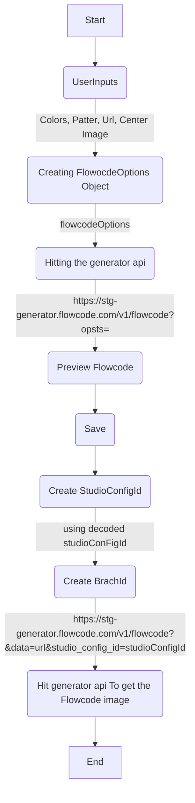

# Workflow

Here is the workflow of flowcode generation process.

This documentation is based on this workflow and its in the sequence

```mermaid!
graph TD;
Start --> A(UserInputs) -->|Colors, Patter, Url, Center Image| B(Creating FlowocdeOptions Object) --> |flowcodeOptions| C(Hitting the generator api) -->|https://stg-generator.flowcode.com/v1/flowcode?opsts=| D(Preview Flowcode) -->E(Save) -->F(Create StudioConfigId) -->|using decoded studioConFigId|G(Create BrachId)-->|https://stg-generator.flowcode.com/v1/flowcode?&data=url&studio_config_id=studioConfigId|H(Hit generator api To get the Flowcode image)-->End
```