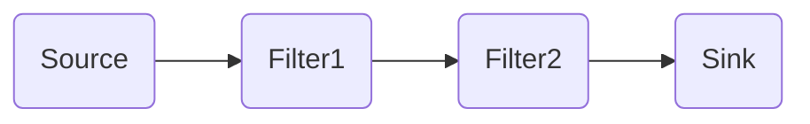
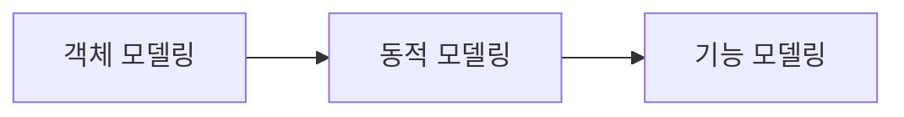

- [1. 소프트웨어 아키텍처](#1-소프트웨어-아키텍처)
  - [1.1. 모듈화(Modularity)](#11-모듈화modularity)
  - [1.2. 추상화(Abstraction)](#12-추상화abstraction)
  - [1.3. 단계적 분해(Stepwise Refinement)](#13-단계적-분해stepwise-refinement)
  - [1.4. 정보 은닉(Information Hiding)](#14-정보-은닉information-hiding)
  - [1.5. 소프트웨어 아키텍처의 품질 속성](#15-소프트웨어-아키텍처의-품질-속성)
  - [1.6. 소프트웨어 아키텍처의 설계 과정](#16-소프트웨어-아키텍처의-설계-과정)
- [2. 아키텍처 패턴](#2-아키텍처-패턴)
  - [2.1. 레이어 패턴(Layers Pattern)](#21-레이어-패턴layers-pattern)
  - [2.2. 클라이언트-서버 패턴(Client Server Pattern)](#22-클라이언트-서버-패턴client-server-pattern)
  - [2.3. 파이프-필터 패턴(Pipe-Filter Pattern)](#23-파이프-필터-패턴pipe-filter-pattern)
  - [2.4. 모델-뷰-컨트롤러 페턴(Model-View-Controller Pattern)](#24-모델-뷰-컨트롤러-페턴model-view-controller-pattern)
  - [2.5. 기타 패턴](#25-기타-패턴)
    - [2.5.1. 마스터-슬레이브 패턴(Master-Slave Pattern)](#251-마스터-슬레이브-패턴master-slave-pattern)
    - [2.5.2 브로커 패턴(Broker Pattern)](#252-브로커-패턴broker-pattern)
    - [2.5.3. 피어-투-피어 패턴(Peer-To-Peer Pattern)](#253-피어-투-피어-패턴peer-to-peer-pattern)
    - [2.5.4. 이벤트-버스 패턴(Event-Bus Pattern)](#254-이벤트-버스-패턴event-bus-pattern)
    - [2.5.5. 블랙보드 패턴(BlackBoard Pattern)](#255-블랙보드-패턴blackboard-pattern)
    - [2.5.6. 인터프리터 패턴(Interpreter Patter)](#256-인터프리터-패턴interpreter-patter)
- [3. 객체지향(Object-Oriented)](#3-객체지향object-oriented)
  - [3.1. 객체(Object)](#31-객체object)
  - [3.2. 클래스(Class)](#32-클래스class)
  - [3.3. 캡슐화(Encapsulation)](#33-캡슐화encapsulation)
  - [3.4. 상속(Inheritance)](#34-상속inheritance)
  - [3.5. 다형성(Polymorphism)](#35-다형성polymorphism)
  - [3.7. 연관성(Relationship)](#37-연관성relationship)
- [4. 객체지향 분석 및 설계](#4-객체지향-분석-및-설계)
  - [4.1. Rumbaugh의 분석 기법](#41-rumbaugh의-분석-기법)
  - [4.2. 객체지향 설계 원칙(SOLID)](#42-객체지향-설계-원칙solid)
- [5. 모듈](#5-모듈)
- [6. 공통 모듈](#6-공통-모듈)
- [7. 코드](#7-코드)
- [8. 디자인 패턴](#8-디자인-패턴)

# 1. 소프트웨어 아키텍처

소프트웨어 골격이 되는 기본 구조이자 소프트웨어를 구성하는 요소들 간의 관계를 표현하는 시스템의 구조 또는 구조체  

|상위 설계|하위 설계|
|--------|---------|
|아키텍쳐 설계, 예비 설계|모듈 설계, 상세 설계|
|시스템의 전체적인 구조|시스템의 내부 구조 및 행위|
|구조,DB,인터페이스|컴포넌트, 자료구조, 알고리즘|

## 1.1. 모듈화(Modularity)
소프트웨어의 성능을 향상시키거나 시스템의 수정 및 재사용, 유지 관리 등이 용이하도록 시스템의 기능들을 모듈 단위로 나누는 것.
- 재사용성 향상
- 크기를 너무 작게 나누면 개수가 많아져 통합 비용이 많이 듦
- 크기를 너무 크게 나누면 개수가 적어 모듈 하나의 개발 비용이 많이 듦
- 프로그램 효율관리 및 오류의 파급효과 최소화

## 1.2. 추상화(Abstraction)
전체적이고 포괄적인 개념을 설계한 후 차례로 세분화하여 구체화시켜 나가는 것.

**유형**
- 과정 추상화 : 자세한 수행 과정을 정의하지 않고 전반적인 흐름만 파악할 수 있게 설계
- 데이터(재료) 추상화 : 데이터 세부적인 속성이나 용도를 정의하지 않고, 데이터 구조를 대표할 수 있는 표현으로 대체하는 방법
- 제어 추상화 : 이벤트 발생의 정확한 절차나 방법을 정의하지 않고 대표할 수 있는 표현으로 대체

## 1.3. 단계적 분해(Stepwise Refinement)
하향식 설계 전략. 추상화의 반복에 의해 세분화. 

## 1.4. 정보 은닉(Information Hiding)
한 모듈 내에 포함된 절차와 자료를 감추어 다른 모듈이 접근하지 못하도록 하는 것.  
필요한 정보만 인터페이스를 통해 제공.
- 캡슐로 된 감기약에 어떤 재료가 들어 있는지 몰라도 감기 걸렸을 때 먹는 약이라는 것만 알고 복용하는 것과 같음.
- IP주소, 물리적 코드, 상세 데이터 구조 등
- 다른 모듈에 영향을 주지 않으므로 수정, 시험, 유지보수가 용이

## 1.5. 소프트웨어 아키텍처의 품질 속성
이해관계자가 요구하는 수준의 품질을 확인하기 위해 품질 평가 요소를 나눈 것.

1. 시스템 측면
- 성능
- 보안
- 가용성
- 기능성
- 사용성
- 변경용이성
- 확장성
- 테스트용이성, 배치성, 안정성 등
2. 비즈니스 측면
- 시장 적시성
- 비용과 혜택
- 예상 시스템 수명
- 목표 시장, 공개 일정, 기존 시스템과의 통합
3. 아키텍쳐 측면
- 개념적 무결성
- 정확성, 완결성
- 구축 가능성
- 변경성, 시험성, 적응성, 일치성, 대체성

## 1.6. 소프트웨어 아키텍처의 설계 과정
1. 설계목표 설정
2. 시스템 타입 설정
   - 대화형 시스템 : 사용자 요구 발생 시 시스템이 처리하고 반응 ex.온라인 쇼핑몰과 같은 대부분의 웹 애플리케이션
   - 이벤트 중심 시스템 : 외부의 상태 변화에 따라 동작하는 시스템 ex.전화, 비상벨 등의 내장 소프트웨어
   - 변환형 시스템 : 데이터가 입력되면 정해진 작업들을 수행하여 결과를 출력하는 시스템 ex.컴파일러, 네트워크 프로토콜 등
   - 객체 영속성 시스템 : DB를 사용하여 파일을 효과적으로 저장검색갱신할 수 있는 시스템 ex.서버관리 소프트웨어
3. 아키텍처 패턴 적용
4. 서브시스템 구체화
5. 검토

**협약(Contract)에 의한 설계**
컴포넌트를 설계할 때 클래스에 대한 여러 가정을 공유할 수 있도록 명세한 것. 소프트웨어 컴포넌트에 대한 정확한 인터페이스를 명세.
협약에 의한 설계 시 명세에 포함될 조건
1. 선행 조건(Precondition) : 오퍼레이션이 호출되기 전에 참이 되어야 할 조건
2. 결과 조건(Postcondition) : 오퍼레이션이 수행된 후 만족되어야 할 조건
3. 불변 조건(Invariant) : 오퍼레이션이 실행되는 동안 항상 만족되어야 할 조건

# 2. 아키텍처 패턴

소프트웨어 시스템의 구조 기본 윤곽을 제시.  
서브시스템과 그 역할이 정의되어 여러 규칙, 지침 등이 포함됨  
아키텍처 패턴을 아키텍처 스타일 또는 표준 아키텍처라고 함.

## 2.1. 레이어 패턴(Layers Pattern)
계층으로 구분하여 구성하는 고전적인 방법.  
서로 마주보는 두 계층 사이에서만 상호작용함.    
ex. OSI 참조 모델, 데스크톱 애플리케이션, E-commerce 웹 애플리케이션

**OSI 참조 모델**  
  
국제표준화기구(ISO)에서 네트워크 프로토콜을 계층별로 구분한 모델.    
1. 물리 : 0,1로 된 데이터를 전기신호로 바꿔줌. 전선.
   - 전기신호 그 자체인 Bit 를 보냄.
   - 통신 케이블, 리피터, 허브
2. 데이터링크 : 하드웨어가 보유한 고유번호.
   - 프레임(Frame)이라는 단위 사용.
   - 브릿지, 스위치, 이더넷
3. 네트워크 : 도착할 곳으로 가려면 어떤 경로로 가야 최소로 갈수 있을지(라우팅). 주소는 IP라고 함.
   - 패킷(Packet)이라는 단위 사용.
   - 장비 : 라우터
4. 전송(Transport) : 전송 방식 TCP(신뢰성, 연결지향적)/UDP(비신뢰성,비연결지향적). Port번호(전송할 대상이 누구인지)
   - 세그먼트(Segment)라는 단위 사용.
5. 세션(Session) : 연결 생성(create)/유지(establish)/종료(close). 통신 방식으로는 반이중(무전기), 전이중(전화) 존재. 호스트와 호스트 간 연결 유지.
   - 데이터 사용함.
6. 표현(Presentation) : 암호화, 인코딩, 압축. 데이터 표현 방식 결정.
   - 데이터 사용함.
7. 응용(Application) : 실제 전송하고 싶은 내용. 응용 서비스 수행 데이터
   - 데이터 사용함.

## 2.2. 클라이언트-서버 패턴(Client Server Pattern)
하나의 서버 컴포넌트와 다수의 클라이언트 컴포넌트로 구성되는 패턴.  
서버는 클라이언트 요청에 대비해 항상 대기 상태를 유지.  
클라이언트나 서버는 요청과 응답을 받기 위해 동기화되는 경우를 제외하곤 서로 독립적이다.  
ex. 이메일, 문서 공유 및 은행 등의 온라인 애플리케이션

## 2.3. 파이프-필터 패턴(Pipe-Filter Pattern)

데이터 스트림 절차의 각 단계를 필터 컴포넌트로 캡슐화하여 파이프를 통해 데이터를 전송하는 패턴.  
ex. 컴파일러
- 필터 컴포넌트는 재사용성이 좋고 추가가 쉬워 확장이 용이
- 필터 컴포넌트는 데이터 변환, 버퍼링, 동기화 등에 주로 사용.
- 데이터 변환으로 인한 오버헤드가 있을 수 있음.

## 2.4. 모델-뷰-컨트롤러 페턴(Model-View-Controller Pattern)
  
서브 시스템을 3개의 부분으로 구조화하는 패턴.  
각 부분은 별도의 컴포넌트로 분리되어 있으므로 서로 영향을 받지 않고 개발 작업을 수행할 수 있음.  
여러 개의 뷰를 만들 수 있으므로 한 개의 모델에 대해 여러 개의 뷰를 필요로 하는 대화형 애플리케이션에 적합함.
- 모델 : 서브 시스템의 핵심 기능과 데이터를 보관.
- 뷰 : 사용자에게 정보를 표시.
- 컨트롤러 : 사용자로부터 입력된 변경 요청을 처리하기 위해 모델에게 명령을 보냄.

## 2.5. 기타 패턴

### 2.5.1. 마스터-슬레이브 패턴(Master-Slave Pattern)
  
ex. 장애 허용 시스템, 병렬 컴퓨팅 시스템  
마스터 컴포넌트는 동일한 구조의 슬레이브 컴포넌트로 작업을 분할한 후, 슬레이브 컴포넌트에서 처리된 결과물을 다시 돌려받는 방식으로 작업을 수행.  
마스터 컴포넌트는 모든 작업의 주체이고 슬레이브 컴포넌트는 마스터 컴포넌트의 `지시`에 따라 작업을 수행해 결과물을 반환.

### 2.5.2 브로커 패턴(Broker Pattern)
  
ex. Apache ActiveMQ, Kafka, RabbitMQ  
사용자가 원하는 서비스와 특성을 브로커 컴포넌트에 요청하면 브로커 컴포넌트가 요청에 맞는 컴포넌트와 사용자를 연결해줌.  
원격 서비스 호출에 응답하는 컴포넌트가 여러 개 있을 때 적합한 패턴.  
분산 환경 시스템에서 주로 활용.
이벤트-버스 패턴의 상위호환이라고도 볼 수 있음.

### 2.5.3. 피어-투-피어 패턴(Peer-To-Peer Pattern)
  
ex. Spotify, 파일 공유 프로그램  
피어(Peer)를 하나의 컴포넌트로 간주하며, 각 피어는 서비스를 호출하는 클라이언트가 될 수도, 서비스를 제공하는 서버가 될 수도 있는 패턴.  
클라이언트와 서버는 전형적인 멀티스레딩 방식을 사용.

**멀티스레딩** : 프로세스를 두개 이상 실행단위로 구분하여 자원을 공유하며 병렬로 수행하는 기능.

### 2.5.4. 이벤트-버스 패턴(Event-Bus Pattern)
  
소스가 특정 채널에 이벤트를 발생(Publish)하면, 해당 채널을 구독(Subscribe)한 리스너들이 메시지를 받아 이벤트를 처리하는 방식.  
ex. 안드로이드 개발, 알림 서비스

4가지 주요 컴포넌트가 존재.  
1. 소스(Source) : 이벤트 생성
2. 리스너(Listener) : 이벤트 수행
3. 채널(Channel) : 이벤트 통로
4. 버스(Bus) : 채널 관리

### 2.5.5. 블랙보드 패턴(BlackBoard Pattern)
  
모든 컴포넌트들이 공유 데이터 저장소와 블랙보드 컴포넌트에 접근 가능한 형태.  
해결책이 명확하지 않은 문제를 처리하는데 유용.  
ex. 음성 인식, 차량 식별 및 추적, 수중 음파 탐지기 신호 해석, 단백질 구조 식별

### 2.5.6. 인터프리터 패턴(Interpreter Patter)
프로그램 코드의 각 라인을 수행하는 방법을 지정하고 기호마다 클래스를 갖도록 구성.  
특정 언어로 작성된 프로그램 코드를 해석하는 컴포넌트를 설계할 때 사용.  
ex. SQL과 같은 DB 쿼리 언어, 통신 프로토콜을 정의하기 위한 언어.

# 3. 객체지향(Object-Oriented)

현실 세계의 개체(Entity)를 기계의 부품처럼 하나의 객체(Object)로 만들어, 기계적인 부품들을 조립하여 제품을 만들듯이 소프트웨어 개발 때도 객체를 조립해 작성할 수 있는 기법.
- 재사용 및 확장이 용이
- 유지보수 쉬움
- 복잡한 구조를 계층/단계적으로 표현
- 현실 세계를 모형화하므로 사용자와 개발자가 쉽게 이해 가능
  
**주요 개념**
1. 객체(Object)
2. 클래스(Class)
3. 캡슐화(Encapsulation)
4. 상속(Inheritance)
5. 다형성(Polymorphism)
6. 연관성(Relationship)

## 3.1. 객체(Object)
- 데이터 : 객체가 가지고 있는 정보. 속성(Attribute)이라고도 함.
- 함수 : 객체가 수행하는 기능. 메소드(Method)라고도 함.

객체는 독립적으로 식별 가능한 이름을 가짐. 객체가 가질 수 있는 조건을 상태(State)라고 하는데, 일반적으로 상태는 시간에 따라 변함.   
객체와 객체는 상호 연관성에 의한 관계가 형성.  
객체가 반응할 수 있는 메시지(Message)의 집합을 행위라고 함. 객체는 행위의 특징을 나타냄.  
객체는 일정한 기억장소를 가지고 있음.  

## 3.2. 클래스(Class)
공통된 속성과 연산을 갖는 객체의 집합. 객체의 일반적인 타입(Type)을 의미.  
각각의 객체들이 갖는 속성과 연산을 정의하고 있는 틀.   
클래스에 속한 각각의 객체를 인스턴스(Instance)라 하며 클래스로부터 새로운 객체를 생성하는 것을 인스턴스화(Instantiation)라고 함.  

**슈퍼 클래스** : 특정 클래스의 상위(부모) 클래스  
**서브 클래스** : 특정 클래스의 하위(자식) 클래스

## 3.3. 캡슐화(Encapsulation)
데이터와 데이터를 처리하는 함수를 하나로 묶는 것.  
캡슐화된 객체는 인터페이스를 제외한 세부 내용이 은폐(정보은닉)되어 외부에서의 접근이 제한적임. 재사용 용이.  
객체 간 메시지 주고받을 대 상대 객체의 세부 내용은 알 필요 없으므로 인터페이스가 단순해지고, 객체 간의 결합도도 낮아짐.  

## 3.4. 상속(Inheritance)
정의된 상위 클래스의 모든 속성과 연산을 하위 클래스가 물려받는 것.  
하위는 즉시 상위 클래스의 모든 속성과 연산을 사용할 수 있고 새로운 속성과 연산을 첨가해 사용 가능.  
소프트웨어의 재사용을 높이는 중요한 개념.

**다중 상속(Multiple Inheritance)**  
한개의 클래스가 두개 이상의 상위 클래스로부터 속성과 연산을 상속받는 것.  
클래스 계층을 복잡하게 만들고 상속 순서 추적이 어려워 다중 상속을 허용하지 않는 프로그래밍 언어도 존재.

## 3.5. 다형성(Polymorphism)
메시지에 의해 객체(클래스)가 연산을 수행하게 될 때 하나의 메시지에 대해 각각의 객체(클래스)가 가지고 있는 고유한 방법(특성)으로 응답할 수 있는 능력.  
하나의 타입에 여러 객체를 대입 가능. 여러 형태를 받아들일 수 있는 성질.  
상속받은 여러 개의 하위 객체들이 다른 형태의 특성을 갖는 객체로 이용될 수 있는 성질.  
- 객체들은 동일한 메소드명을 사용하며 같은 의미로 응답함.
- 오버로딩(Overloading) : 메소드의 이름은 같지만 인수를 받는 자료형과 개수를 달리하여 여러 기능을 정의.
- 오버라이딩(Overriding, 메소드 재정의) : 상위 클래스에서 정의한 메소드와 이름은 같지만 메소드 안의 실행코드를 달리하여 자식 클래스에서 재정의해 사용 가능.  

## 3.7. 연관성(Relationship)
두개 이상의 객체들이 상호 참조하는 관계
- `is member of`(연관화, Association) : 2개 이상의 객체가 상호 관련됨
- `is instance of`(분류화, Classification) : 동일한 형의 특성을 갖는 객체들을 모아 구성한 것.
- `is part of`(집단화, Aggregation) : 관련 있는 객체들을 묶어 하나의 상위 객체를 구성하는 것.
- `is a`(일반화, Generalization) : 공통적인 성질들로 추상화한 상위 객체를 구성하는 것.
- `is a`(특수화/상세화, Specialization) : 상위 객체를 구체화하여 하위 객체를 구성하는 것.

# 4. 객체지향 분석 및 설계

사용자의 요구사항을 분석하여 요구된 문제와 관련된 모든 클래스(객체), 이와 연관된 속성과 연산, 그들 간의 관계 등을 정의하여 모델링하는 작업을 객체지향 분석이라 한다.

1. Rumbaugh 방법
2. Booch(부치) 방법 : 미시적 개발 프로세스와 거시적 개발 프로세스를 모두 사용하는 분석 방법. 클래스와 객체들을 분석 및 식별하고 클래스의 속성과 연산을 정의
3. Jacobson 방법 : Use Case를 강조하여 사용하는 분석 방법
4. Coad와 Yourdon 방법 : ERD를 사용하여 객체의 행위를 모델링.
5. Wirfs-Brock 방법 : 분석과 설계 간 구분이 없고 고객 명세서를 평가해 설계 작업까지 연속적으로 수행.

## 4.1. Rumbaugh의 분석 기법
가장 일반적으로 사용됨. 모든 소프트웨어 구성 요소를 그래픽 표기법을 이용하여 모델링. 객체 모델링 기법(OMT, Object-Modeling-Technique)이라고도 함.   
객체 모델링, 동적 모델링, 기능 모델링 순으로 이루어짐.

- **객체 모델링** : 정보 모델링. 시스템에서 요구되는 객체를 찾아 속성과 연산 식별 및 객체들 간 관계를 규정해 객체 다이어그램으로 표시하는 것.
- **동적 모델링** : 상태 다이어그램을 이용하여 시간의 흐름에 따른 객체들 간의 제어 흐름, 상호 작용, 동작 순서 등의 동적인 행위를 표현하는 모델링.
- **기능 모델링** : 자료 흐름도를 이용해 다수의 프로세스들 간의 자료 흐름을 중심으로 처리 과정을 표현한 모델링.

## 4.2. 객체지향 설계 원칙(SOLID)

- **단일 책임 원칙(SRP, Single Responsibility Principle)** : 객체는 단 하나의 책임만 가져야 한다. 응집도는 높고 결합도는 낮게.
- **개방-폐쇄 원칙(OCP, Open-Close Principle)** : 기존의 코드는 변경하지 않고 기능을 추가할 수 있도록 설계해야 한다. 공통 인터페이스를 하나의 인터페이스로 묶어 캡슐화하는 방법이 대표적. 확장에 대해선 열려있고, 변경에 대해선 닫혀 있어야 한다는 원칙.
- **리스코프 치환 원칙(LSP, Liskov Substitution Principle)** : 자식 클래스는 최소한 자신의 부모 클래스에서 가능한 행위는 수행할 수 있어야 한다. 자식 클래스는 부모 클래스의 책임을 무시하거나 재정의하지않고 확장만 수행.
- **인터페이스 분리 원칙(Interface Segregation Principle)** : 자신이 사용하지 않는 인터페이스나 메소드와 의존 관계를 맺거나 영향을 받지 않아야 한다. 단일 책임 원칙은 객체가 갖는 하나의 책임이라면, 인터페이스 분리 원칙은 인터페이스가 갖는 하나의 책임이다.
- **의존 역전 원칙(DIP, Dependency Inversion Principle)** : 각 객체들 간의 의존 관계가 성립될 때 추상성이 낮은 클래스보다 추상성이 높은 클래스와 의존 관계를 맺어야 한다는 원칙. 일반적으로 인터페이스를 활용하면 이 원칙은 준수됨.

# 5. 모듈
# 6. 공통 모듈
# 7. 코드
# 8. 디자인 패턴
