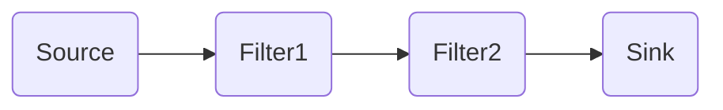

- [1. 소프트웨어 아키텍처](#1-소프트웨어-아키텍처)
  - [1.1. 모듈화(Modularity)](#11-모듈화modularity)
  - [1.2. 추상화(Abstraction)](#12-추상화abstraction)
  - [1.3. 단계적 분해(Stepwise Refinement)](#13-단계적-분해stepwise-refinement)
  - [1.4. 정보 은닉(Information Hiding)](#14-정보-은닉information-hiding)
  - [1.5. 소프트웨어 아키텍처의 품질 속성](#15-소프트웨어-아키텍처의-품질-속성)
  - [1.6. 소프트웨어 아키텍처의 설계 과정](#16-소프트웨어-아키텍처의-설계-과정)
- [2. 아키텍처 패턴](#2-아키텍처-패턴)
  - [2.1. 레이어 패턴(Layers Pattern)](#21-레이어-패턴layers-pattern)
  - [2.2. 클라이언트-서버 패턴(Client Server Pattern)](#22-클라이언트-서버-패턴client-server-pattern)
  - [2.3. 파이프-필터 패턴(Pipe-Filter Pattern)](#23-파이프-필터-패턴pipe-filter-pattern)
  - [2.4. 모델-뷰-컨트롤러 페턴(Model-View-Controller Pattern)](#24-모델-뷰-컨트롤러-페턴model-view-controller-pattern)
  - [2.5. 기타 패턴](#25-기타-패턴)
    - [2.5.1. 마스터-슬레이브 패턴(Master-Slave Pattern)](#251-마스터-슬레이브-패턴master-slave-pattern)
    - [2.5.2 브로커 패턴(Broker Pattern)](#252-브로커-패턴broker-pattern)
    - [2.5.3. 피어-투-피어 패턴(Peer-To-Peer Pattern)](#253-피어-투-피어-패턴peer-to-peer-pattern)
    - [2.5.4. 이벤트-버스 패턴(Event-Bus Pattern)](#254-이벤트-버스-패턴event-bus-pattern)
    - [2.5.5. 블랙보드 패턴(BlackBoard Pattern)](#255-블랙보드-패턴blackboard-pattern)
    - [2.5.6. 인터프리터 패턴(Interpreter Patter)](#256-인터프리터-패턴interpreter-patter)
- [3. 객체지향(Object-Oriented)](#3-객체지향object-oriented)
  - [3.1. 객체(Object)](#31-객체object)
  - [3.2. 클래스(Class)](#32-클래스class)
  - [3.3. 캡슐화(Encapsulation)](#33-캡슐화encapsulation)
  - [3.4. 상속(Inheritance)](#34-상속inheritance)
  - [3.5. 다형성(Polymorphism)](#35-다형성polymorphism)
  - [3.7. 연관성(Relationship)](#37-연관성relationship)
- [4. 객체지향 분석 및 설계](#4-객체지향-분석-및-설계)
  - [4.1. Rumbaugh의 분석 기법](#41-rumbaugh의-분석-기법)
  - [4.2. 객체지향 설계 원칙(SOLID)](#42-객체지향-설계-원칙solid)
- [5. 모듈](#5-모듈)
  - [5.1. 결합도(Coupling)](#51-결합도coupling)
  - [5.2. 응집도](#52-응집도)
  - [5.3. 팬인(Fan-In)/팬아웃(Fan-Out)](#53-팬인fan-in팬아웃fan-out)
- [6. 공통 모듈](#6-공통-모듈)
  - [6.1. 재사용(Reuse)](#61-재사용reuse)
- [7. 코드](#7-코드)
  - [7.1. 코드 기능](#71-코드-기능)
  - [7.2. 코드의 종류](#72-코드의-종류)
  - [7.3. 코드 부여 체계](#73-코드-부여-체계)
- [8. 디자인 패턴](#8-디자인-패턴)
  - [8.1. 디자인 패턴의 장단점](#81-디자인-패턴의-장단점)
  - [8.2. 생성 패턴(Creation Pattern)](#82-생성-패턴creation-pattern)
    - [8.2.1 추상 팩토리(Abstract Factory)](#821-추상-팩토리abstract-factory)
    - [8.2.2 빌더(Builder)](#822-빌더builder)
    - [8.2.3 팩토리 메소드(Factory Method)](#823-팩토리-메소드factory-method)
    - [8.2.4 프로토타입(Prototype)](#824-프로토타입prototype)
    - [8.2.5 싱글톤(Singleton)](#825-싱글톤singleton)
  - [8.3. 구조 패턴(Structural Pattern)](#83-구조-패턴structural-pattern)
    - [8.3.1 어댑터(Adaptor)](#831-어댑터adaptor)
    - [8.3.2 브리지(Bridge)](#832-브리지bridge)
    - [8.3.3 컴포지트(Composite)](#833-컴포지트composite)
    - [8.3.4 데코레이터(Decorator)](#834-데코레이터decorator)
    - [8.3.5 퍼싸드(Facade)](#835-퍼싸드facade)
    - [8.3.6 프록시(Proxy)](#836-프록시proxy)
    - [8.3.7 플라이웨이트(Flyweight)](#837-플라이웨이트flyweight)
  - [8.4. 행위 패턴(Behavioral Pattern)](#84-행위-패턴behavioral-pattern)
    - [8.4.1 책임 연쇄(Chain of Responsibility)](#841-책임-연쇄chain-of-responsibility)
    - [8.4.2 커맨드(Command)](#842-커맨드command)
    - [8.4.3 인터프리터 패턴(Interpreter)](#843-인터프리터-패턴interpreter)
    - [8.4.4 반복자(Iterator)](#844-반복자iterator)
    - [8.4.5 중재자(Mediator)](#845-중재자mediator)
    - [8.4.6 메멘토(Memento)](#846-메멘토memento)
    - [8.4.7 옵저버(Observer)](#847-옵저버observer)
    - [8.4.8 상태(State)](#848-상태state)
    - [8.4.9 전략(Strategy)](#849-전략strategy)
    - [8.4.10 템플릿 메소드(Template Method)](#8410-템플릿-메소드template-method)
    - [8.4.11 방문자(Visitor)](#8411-방문자visitor)

# 1. 소프트웨어 아키텍처

소프트웨어 골격이 되는 기본 구조이자 소프트웨어를 구성하는 요소들 간의 관계를 표현하는 시스템의 구조 또는 구조체  

|상위 설계|하위 설계|
|--------|---------|
|아키텍쳐 설계, 예비 설계|모듈 설계, 상세 설계|
|시스템의 전체적인 구조|시스템의 내부 구조 및 행위|
|구조,DB,인터페이스|컴포넌트, 자료구조, 알고리즘|

## 1.1. 모듈화(Modularity)
소프트웨어의 성능을 향상시키거나 시스템의 수정 및 재사용, 유지 관리 등이 용이하도록 시스템의 기능들을 모듈 단위로 나누는 것.
- 재사용성 향상
- 크기를 너무 작게 나누면 개수가 많아져 통합 비용이 많이 듦
- 크기를 너무 크게 나누면 개수가 적어 모듈 하나의 개발 비용이 많이 듦
- 프로그램 효율관리 및 오류의 파급효과 최소화

## 1.2. 추상화(Abstraction)
전체적이고 포괄적인 개념을 설계한 후 차례로 세분화하여 구체화시켜 나가는 것.

**유형**
- 과정 추상화 : 자세한 수행 과정을 정의하지 않고 전반적인 흐름만 파악할 수 있게 설계
- 데이터(재료) 추상화 : 데이터 세부적인 속성이나 용도를 정의하지 않고, 데이터 구조를 대표할 수 있는 표현으로 대체하는 방법
- 제어 추상화 : 이벤트 발생의 정확한 절차나 방법을 정의하지 않고 대표할 수 있는 표현으로 대체

## 1.3. 단계적 분해(Stepwise Refinement)
하향식 설계 전략. 추상화의 반복에 의해 세분화. 

## 1.4. 정보 은닉(Information Hiding)
한 모듈 내에 포함된 절차와 자료를 감추어 다른 모듈이 접근하지 못하도록 하는 것.  
필요한 정보만 인터페이스를 통해 제공.
- 캡슐로 된 감기약에 어떤 재료가 들어 있는지 몰라도 감기 걸렸을 때 먹는 약이라는 것만 알고 복용하는 것과 같음.
- IP주소, 물리적 코드, 상세 데이터 구조 등
- 다른 모듈에 영향을 주지 않으므로 수정, 시험, 유지보수가 용이

## 1.5. 소프트웨어 아키텍처의 품질 속성
이해관계자가 요구하는 수준의 품질을 확인하기 위해 품질 평가 요소를 나눈 것.

1. 시스템 측면
- 성능
- 보안
- 가용성
- 기능성
- 사용성
- 변경용이성
- 확장성
- 테스트용이성, 배치성, 안정성 등
2. 비즈니스 측면
- 시장 적시성
- 비용과 혜택
- 예상 시스템 수명
- 목표 시장, 공개 일정, 기존 시스템과의 통합
3. 아키텍쳐 측면
- 개념적 무결성
- 정확성, 완결성
- 구축 가능성
- 변경성, 시험성, 적응성, 일치성, 대체성

## 1.6. 소프트웨어 아키텍처의 설계 과정
1. 설계목표 설정
2. 시스템 타입 설정
   - 대화형 시스템 : 사용자 요구 발생 시 시스템이 처리하고 반응 ex.온라인 쇼핑몰과 같은 대부분의 웹 애플리케이션
   - 이벤트 중심 시스템 : 외부의 상태 변화에 따라 동작하는 시스템 ex.전화, 비상벨 등의 내장 소프트웨어
   - 변환형 시스템 : 데이터가 입력되면 정해진 작업들을 수행하여 결과를 출력하는 시스템 ex.컴파일러, 네트워크 프로토콜 등
   - 객체 영속성 시스템 : DB를 사용하여 파일을 효과적으로 저장검색갱신할 수 있는 시스템 ex.서버관리 소프트웨어
3. 아키텍처 패턴 적용
4. 서브시스템 구체화
5. 검토

**협약(Contract)에 의한 설계**
컴포넌트를 설계할 때 클래스에 대한 여러 가정을 공유할 수 있도록 명세한 것. 소프트웨어 컴포넌트에 대한 정확한 인터페이스를 명세.
협약에 의한 설계 시 명세에 포함될 조건
1. 선행 조건(Precondition) : 오퍼레이션이 호출되기 전에 참이 되어야 할 조건
2. 결과 조건(Postcondition) : 오퍼레이션이 수행된 후 만족되어야 할 조건
3. 불변 조건(Invariant) : 오퍼레이션이 실행되는 동안 항상 만족되어야 할 조건

# 2. 아키텍처 패턴

소프트웨어 시스템의 구조 기본 윤곽을 제시.  
서브시스템과 그 역할이 정의되어 여러 규칙, 지침 등이 포함됨  
아키텍처 패턴을 아키텍처 스타일 또는 표준 아키텍처라고 함.

## 2.1. 레이어 패턴(Layers Pattern)
계층으로 구분하여 구성하는 고전적인 방법.  
서로 마주보는 두 계층 사이에서만 상호작용함.    
ex. OSI 참조 모델, 데스크톱 애플리케이션, E-commerce 웹 애플리케이션

**OSI 참조 모델**  
  
국제표준화기구(ISO)에서 네트워크 프로토콜을 계층별로 구분한 모델.    
1. 물리 : 0,1로 된 데이터를 전기신호로 바꿔줌. 전선.
   - 전기신호 그 자체인 Bit 를 보냄.
   - 통신 케이블, 리피터, 허브
2. 데이터링크 : 하드웨어가 보유한 고유번호.
   - 프레임(Frame)이라는 단위 사용.
   - 브릿지, 스위치, 이더넷
3. 네트워크 : 도착할 곳으로 가려면 어떤 경로로 가야 최소로 갈수 있을지(라우팅). 주소는 IP라고 함.
   - 패킷(Packet)이라는 단위 사용.
   - 장비 : 라우터
4. 전송(Transport) : 전송 방식 TCP(신뢰성, 연결지향적)/UDP(비신뢰성,비연결지향적). Port번호(전송할 대상이 누구인지)
   - 세그먼트(Segment)라는 단위 사용.
5. 세션(Session) : 연결 생성(create)/유지(establish)/종료(close). 통신 방식으로는 반이중(무전기), 전이중(전화) 존재. 호스트와 호스트 간 연결 유지.
   - 데이터 사용함.
6. 표현(Presentation) : 암호화, 인코딩, 압축. 데이터 표현 방식 결정.
   - 데이터 사용함.
7. 응용(Application) : 실제 전송하고 싶은 내용. 응용 서비스 수행 데이터
   - 데이터 사용함.

## 2.2. 클라이언트-서버 패턴(Client Server Pattern)
하나의 서버 컴포넌트와 다수의 클라이언트 컴포넌트로 구성되는 패턴.  
서버는 클라이언트 요청에 대비해 항상 대기 상태를 유지.  
클라이언트나 서버는 요청과 응답을 받기 위해 동기화되는 경우를 제외하곤 서로 독립적이다.  
ex. 이메일, 문서 공유 및 은행 등의 온라인 애플리케이션

## 2.3. 파이프-필터 패턴(Pipe-Filter Pattern)

데이터 스트림 절차의 각 단계를 필터 컴포넌트로 캡슐화하여 파이프를 통해 데이터를 전송하는 패턴.  
ex. 컴파일러
- 필터 컴포넌트는 재사용성이 좋고 추가가 쉬워 확장이 용이
- 필터 컴포넌트는 데이터 변환, 버퍼링, 동기화 등에 주로 사용.
- 데이터 변환으로 인한 오버헤드가 있을 수 있음.

## 2.4. 모델-뷰-컨트롤러 페턴(Model-View-Controller Pattern)
  
서브 시스템을 3개의 부분으로 구조화하는 패턴.  
각 부분은 별도의 컴포넌트로 분리되어 있으므로 서로 영향을 받지 않고 개발 작업을 수행할 수 있음.  
여러 개의 뷰를 만들 수 있으므로 한 개의 모델에 대해 여러 개의 뷰를 필요로 하는 대화형 애플리케이션에 적합함.
- 모델 : 서브 시스템의 핵심 기능과 데이터를 보관.
- 뷰 : 사용자에게 정보를 표시.
- 컨트롤러 : 사용자로부터 입력된 변경 요청을 처리하기 위해 모델에게 명령을 보냄.

## 2.5. 기타 패턴

### 2.5.1. 마스터-슬레이브 패턴(Master-Slave Pattern)
  
ex. 장애 허용 시스템, 병렬 컴퓨팅 시스템  
마스터 컴포넌트는 동일한 구조의 슬레이브 컴포넌트로 작업을 분할한 후, 슬레이브 컴포넌트에서 처리된 결과물을 다시 돌려받는 방식으로 작업을 수행.  
마스터 컴포넌트는 모든 작업의 주체이고 슬레이브 컴포넌트는 마스터 컴포넌트의 `지시`에 따라 작업을 수행해 결과물을 반환.

### 2.5.2 브로커 패턴(Broker Pattern)
  
ex. Apache ActiveMQ, Kafka, RabbitMQ  
사용자가 원하는 서비스와 특성을 브로커 컴포넌트에 요청하면 브로커 컴포넌트가 요청에 맞는 컴포넌트와 사용자를 연결해줌.  
원격 서비스 호출에 응답하는 컴포넌트가 여러 개 있을 때 적합한 패턴.  
분산 환경 시스템에서 주로 활용.
이벤트-버스 패턴의 상위호환이라고도 볼 수 있음.

### 2.5.3. 피어-투-피어 패턴(Peer-To-Peer Pattern)
  
ex. Spotify, 파일 공유 프로그램  
피어(Peer)를 하나의 컴포넌트로 간주하며, 각 피어는 서비스를 호출하는 클라이언트가 될 수도, 서비스를 제공하는 서버가 될 수도 있는 패턴.  
클라이언트와 서버는 전형적인 멀티스레딩 방식을 사용.

**멀티스레딩** : 프로세스를 두개 이상 실행단위로 구분하여 자원을 공유하며 병렬로 수행하는 기능.

### 2.5.4. 이벤트-버스 패턴(Event-Bus Pattern)
  
소스가 특정 채널에 이벤트를 발생(Publish)하면, 해당 채널을 구독(Subscribe)한 리스너들이 메시지를 받아 이벤트를 처리하는 방식.  
ex. 안드로이드 개발, 알림 서비스

4가지 주요 컴포넌트가 존재.  
1. 소스(Source) : 이벤트 생성
2. 리스너(Listener) : 이벤트 수행
3. 채널(Channel) : 이벤트 통로
4. 버스(Bus) : 채널 관리

### 2.5.5. 블랙보드 패턴(BlackBoard Pattern)
  
모든 컴포넌트들이 공유 데이터 저장소와 블랙보드 컴포넌트에 접근 가능한 형태.  
해결책이 명확하지 않은 문제를 처리하는데 유용.  
ex. 음성 인식, 차량 식별 및 추적, 수중 음파 탐지기 신호 해석, 단백질 구조 식별

### 2.5.6. 인터프리터 패턴(Interpreter Patter)
프로그램 코드의 각 라인을 수행하는 방법을 지정하고 기호마다 클래스를 갖도록 구성.  
특정 언어로 작성된 프로그램 코드를 해석하는 컴포넌트를 설계할 때 사용.  
ex. SQL과 같은 DB 쿼리 언어, 통신 프로토콜을 정의하기 위한 언어.

# 3. 객체지향(Object-Oriented)

현실 세계의 개체(Entity)를 기계의 부품처럼 하나의 객체(Object)로 만들어, 기계적인 부품들을 조립하여 제품을 만들듯이 소프트웨어 개발 때도 객체를 조립해 작성할 수 있는 기법.
- 재사용 및 확장이 용이
- 유지보수 쉬움
- 복잡한 구조를 계층/단계적으로 표현
- 현실 세계를 모형화하므로 사용자와 개발자가 쉽게 이해 가능
  
**주요 개념**
1. 객체(Object)
2. 클래스(Class)
3. 캡슐화(Encapsulation)
4. 상속(Inheritance)
5. 다형성(Polymorphism)
6. 연관성(Relationship)

## 3.1. 객체(Object)
- 데이터 : 객체가 가지고 있는 정보. 속성(Attribute)이라고도 함.
- 함수 : 객체가 수행하는 기능. 메소드(Method)라고도 함.

객체는 독립적으로 식별 가능한 이름을 가짐. 객체가 가질 수 있는 조건을 상태(State)라고 하는데, 일반적으로 상태는 시간에 따라 변함.   
객체와 객체는 상호 연관성에 의한 관계가 형성.  
객체가 반응할 수 있는 메시지(Message)의 집합을 행위라고 함. 객체는 행위의 특징을 나타냄.  
객체는 일정한 기억장소를 가지고 있음.  

## 3.2. 클래스(Class)
공통된 속성과 연산을 갖는 객체의 집합. 객체의 일반적인 타입(Type)을 의미.  
각각의 객체들이 갖는 속성과 연산을 정의하고 있는 틀.   
클래스에 속한 각각의 객체를 인스턴스(Instance)라 하며 클래스로부터 새로운 객체를 생성하는 것을 인스턴스화(Instantiation)라고 함.  

**슈퍼 클래스** : 특정 클래스의 상위(부모) 클래스  
**서브 클래스** : 특정 클래스의 하위(자식) 클래스

## 3.3. 캡슐화(Encapsulation)
데이터와 데이터를 처리하는 함수를 하나로 묶는 것.  
캡슐화된 객체는 인터페이스를 제외한 세부 내용이 은폐(정보은닉)되어 외부에서의 접근이 제한적임. 재사용 용이.  
객체 간 메시지 주고받을 대 상대 객체의 세부 내용은 알 필요 없으므로 인터페이스가 단순해지고, 객체 간의 결합도도 낮아짐.  

## 3.4. 상속(Inheritance)
정의된 상위 클래스의 모든 속성과 연산을 하위 클래스가 물려받는 것.  
하위는 즉시 상위 클래스의 모든 속성과 연산을 사용할 수 있고 새로운 속성과 연산을 첨가해 사용 가능.  
소프트웨어의 재사용을 높이는 중요한 개념.

**다중 상속(Multiple Inheritance)**  
한개의 클래스가 두개 이상의 상위 클래스로부터 속성과 연산을 상속받는 것.  
클래스 계층을 복잡하게 만들고 상속 순서 추적이 어려워 다중 상속을 허용하지 않는 프로그래밍 언어도 존재.

## 3.5. 다형성(Polymorphism)
메시지에 의해 객체(클래스)가 연산을 수행하게 될 때 하나의 메시지에 대해 각각의 객체(클래스)가 가지고 있는 고유한 방법(특성)으로 응답할 수 있는 능력.  
하나의 타입에 여러 객체를 대입 가능. 여러 형태를 받아들일 수 있는 성질.  
상속받은 여러 개의 하위 객체들이 다른 형태의 특성을 갖는 객체로 이용될 수 있는 성질.  
- 객체들은 동일한 메소드명을 사용하며 같은 의미로 응답함.
- 오버로딩(Overloading) : 메소드의 이름은 같지만 인수를 받는 자료형과 개수를 달리하여 여러 기능을 정의.
- 오버라이딩(Overriding, 메소드 재정의) : 상위 클래스에서 정의한 메소드와 이름은 같지만 메소드 안의 실행코드를 달리하여 자식 클래스에서 재정의해 사용 가능.  

## 3.7. 연관성(Relationship)
두개 이상의 객체들이 상호 참조하는 관계
- `is member of`(연관화, Association) : 2개 이상의 객체가 상호 관련됨
- `is instance of`(분류화, Classification) : 동일한 형의 특성을 갖는 객체들을 모아 구성한 것.
- `is part of`(집단화, Aggregation) : 관련 있는 객체들을 묶어 하나의 상위 객체를 구성하는 것.
- `is a`(일반화, Generalization) : 공통적인 성질들로 추상화한 상위 객체를 구성하는 것.
- `is a`(특수화/상세화, Specialization) : 상위 객체를 구체화하여 하위 객체를 구성하는 것.

# 4. 객체지향 분석 및 설계

사용자의 요구사항을 분석하여 요구된 문제와 관련된 모든 클래스(객체), 이와 연관된 속성과 연산, 그들 간의 관계 등을 정의하여 모델링하는 작업을 객체지향 분석이라 한다.

1. Rumbaugh 방법
2. Booch(부치) 방법 : 미시적 개발 프로세스와 거시적 개발 프로세스를 모두 사용하는 분석 방법. 클래스와 객체들을 분석 및 식별하고 클래스의 속성과 연산을 정의
3. Jacobson 방법 : Use Case를 강조하여 사용하는 분석 방법
4. Coad와 Yourdon 방법 : ERD를 사용하여 객체의 행위를 모델링.
5. Wirfs-Brock 방법 : 분석과 설계 간 구분이 없고 고객 명세서를 평가해 설계 작업까지 연속적으로 수행.

## 4.1. Rumbaugh의 분석 기법
가장 일반적으로 사용됨. 모든 소프트웨어 구성 요소를 그래픽 표기법을 이용하여 모델링. 객체 모델링 기법(OMT, Object-Modeling-Technique)이라고도 함.   
객체 모델링, 동적 모델링, 기능 모델링 순으로 이루어짐.

- **객체 모델링** : 정보 모델링. 시스템에서 요구되는 객체를 찾아 속성과 연산 식별 및 객체들 간 관계를 규정해 객체 다이어그램으로 표시하는 것.
- **동적 모델링** : 상태 다이어그램을 이용하여 시간의 흐름에 따른 객체들 간의 제어 흐름, 상호 작용, 동작 순서 등의 동적인 행위를 표현하는 모델링.
- **기능 모델링** : 자료 흐름도를 이용해 다수의 프로세스들 간의 자료 흐름을 중심으로 처리 과정을 표현한 모델링.

## 4.2. 객체지향 설계 원칙(SOLID)

- **단일 책임 원칙(SRP, Single Responsibility Principle)** : 객체는 단 하나의 책임만 가져야 한다. 응집도는 높고 결합도는 낮게.
- **개방-폐쇄 원칙(OCP, Open-Close Principle)** : 기존의 코드는 변경하지 않고 기능을 추가할 수 있도록 설계해야 한다. 공통 인터페이스를 하나의 인터페이스로 묶어 캡슐화하는 방법이 대표적. 확장에 대해선 열려있고, 변경에 대해선 닫혀 있어야 한다는 원칙.
- **리스코프 치환 원칙(LSP, Liskov Substitution Principle)** : 자식 클래스는 최소한 자신의 부모 클래스에서 가능한 행위는 수행할 수 있어야 한다. 자식 클래스는 부모 클래스의 책임을 무시하거나 재정의하지않고 확장만 수행.
- **인터페이스 분리 원칙(Interface Segregation Principle)** : 자신이 사용하지 않는 인터페이스나 메소드와 의존 관계를 맺거나 영향을 받지 않아야 한다. 단일 책임 원칙은 객체가 갖는 하나의 책임이라면, 인터페이스 분리 원칙은 인터페이스가 갖는 하나의 책임이다.
- **의존 역전 원칙(DIP, Dependency Inversion Principle)** : 각 객체들 간의 의존 관계가 성립될 때 추상성이 낮은 클래스보다 추상성이 높은 클래스와 의존 관계를 맺어야 한다는 원칙. 일반적으로 인터페이스를 활용하면 이 원칙은 준수됨.

# 5. 모듈

단독 컴파일 가능. 재사용 가능. 각 모듈의 기능은 서로 독립적임.  
모듈은 하나의 기능만을 수행하고 다른 모듈과의 과도한 상호작용을 배제함.  
모듈의 독립성은 결합도(Coupling)와 응집도(Cohesion)에 의해 측정.
- 독립성을 높이려면 모듈의 결합도는 약하게, 응집도는 강하게, 모듈의 크기는 작게 만들어야 함.

## 5.1. 결합도(Coupling)

모듈 간 상호 의존하는 정도 또는 두 모듈 사이의 연관 관계.  
결합도가 강하면 시스템 구현 및 유지보수 작업이 어려움. 결합도가 약할수록 품질이 높고, 강할수록 품질이 낮음.  

약함 -> 강함 순

1. 자료 결합도(Data Coupling)
   - 모듈 간 인터페이스가 자료 요소로만 구성될 때의 결합도
   - 매개변수나 인수로 데이터를 넘겨주고 호출받은 모듈은 처리 결과만 다시 돌려주는 방식 
2. 스탬프 결합도(Stamp Coupling)
   - 모듈 간 인터페이스로 배열이나 레코즈 등의 자료구조가 전달될 때의 결합도
   - 두 모듈이 동일한 자료 구조를 조회하는 정도의 결합도
3. 제어 결합도(Control Coupling)
   - 어떤 모듈이 다른 모듈의 내부적인 논리 흐름을 제어하기 위해 제어신호를 이용하여 통신하거나 제어 요소를 전달하는 결합도
4. 외부 결합도(External Coupling)
   - 어떤 모듈에서 선언한 변수를 외부의 다른 모듈에서 참조할 때의 결합도
   - 참조되는 데이터의 범위를 각 모듈에서 제한 가능
5. 공통 결합도(Common Coupling)
   - 공유되는 공통 데이터 영역을 여러 모듈이 사용할 때의 결합도
   - 동일한 전역 데이터를 접근하는 경우
6. 내용 결합도(Content Coupling)
   - 한 모듈이 다른 모듈의 내부 기능 및 그 내부 자료를 직접 참조하거나 수정할 때의 결합도
   - 하나의 모듈이 직접적으로 다른 모듈의 내용을 참조할 때
   - 한 모듈에서 다른 모듈로 내부의 제어가 이동하는 경우에도 내용 결합도에 해당.

## 5.2. 응집도
정보은닉 개념을 확장한 것. 명령어나 호출문 등 모듈의 내부 요소들의 서로 관련되어 있는 정도.  
용도나 종류에 따라 구분하였다면 응집도가 강함. 구분이 없다면 응집도가 약함.  

약함 -> 강함 순

1. 우연적 응집도(Coincidental Cohesion) : 각 구성요소들이 서로 관련 없는 요소로만 구성된 경우
2. 논리적 응집도(Logical Cohesion) : 유사한 성격을 갖거나 특정 형태로 분류되는 처리 요소들로 하나의 모듈이 형성되는 경우
3. 시간적 응집도(Temporal Cohesion) : 특정 시간에 처리되는 몇개의 기능을 모아 하나의 모듈로 작성할 경우
4. 절차적 응집도(Procedural Cohesion) : 다수의 관련 기능을 가질 때 모듈 안의 구성 요소들이 그 기능을 순차적으로 수행할 경우
5. 교환(통신)적 응집도(Communication Cohesion) : 동일한 입력과 출력을 사용하여 서로 다른 기능을 수행하는 구성 요소들이 모였을 경우
6. 순차적 응집도(Sequential Cohesion) : 모듈 내부의 모든 기능 요소들이 단일 문제와 연관되어 수행될 경우의 응집도
7. 기능적 응집도(Functional Cohesion) : 모든 기능 요소들이 단일 문제와 연관되어 수행될 경우

## 5.3. 팬인(Fan-In)/팬아웃(Fan-Out)

- **팬인** : 어떤 모듈을 제어하는 모듈의 수
- **팬아웃** : 어떤 모듈에 의해 제어되는 모듈의 수
  
팬 인이 높다면 재사용 측면에서 설계가 잘 되어 있다고 볼 수 있으나 단일 장애점이 발생할 수 있으므로 중점적인 관리 및 테스트가 필요.  
팬 아웃이 높은 경우 불필요하게 다른 모듈을 호출하고 있는지 검토. 단순화시킬 수 있는지 여부에 대한 검토가 필요.  
시스템 최적화를 위해선 팬인은 높게, 팬아웃은 낮게 설계해야 함.

SPOF(Single Point Of Failure, 단일 장애점) : 시스템의 구성 요소 중 동작하지 않으면 전체 시스템이 중단되어 버리는 요소

N-S 차트(Nassi Schneiderman Chart) : 논리의 기술에 중점을 둔 도형을 이용한 표현 방법. 박스 다이어그램, Chapin Chart라고도 함.
- 연속, 선택 및 다중 선택, 반복 등의 제어 논리구조를 표현
- GOTO나 화살표를 사용하지 않음
- 선택과 반복을 시각적으로 표현
- 조건이 복합되어 있는 곳의 처리를 시각적으로 명확히 식별하는데 적합
- 이해하기 쉽고 코드변환이 용이
- 읽기는 쉽지만 작성하기 어려움, 임의로 제어를 전이하는 것이 불가능
- 총체적인 구조 표현과 인터페이스를 나타내기 어려움.
- 단일 입구, 단일 출구를 가짐.

# 6. 공통 모듈

여러 프로그램에서 공통적으로 사용할 수 있는 모듈.
ex. '로그인' 기능

**명세 기법 준수사항**  
1. 정확성(Correctness) : 해당 기능이 필요하다는 것을 알수 있도록 작성
2. 명확성(Clarity) : 해당 기능을 이해할 때 중의적으로 해석되지 않도록 명확히 작성
3. 완전성(Correctness) : 구현을 위해 필요한 모든 것을 기술
4. 일관성(Consistency) : 공통 기능들 간 상호충돌이 발생하지 않도록 작성
5. 추적성(Traceability) : 기능에 대한 요구사항의 출처, 관련 시스템 등의 관계를 파악할 수 있도록 작성

## 6.1. 재사용(Reuse)
누구나 이해할 수 있고 사용이 가능하도록 사용법 공개.

**재사용 규모에 따른 분류**  
1. 함수와 객체 : 클래스나 메소드 단위의 소스코드를 재사용
2. 컴포넌트 : 독립적인 업무 또는 기능을 수행하는 실행 코드 기반으로 작성된 모듈
3. 애플리케이션 : 공통된 기능들을 제공하는 애플리케이션을 공유하는 방식으로 재사용

**모듈 설계 방안**  
1. 결합도 줄이고 응집도 높이기
2. 모듈의 제어 영역 안에서 모듈의 영향 영역(다른 모듈들에게 미치게 되는 영향의 범위)을 유지
3. 복잡도와 중복성 줄이고 일관성 유지
4. 유지보수 용이
5. 모듈의 기능은 예측가능해야 하며, 지나치게 제한적이어서는 안됨
6. 모듈 크기는 시스템의 전반적인 기능과 구조를 이해하기 쉬운 크기로 분해.
7. 하나의 입구와 하나의 출구를 갖도록 해야 함.
8. 효과적인 제어를 위해 설계에서 계층적 관계를 정의하는 자료가 제시되어야 함.

# 7. 코드

컴퓨터를 이용해 자료를 처리하는 과정에서 분류, 조합 및 집계를 용이하게 하고 특정 자료의 추출을 쉽게 하기 위해서 사용하는 기호.  
ex. 주민등록번호, 학번, 전화번호

## 7.1. 코드 기능
1. 식별 기능 : 데이터간 성격에 따라 구분 가능
2. 분류 기능 : 특정 기능이나 동일한 유형에 해당하는 데이터를 그룹화 할 수 있음
3. 배열 기능 : 의미를 부여하여 나열할 수 있음.
4. 표준화 기능 : 다양한 데이터를 기준에 맞추어 표현
5. 간소화 기능 : 복잡한 데이터를 간소화.

## 7.2. 코드의 종류
1. 순차 코드(Sequence Code), 일련번호 코드 : 자료의 발생 순서, 크기 순서 등 일정 기준에 따라 최초의 자료부터 차례대로 일련번호를 부여하는 방법
   - ex. 1,2,3,4,....
2. 블록 코드(Block Code), 구분 코드 : 코드화 대상 항목 중에서 공통성이 있는 것끼리 블록으로 구분
   - ex. 1001~1100 : 총무부, 1101~1200 : 영업부
3. 10진 코드(Decimal Code), 도서 분류식 코드 : 코드화 대상 항목을 0~9까지 10진 분할하고, 다시 그 각각에 대하여 10진 분할하는 방법을 필요한 만큼 반복하는 방법
   - ex. 1000 : 공학, 1100 : 소프트웨어 공학, 1110 : 소프트웨어 설계
4. 그룹 분류 코드(Group Classification Code) : 코드화 대상 항목을 일정 기준에 따라 대분류, 중분류, 소분류 등으로 구분하고 각 그룹 안에서 일련번호를 부여하는 방법.
   - ex. 1-01-001 : 본사-총무부-인사계, 2-01-001 : 지사-총무부-인사계
4. 연상 코드(Mnemonic Code) : 코드화 대상 항목을 명칭이나 약호와 관계있는 숫자나 문자, 기호를 이용하여 코드를 부여하는 방법
   - ex. TV-40 : 40인치 TV, L-15-220 : 15W 220V의 램프
5. 표의 숫자 코드(Significant Digit Code), 유효 숫자 코드 : 코드화 대상 항목의 성질, 길이, 넓이, 부피, 지름, 높이 등 물리적 수치를 그대로 코드에 적용시키는 방법.
   - ex. 120-720-1500 : 두께 * 폭 * 길이가 120*720*1500인 강판
6. 합성 코드(Combined Code) : 필요한 기능을 하나의 코드로 수행하기 어려운 경우 2개 이상의 코드를 조합하여 만드는 방법.
   - ex. KE-711 : 대한항공 711기, AC-253 : 에어캐나다 253기

## 7.3. 코드 부여 체계
이름만으로 개체의 용도와 적용 범위를 알 수 있도록 코드를 부여하는 방식.  
모듈이나 컴포넌트에 식별할 수 있는 코드를 부여하는 것.  
하나 이상의 코드를 조합하여 사용함.

ex. 모듈 코드 부여 체계
자리수 : 구분자를 포함하여 11자리
기본 구조 : AAA-MOD-000
상세 구조
1. AAA : 영문 및 숫자 3자리, 단위 시스템의 코드 3자리거나 전체 시스템의 경우 PJC 고정
2. MOD : 영문 3자리, 모듈은 MOD, 공통 모듈은 COM
3. 000 : 숫자 3자리, 순차적 일련번호 : 001~999
PJC-COM-003 : 전체 시스템 단위의 3번째 공통 모듈
PY3-MOD-010 : PY3이라는 단위 시스템의 10번째 모듈

# 8. 디자인 패턴
  
각 모듈의 세분화된 역할이나 모듈들 간의 인터페이스와 같은 코드를 작성하는 수주느이 세부적인 구현 방안을 설계할 때 참조할 수 있는 전형적인 해결 방식.  
문제 및 배경, 실제 적용된 사례, 재사용이 가능한 샘플 코드 등으로 구성되어 있음.  
GoF의 디자인 패턴 : 수많은 디자인 패턴 중 가장 일반적인 사례에 적용될 수 있는 패턴들을 분류하여 정리. 가장 많이 사용하는 디자인 패턴들.
- 생성 패턴 5개, 구조 패턴 7개, 행위 패턴 11개 총 23개의 패턴으로 이루어짐.

**아키텍처 패턴 vs 디자인 패턴**
- 아키텍처 패턴은 디자인 패턴보다 상위 수준의 설계에 사용
- 아키텍처 패턴이 전체 시스템의 구조를 설계하기 위한 참조 모델이라면, 디자인 패턴은 서브시스템에 속하는 컴포넌트들과 그 관게를 설계하기 위한 참조 모델
- 몇몇 디자인 패턴은 특정 아키텍처 패턴을 구현하는 데 유용하게 사용됨.

## 8.1. 디자인 패턴의 장단점
**[장점]**
1. 범용적인 코딩 스타일로 인해 구조 파악이 용이
2. 객체지향 설계 및 구현의 생산성을 높이는 데 적합.
3. 검증된 구조 재사용을 통해 시간과 비용 절약
4. 개발자간 원활한 의사소통
5. 설계 변경 요청에 대한 유연한 대처 가능

**[단점]**
1. 초기 투자 비용이 부담
2. 객체지향 기반으로 한 설계를 다루므로 다른 기반의 애플리케이션 개발에는 적절하지 않음

## 8.2. 생성 패턴(Creation Pattern)
객체의 생성과 관련된 패턴으로 총 5개의 패턴이 존재.

### 8.2.1 추상 팩토리(Abstract Factory)
구체적인 클래스에 의존하지 않고 인터페이스를 통해 서로 연관, 의존하는 객체들의 그룹으로 생성하여 추상적으로 표현
### 8.2.2 빌더(Builder)
작게 분리된 인스턴스를 건축 하듯이 조합하여 객체 생성. 객체의 생성과 표현을 분리해 동일한 객체 생성이라도 다른 결과를 만들어낼 수 있음.
### 8.2.3 팩토리 메소드(Factory Method)
객체 생성을 서브 클래스에서 처리하도록 분리하고 캡슐화한 패턴. 상위 클래스에서 인터페이스만 정의하고 실제 생성은 서브 클래스가 담당.   
가상 생성자(Virtual Constructor) 패턴이라고도 함
### 8.2.4 프로토타입(Prototype)
원본 객체를 복제하는 방법으로 객체를 생성하는 패턴. 일반적인 방법으로 객체를 생성하며, 비용이 큰 경우 주로 이용
### 8.2.5 싱글톤(Singleton)
하나의 객체를 생성하면 생성된 객체를 어디서든 참조할 수 있지만, 여러 프로세스가 동시에 참조할 수는 없음. 클래스 내에서 인스턴스가 하나뿐임을 보장하며, 불필요한 메모리 낭비를 최소화할 수 있음.

## 8.3. 구조 패턴(Structural Pattern)
클래스나 객체를 조합하여 더 큰 구조로 만들 수 있게 해주는 패턴으로 구성.

### 8.3.1 어댑터(Adaptor)
- 호환성이 없는 클래스들의 인터페이스를 다른 클래스가 이용할 수 있도록 변환해주는 패턴.
- 기존 클래스를 이용하고 싶지만 인터페이스가 일치하지 않을 때 이용.
- 220v를 110v로 변환시켜주는 "어댑터"의 역할.
- Adapter가 Adaptee를 감싸고 있어서 Wrapper 패턴이라고도 불림.  
  
- Adaptee : 서드파티 라이브러리
- Client : 서드파티 라이브러리나 외부 시스템을 사용하려는 쪽.
- Target Interface : Adapter가 구현하는 인터페이스. 클라이언트는 Target Interface를 통해 Adaptee인 서드파티 라이브러리를 사용하게 됨.
- Adapter : Client와 Adaptee 중간에서 호환성이 없는 둘을 연결시켜주는 역할 담당.

### 8.3.2 브리지(Bridge)
- 구현부에서 추상층을 분리하여 서로가 독립적으로 확장할 수 있도록 구성한 패턴.
- 기능과 구현을 두개의 별도 클래스로 구현.
- "다리" 역할.
  
  
- 브리지 패턴 적용 전에는 모양x색상으로 매번마다 자식 클래스를 생성해야 했는데, 브리지 패턴 적용 이후에는 객체를 생성하더라도 이미 구현된 부분을 참조할 수 있으므로 추가작업이 필요가 없다.
- 기능이 여러개고, 변형(구현)이 여러개라면 사용. 

### 8.3.3 컴포지트(Composite)
    
- 여러 객체를 가진 복합 객체와 단일 객체를 구분 없이 다루고자 할 때 사용하는 패턴
- 객체들을 트리 구조로 구성하여 디렉터리 안에 디렉터리가 있듯이 복합 객체 안에 복합 객체가 포함되는 구조를 구현할 수 있음

### 8.3.4 데코레이터(Decorator)
  
- 객체 간의 결합을 통해 능동적으로 기능들을 확장할 수 있는 패턴
- 임의의 객체에 부가적인 기능을 추가하기 위해 다른 객체들을 덧붙이는 방식으로 구현
ConcreteComponent를 기본 커피, ConcreteDecoratorA, ConcreteDecoratorB를 우유를 추가한 커피, 설탕을 추가한 커피라고 생각하면 Base에 임의의 부가적인 기능이 추가된 식으로 구성된 걸로 이해할 수 있음.

### 8.3.5 퍼싸드(Facade)
  
- 복잡한 서브 클래스들을 피해 더 상위에 인터페이스를 구상함으로써 서브 클래스들의 기능을 간편하게 사용할 수 있도록 하는 패턴
- 서브 클래스들 사이의 통합 인터페이스를 제공하는 Wrapper 객체가 필요.

### 8.3.6 프록시(Proxy)
  
- 접근이 어려운 객체와 여기에 연결하려는 객체 사이에서의 인터페이스 역할을 수행하는 패턴
- 네트워크 연결, 메모리의 대용량 객체로의 접근 등에 주로 이용

### 8.3.7 플라이웨이트(Flyweight)
- 인스턴스가 필요할 때마다 매번 생성하는 것이 아니고 가능한 한 공유해서 사용함으로써 메모리를 절약하는 패턴
- 다수의 유사 객체를 생성하거나 조작할 때 유용하게 사용.

## 8.4. 행위 패턴(Behavioral Pattern)

객체들이 서로 상호작용하는 방법이나 책임 분배 방법을 정의하는 패턴.
행위 패턴은 하나의 객체로 수행할 수 없는 작업을 여러 객체로 분배하면서 결합도를 최소화할 수 있도록 도와줌.

### 8.4.1 책임 연쇄(Chain of Responsibility)
- 요청을 처리할 수 있는 객체가 둘 이상 존재하여 한 객체가 처리하지 못하면 다음 객체로 넘어가는 형태의 패턴.
- 요청을 처리할 수 있는 각 객체들이 고리(Chain)로 묶여 있어 요청이 해결될 때까지 고리를 따라 책임이 넘어감.

### 8.4.2 커맨드(Command)
- 요청을 객체의 형태로 캡슐화하여 재이용하거나 취소할 수 있도록 요청에 필요한 정보를 저장하거나 로그에 남기는 패턴
- 요청에 사용되는 각종 명령어들을 추상 클래스와 구체 클래스로 분리하여 단순화

### 8.4.3 인터프리터 패턴(Interpreter)
- 언어에 문법 표현을 정의하는 패턴
- SQL이나 통신 프로토콜과 같은 것을 개발할 때 사용

### 8.4.4 반복자(Iterator)
- 자료 구조와 같이 접근이 잦은 객체에 대해 동일한 인터페이스를 사용하도록 하는 패턴
- 내부 표현 방법의 노출 없이 순차적인 접근 가능.

### 8.4.5 중재자(Mediator)

- 수많은 객체들 간의 복잡한 상호작용(Interface)을 캡슐화하여 객체로 정의하는 패턴
- 객체 사이의 의존성을 줄여 결합도를 감소시킬 수 있음
- 중재자는 객체 간의 통제와 지시의 역할을 수행

### 8.4.6 메멘토(Memento)
- 특정 시점에서의 객체 내부 상태를 객체화함으로써 이후 요청에 따라 객체를 해당 시점의 상태로 돌릴 수 있는 기능을 제공하는 패턴.
- Ctrl+Z와 같은 되돌리기 기능을 개발할 때 주로 이용.

### 8.4.7 옵저버(Observer)
- 한 객체의 상태가 변화하면 객체에 상속되어 있는 다른 객체들에게 변화된 상태를 전달하는 패턴
- 주로 분산된 시스템 간에 이벤트를 생성, 발행하고 이를 수신해야 할 때 이용

### 8.4.8 상태(State)
- 객체의 상태에 따라 동일한 동작을 다르게 처리해야 할 때 사용하는 패턴
- 객체 상태를 캡슐화하고 이를 참조하는 방식으로 처리

### 8.4.9 전략(Strategy)
- 동일한 계열의 알고리즘을 개별적으로 캡슐화하여 상호 교환할 수 있게 정의하는 패턴
- 클라이언트는 독립적으로 원하는 알고리즘을 선택하여 사용할 수 있으며, 클라이언트에 영향 없이 알고리즘의 변경이 가능

### 8.4.10 템플릿 메소드(Template Method)
- 상위 클래스에서 골격을 정의하고, 하위 클래스에서 세부 처리를 구체화하는 구조의 패턴
- 유사한 서브 클래스들을 묶어 공통된 내용을 상위 클래스에서 정의함으로써 코드의 양을 줄이고 유지보수를 용이하게 해줌.

### 8.4.11 방문자(Visitor)
- 각 클래스들의 데이터 구조에서 처리 기능을 분리하여 별도의 클래스로 구성하는 패턴
- 분리된 처리 기능은 각 클래스를 방문(Visit)하여 수행

