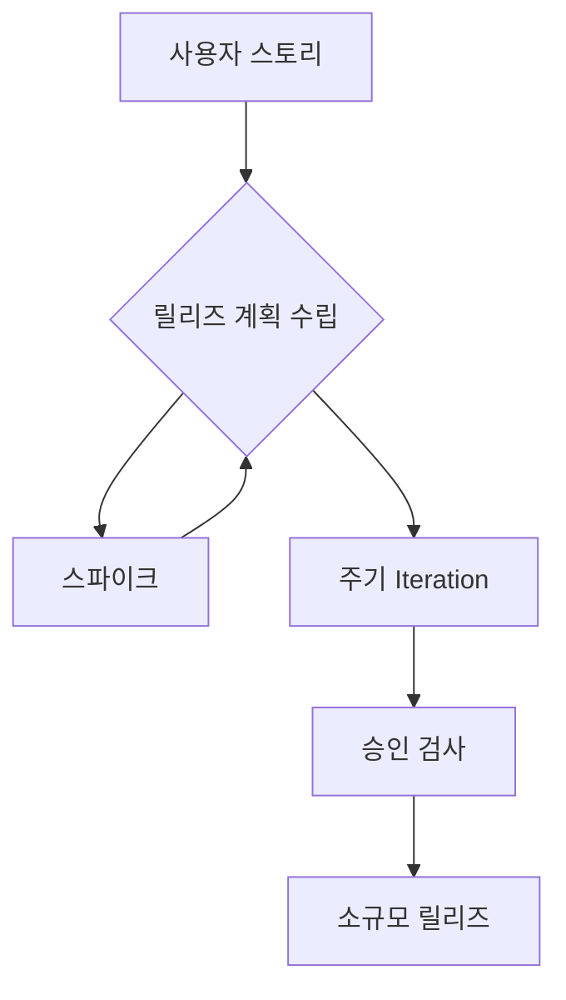
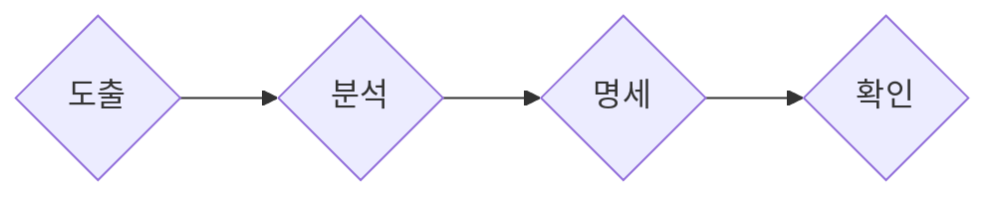
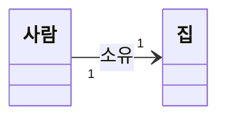
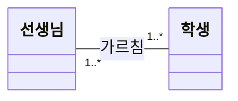
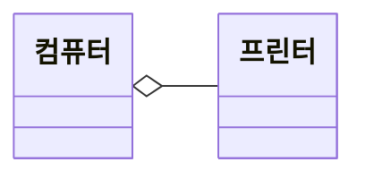
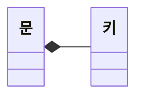
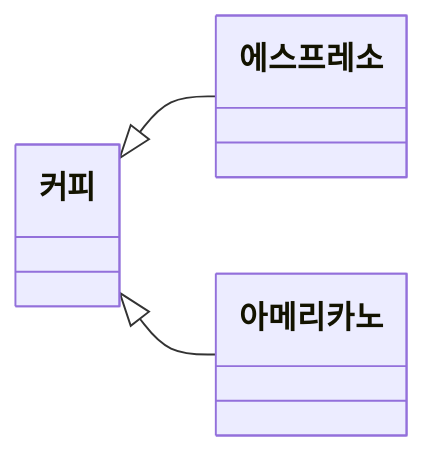
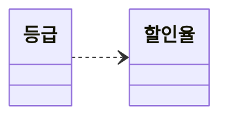
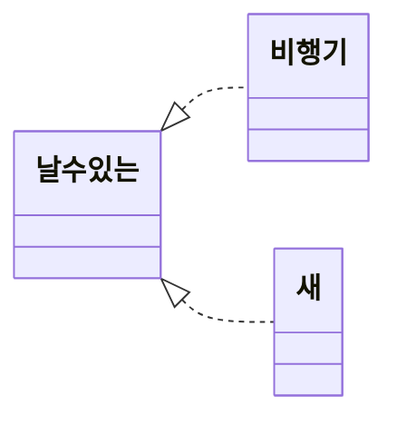

# 요구사항 확인

- [요구사항 확인](#요구사항-확인)
  - [1. 소프트웨어 생명 주기](#1-소프트웨어-생명-주기)
    - [1.1. 폭포수 모형](#11-폭포수-모형)
    - [1.2. 프로토타입 모형](#12-프로토타입-모형)
    - [1.3. 나선형 모형(점진적 모형)](#13-나선형-모형점진적-모형)
    - [1.4 애자일 모형](#14-애자일-모형)
  - [2. 스크럼 기법](#2-스크럼-기법)
    - [2.1. 제품 책임자(Product Owner)](#21-제품-책임자product-owner)
    - [2.2. 스크럼 마스터(Scrum Master)](#22-스크럼-마스터scrum-master)
    - [2.3. 개발팀(Development Team)](#23-개발팀development-team)
    - [2.4. 개발 프로세스](#24-개발-프로세스)
  - [3. XP(eXtreme Programming) 기법](#3-xpextreme-programming-기법)
    - [3.1. XP개발 프로세스](#31-xp개발-프로세스)
    - [3.2. XP의 주요 실천 방법](#32-xp의-주요-실천-방법)
  - [4. 현행 시스템 파악](#4-현행-시스템-파악)
  - [5. 개발 기술 환경 파악](#5-개발-기술-환경-파악)
    - [5.1. OS](#51-os)
    - [5.2. DBMS](#52-dbms)
    - [5.3. WAS(Web Application Service)](#53-wasweb-application-service)
  - [6. 요구사항 정의](#6-요구사항-정의)
    - [6.1. 요구사항 유형](#61-요구사항-유형)
    - [6.2. 요구사항 개발 프로세스](#62-요구사항-개발-프로세스)
  - [7. 요구사항 분석](#7-요구사항-분석)
    - [7.1. 구조적 분석](#71-구조적-분석)
    - [7.2. 자료 흐름도(DFD, Data Flow Diagram)](#72-자료-흐름도dfd-data-flow-diagram)
    - [7.3. 자료 사전(DD, Data Dictionary)](#73-자료-사전dd-data-dictionary)
  - [8. 요구사항 분석 Case와 HIPO](#8-요구사항-분석-case와-hipo)
    - [8.1 HIPO(Hierarchy Input Process Output)](#81-hipohierarchy-input-process-output)
  - [9. UML(Unified Modeling Language)](#9-umlunified-modeling-language)
    - [9.1 사물(Things)](#91-사물things)
    - [9.2. 관계](#92-관계)
      - [9.2.1. 연관(Association) 관계](#921-연관association-관계)
      - [9.2.2. 집합(Aggregation) 관계](#922-집합aggregation-관계)
      - [9.2.3. 포함(Composition) 관계](#923-포함composition-관계)
      - [9.2.4 일반화(Generalization) 관계](#924-일반화generalization-관계)
      - [9.2.5. 의존(Dependency) 관계](#925-의존dependency-관계)
      - [9.2.6. 실체화(Realization) 관계](#926-실체화realization-관계)
    - [9.3. 다이어그램(Diagram)](#93-다이어그램diagram)
      - [9.3.1 구조적 다이어그램 종류](#931-구조적-다이어그램-종류)
      - [9.3.2 행위 다이어그램 종류](#932-행위-다이어그램-종류)
      - [9.3.4. 스테레오 타입](#934-스테레오-타입)
  - [10. 주요 UML Diagram](#10-주요-uml-diagram)
    - [10.1 Use Case Diagram](#101-use-case-diagram)
    - [10.2 Class Diagram](#102-class-diagram)
    - [10.3 Sequence Diagram](#103-sequence-diagram)

## 1. 소프트웨어 생명 주기

**소프트웨어 생명 주기**는 소프트웨어를 개발하기 위해 정의하고 운용, 유지보수 등의 과정을 각 단계별로 나눈 것입니다.
**소프트웨어 공학**은 소프트웨어의 품질과 생산성을 향상시키기 위해 여러가지 방법론과 도구, 관리 기법들을 사용함.

### 1.1. 폭포수 모형

폭포수 모형은 가장 오래되고 폭넓게 사용되는 고전적 생명 주기 모형입니다.   
이 모델에서는 제품의 일부로 메뉴얼을 작성해야 합니다.   
각 단계를 확실히 매듭짓고 그 결과를 철저하게 검토하여 승인 과정을 거친 후 다음 단계를 진행하는 개발 방법론입니다.  

### 1.2. 프로토타입 모형

프로토타입 모형은 사용자의 요구사항을 정확히 파악하기 위해 실제 개발될 소프트웨어에 대한 견본(시제)품을 만들어 최종 결과물을 예측하는 모델입니다.  
시스템의 일부를 만들어 골격 코드로 사용합니다.   
단기간 제작을 목표로 하므로 비효율적인 언어나 알고리즘이 사용될 수 있습니다.  

**주의사항:** 개발 과정에서 새롭게 도출된 요구사항을 충분히 반영할 수 있습니다.

### 1.3. 나선형 모형(점진적 모형)

나선형 모형은 폭포수 모형과 프로토타입 모형에 위험 분석 기능을 추가한 모델입니다.  
여러 번의 소프트웨어 개발 과정을 거쳐 점진적으로 완벽한 최종 소프트웨어를 개발합니다.   
이 모델은 소프트웨어 개발 과정에서 발생할 수 있는 위험을 관리하고 최소화하는 것을 목적으로 합니다.   
핵심 기술에 문제가 있거나 사용자의 요구사항이 이해하기 어려운 경우에 적합합니다. 또한, 유지보수 과정이 필요하지 않습니다.  

### 1.4 애자일 모형

애자일 모형은 고객과의 소통에 초점을 맞춘 방법으로, 좋은 것을 빠르고 낭비 없이 만들기 위해 고객의 요구를 적극 수용합니다.    
짧은 개발 주기를 반복하여 주기마다 만들어지는 결과물에 대한 고객의 평가와 요구를 반영하고, 요구사항에 우선순위를 부여하여 개발을 진행합니다.   
이 모델은 소규모 프로젝트에 고도로 숙달된 개발자와 급변하는 요구사항에 적합합니다.     
애자일 모형에는 스크럼, XP, 칸반, Lean, 크리스탈, FDD(기능 중심 개발), ASD, DAD 등의 종류가 있습니다.

**애자일 4가지 핵심 가치:**
1. 프로세스와 도구보다는 개인과 상호작용에 더 가치를 둔다.
2. 방대한 문서보다는 실행되는 SW에 더 가치를 둔다.
3. 계약 협상보다는 고객과 협업에 더 가치를 둔다.
4. 계획을 따르기 보다는 변화에 반응하는 것에 더 가치를 둔다.

| 구분                | 폭포수 모형                | 애자일                |
|---------------------|---------------------------|-----------------------|
| 새로운 요구사항 반영 | 어려움                     | 지속적으로 반영       |
| 고객과의 의사소통   | 적음                       | 지속적                |
| 테스트              | 마지막에 모든 기능을 테스트 | 반복되는 일정 주기마다 테스트 |
| 개발 중심           | 계획, 문서(메뉴얼)         | 고객                  |

**각 모형별 사용 기준**
요구사항이 불분명 : 프로토타입
완성된 제품만 보길 원함 : 워터폴
고객이 개발 과정에 참여할 때 : 애자일
개발 과정에서 발생할 수 있는 위험 최소화 : 나선형

## 2. 스크럼 기법

### 2.1. 제품 책임자(Product Owner)

이해관계자(StakeHolder) 중 제일 이해가 높고 요구사항을 책임지고 의사결정할 사람.   
주로 개발 의뢰자나 사용자가 담당.  
요구사항이 담긴 백로그를 작성하고 백로그에 대한 우선순위를 지정한다.  
팀원들이 백로그에 스토리(요구사항)를 추가할 순 있지만 우선순위를 지정할 순 없다.  

**이해관계자**: 소프트웨어 개발 의뢰자, 개발자, 사용자 등
**백로그** : 제품 개발에 필요한 요구사항을 모두 모아 우선순위를 부여해 놓은 목록

### 2.2. 스크럼 마스터(Scrum Master)

스크럼 팀이 스크럼을 잘 수행할 수 있도록 객관적인 시각에서 조언을 해주는 가이드 역할.  
일일 스크럼 회의를 주관하여 진행 사항을 점검하고 개발 과정에서 발생된 장애 요소를 공론화하야 처리.

### 2.3. 개발팀(Development Team)

개발자 및 디자이너, 테스터 등 제품 개발을 위해 참여하는 모든 사람이 대상.

### 2.4. 개발 프로세스

- **제품 백로그 (Product Backlog)**:
  요구사항을 우선순위에 따라 나열한 목록.

- **스프린트 계획 회의 (Sprint Planning Meeting)**:
  백로그 중 이번 스프린트에서 수행할 작업을 대상으로 단기 일정을 수립하는 회의.

- **스프린트 (Sprint)**:
  실제 개발 작업을 진행하는 과정으로, 2~4주 정도의 기간 내에 진행됩니다. 개발자는 원하는 Task를 직접 선별해 담당하며, To Do, In Progress, Done 등의 상태를 가집니다.

- **일일 스크럼 회의 (Daily Scrum Meeting)**:
  모든 팀원이 약속된 시간에 15분 정도의 짧은 시간동안 진행 상황을 점검하는 회의입니다. 서서 진행하며 소멸 차트(Burn-down Chart)에 표시됩니다.

- **스프린트 검토 회의 (Sprint Review)**:
  부분 또는 전체 완성 제품이 요구사항에 잘 부합되는지 사용자가 포함된 참석자 앞에서 테스트를 수행하는 회의입니다. 제품책임자는 개선할 사항에 대한 피드백을 정리한 후 다음 스프린트에 반영할 수 있도록 제품 백로그를 업데이트합니다.

- **스프린트 회고 (Sprint Retrospective)**:
  스프린트 주기를 되돌아보며 정해놓은 규칙을 잘 준수했는지, 개선점은 없는지 등을 확인하고 기록하는 회의입니다. 해당 스프린트가 끝난 시점에 수행하거나 일정 주기로 수행됩니다.

**소멸 차트(Burn Down Chart)** : 해당 스프린트에서 수행할 작업의 진행 상황을 확인할 수 있도록 시간의 경과에 따라 남은 작업 시간을 그래프로 표현한 것. 초기에 추정했던 작업 시간은 작업이 진행될수록 점점 줄어듦.  

## 3. XP(eXtreme Programming) 기법

고객의 참여와 개발 과정 반복을 극대화하여 고객의 요구사항에 유연하게 대응.   
짧고 반복적인 주기. 단순한 설계, 고객의 적극적인 참여를 통해 소프트웨어 빠르게 개발.  
릴리즈의 기간을 짧게 반복하면서 고객의 요구사항 반영에 대한 가시성을 높임.  
릴리즈 테스트마다 고객을 직접 참여시키면서 요구한 기능이 제대로 작동하는지 고객이 직접 확인할 수 있음.  
비교적 소규모 인원의 개발 프로젝트에 효과적.  
5가지 핵심 가치 : 의사소통, 단순성, 용기, 존중, 피드백  

**가시성** : 고객에게 일부 기능이 구현될 때마다 확인시켜 요구사항이 잘 반영되고 있음을 알림.

### 3.1. XP개발 프로세스

- **스파이크**:
  요구사항의 신뢰성을 높이고 기술 문제에 대한 위험을 감소시키기 위해 별도로 만드는 프로그램. 처리할 문제 외에 다른 조건은 모두 무시하고 작성.

- **이터레이션**:
  하나의 릴리즈를 더 세분화한 단위. 보통 1~3주 정도의 기간으로 진행됨.

- **승인 검사**:
  릴리즈 단위의 부분 완료 제품이 구현되면 수행하는 테스트. 테스트 도중 발견한 사항은 다음 이터레이션에 포함될 수 있음.

- **소규모 릴리즈**:
  고객의 반응을 기능별로 확인할 수 있어 고객의 요구사항에 좀 더 유연하게 대응 가능한 작은 범위의 릴리즈.

### 3.2. XP의 주요 실천 방법

1. **Pair Programming**
   - 다른 사람과 함께 프로그래밍하는 방법.

2. **Collective Ownership**
   - 개발 코드에 대한 권한과 책임을 공동 소유하는 방식.

3. **Test Driven Development (TDD)**
   - 개발자가 실제 코드를 작성하기 전에 테스트 케이스를 먼저 작성하여 자신이 무엇을 해야 할지를 정확히 파악하는 방법.
   - 테스트가 지속적으로 진행될 수 있도록 자동화된 테스트 도구를 사용.

4. **Whole Team**
   - 개발에 참여하는 구성원은 역할을 가지고 있고, 그 역할에 대해 책임을 가진다.

5. **Continuous Integration**
   - 모듈 단위로 나눠 개발한 코드를 하나의 작업이 마무리될 때까지 지속적으로 통합하는 방식.

6. **Design Improvement**
   - 디자인 개선 또는 리팩토링을 통해 코드를 단순화하고 유연성을 강화하는 방법.

7. **Small Release**
   - 릴리즈 기간을 짧게 반복하여 고객의 요구 변화에 신속히 대응하는 방법.

## 4. 현행 시스템 파악

**1단계**
- **시스템 구성 파악**:
  - 주요 업무를 담당하는 기간 업무와 이를 지원하는 지원 업무를 파악합니다.
- **시스템 기능 파악**:
  - 주요 기능을 하부 기능과 세부 기능으로 구분하여 파악합니다.
- **시스템 인터페이스 파악**:
  - 데이터의 종류, 형식(XML, 고정 포맷, 가변 포맷), 프로토콜(TCP/IP), 연계 유형(EAI,FEP)을 파악합니다.

**2단계**
- **아키텍처 구성 파악**:
  - 사용되는 기술 요소를 최상위 수준에서 계층별로 표현한 아키텍처 구성도를 작성합니다.
- **소프트웨어 구성 파악**:
  - 단위 업무 시스템별로 설치된 소프트웨어 제품명, 용도, 라이선스를 파악합니다.

**3단계**
- **하드웨어 구성 파악**:
  - 단위 업무 시스템이 운용되는 서버의 주요 사양과 수량, 그리고 이중화의 적용 여부를 명시합니다.
- **네트워크 구성 파악**:
  - 서버 위치와 서버 간 네트워크 연결 방식을 통한 네트워크 구성도를 작성합니다.

**이중화** : 운용서버 장애 시 대기 서버로 서비스를 계속 유지할 수 있도록 운용 서버 자료 변경이 예비 서버에서도 동일하게 복제되도록 관리하는 것.

## 5. 개발 기술 환경 파악

OS, DBMS, MiddleWare 등 선정 시 고려사항 기술 & 오픈소스 사용시 주의해야 할 내용 제시
**MiddleWare**: 운영체제와 해당 운영체제에 의해 실행되는 응용프로그램 사이에서 운영체제가 제공하는 서비스 이외에 추가적인 서비스를 제공하는 소프트웨어.

### 5.1. OS
컴퓨터 시스템 자원 관리하고 효율적으로 사용할 수 있도록 환경을 제공하는 소프트웨어

**고려사항**

1.가용성
2.성능
3.기술지원
4.주변기기
5.구축비용

### 5.2. DBMS
사용자와 DB 사이에서 사용자의 요구에 따라 정보 생성해주고 관리해주는 소프트웨어  
기존 파일 시스템이 갖는 데이터의 종속성, 중복성의 문제를 해결하기 위해 제안된 시스템.

**고려사항**

1. 가용성
2. 성능
3. 기술지원
4. 상호호환성
5. 구축비용

### 5.3. WAS(Web Application Service)

정적인 콘텐츠 처리를 하는 웹서버와 달리 사용자 요구에 따라 변하는 동적인 컨텐츠를 다루기 위해 사용되는 미들웨어.  
주로 DB와 연동해 사용.

종류 : Tomcat, GlassFish, JBoss, Jetty, Jeus, Resin, WebLogic, WebSphere
**고려사항**
1. 가용성
2. 성능
3. 기술 지원
4. 구축 비용

## 6. 요구사항 정의

소프트웨어가 문제를 해결하기 위해 제공하는 서비스에 대한 설명과 정상적으로 운영되는데 필요한 제약조건 및 문제 해결을 위한 필요조건이 기술됩니다.

### 6.1. 요구사항 유형

요구사항은 기능과 비기능 요구사항으로 나뉩니다.

- **기능 요구사항**은 무엇을 하는지, 어떤 기능을 하는지, 수행해야 하는 기능에 대한 사항을 명시합니다.
  - *예시:* 사용자는 회원ID와 비밀번호를 입력해 로그인할 수 있어야 합니다.

- **비기능 요구사항**은 품질, 장비, 성능과 같은 제약사항과 관련이 있습니다.
  - *예시:* 시스템은 연중무휴로 24시간 운영 가능해야 합니다.
  - 품질 : 가용성, 정합성, 상호호환성, 대응성, 이식성, 확장성
    - 가용성 : 사용하고자 할 때 언제라도 사용할 수 있는 정도
    - 정합성 : 데이터의 값이 서로 모순 없이 일관되게 일치하는 정도
    - 상호호환성 : 다른 소프트웨어와 정보를 교환할 수 있는 정도
    - 대응성 : 발생한 상황에 대처하는 정도
    - 이식성 : 다양한 하드웨어 환경에서도 운용 가능하도록 쉽게 수정될 수 있는 정도
    - 확장성 : 규모나 범위를 넓힐 수 있는 정도

요구사항은 기술 관점과 대상의 범위에 따라 시스템 요구사항과 사용자 요구사항으로 나뉘어집니다.

### 6.2. 요구사항 개발 프로세스

요구사항 개발 프로세스는 개발 대상에 대한 요구사항을 체계적으로 도출하고 이를 분석한 후 분석 결과를 명세서(Specification Document)에 정리한 다음 마지막으로 이를 확인 및 검증하는 일련의 구조화된 활동을 포함합니다.

요구공학은 요구사항 관리 및 요구사항 개발을 포함하는 학문이며, 다음과 같은 과정을 거칩니다:

- **도출(Requirement Elicitation)**: 소프트웨어가 해결해야 할 문제를 이해하기 위해 청취, 인터뷰 등의 기술을 사용합니다. 주요 기법으로는 Use Case, 프로토타이핑, 워크샵, 브레인스토밍, 설문, 인터뷰 등이 있습니다. 문제 이해의 첫 단계.
- **분석(Requirement Analysis)**: 요구사항을 분석하고 중재하여 명확하지 않거나 모호한 부분을 발견하고 걸러내는 과정입니다. 자료 흐름도(DFD), 자료 사전(DD) 등의 기술을 사용합니다.
- **명세(Requirement Specification)**: 분석된 요구사항을 기반으로 모델을 작성하고 문서화하는 단계입니다.
- **확인(Requirement Validation)**: 요구사항 명세서가 정확하고 완전히 작성되었는지를 모든 이해관계자들이 검토하는 활동입니다.

형상 관리(SCM, Software Configuration Management)는 소프트웨어 개발 단계에서 만들어지는 프로그램, 문서, 데이터 등의 형상을 관리합니다.

## 7. 요구사항 분석

개발의 실제적인 첫 단계.
요구사항 분석은 소프트웨어 개발 과정에서 핵심적인 부분으로, 다양한 도구를 활용하여 구조적인 분석을 진행합니다. 
개발 대상에 대한 사용자의 요구사항을 이해하고 문서화(명세화)하는 활동을 의미.  
구조적 분석 기법에 이용됨
주요 도구로는 UML(Unified Modeling Language), 자료 흐름도(DFD), 자료 사전(DD), 소단위 명세서(Mini -Spec.), 개체 관계도(ERD), 상태 전이도(STD), 제어 명세서 등이 있습니다.

### 7.1. 구조적 분석

구조적 분석은 자료의 흐름과 처리를 중심으로 하는 요구사항 분석 방법입니다.  
도형 중심의 분석용 도구와 분석 절차 이용.  

### 7.2. 자료 흐름도(DFD, Data Flow Diagram)
   

자료 흐름도는 자료의 흐름과 기능을 중심으로 한 요구사항 분석 도구입니다.   
자료 흐름도에서는 자료의 흐름과 기능을 프로세스(Process), 자료 흐름(Data Flow), 자료 저장소(Data Store), 단말(Terminator)의 네 가지 기본 기호로 표시됩니다. 처리를 거칠 때마다 새로운 이름이 부여되며, 출력이 있으면 입력도 있어야 합니다.   
상위 단계의 처리와 하위 자료 흐름도의 자료 흐름은 서로 일치해야 합니다.   
입력 화살표가 있는 것은 출력 화살표가 있는 것과 일치하지 않을 수 있습니다.  

### 7.3. 자료 사전(DD, Data Dictionary)

  

[|] : 또는(Or)

자료 흐름도에 있는 자료를 더 자세히 정의하고 기록한 것.  
메타 데이터.

## 8. 요구사항 분석 Case와 HIPO

요구사항 분석을 위한 Case 자동화 도구로는 SATD, SREM, PSL/PSA, TAGS, EPOS 등이 있습니다.

- **SADT(Structured Analysis and Design Technique)**: Softtech 사에서 개발. 구조적 요구분석을 위해 블록 다이어그램을 채택한 자동화 도구입니다. 시스템 정의, 요구사항 분석, 설계를 위해 사용됩니다.

- **SREM(Software Requirements Engineering Methodology)** = RSL/REVS: 실시간 처리 소프트웨어 시스템에서 요구사항을 명확히 기술하도록 하는 목적으로 개발되었습니다.
  - **RSL(Requirement Statement Language)**: 요소, 속성, 관계, 구조를 기술하는 요구사항 기술 언어입니다.
  - **REVS(Requirement Engineering and Validation System)**: RSL로 기술된 요구사항을 자동으로 분석하여 요구사항 분석 명세서를 출력하는 분석 도구입니다.

- **PSL/PSA**: PSL(Problem Statement Language)은 문제를 기술하는 언어이며, PSA(Problem Statement Analyzer)는 PSL로 기술된 요구사항을 자동으로 분석하여 다양한 보고서를 출력하는 분석 도구입니다.

- **TAGS(Technology for Automated Generation of System)**: 시스템 공학 방법에 대한 자동 접근 방법을 제공합니다.

### 8.1 HIPO(Hierarchy Input Process Output)

HIPO(Hierarchy Input Process Output)는 하향식 소프트웨어 개발을 위한 문서화 도구입니다. 이 기법은 시스템의 분석, 설계, 문서화에 사용되며 시스템 실행 과정인 입력, 처리, 출력의 기능을 나타냅니다. HIPO를 사용함으로써 체계적인 문서 관리가 가능하며, 기호와 도표를 사용하여 기능과 자료의 의존 관계를 동시에 표현 가능하며 변경 및 유지보수가 용이해집니다.

**HIPO Chart**는 시스템의 기능을 여러 개의 고유 모듈로 분할하여 이들 간의 인터페이스를 계층 구조로 표현한 것입니다. 다음과 같은 종류의 도표가 있습니다:

- **가시적 도표(Visual Table of Contents)**: 시스템의 전체적인 기능과 흐름을 보여주는 계층 구조를 나타냅니다.
- **총체적 도표(Overview Diagram)**: 프로그램을 구성하는 기능을 기술한 것으로, 입력, 처리, 출력에 대한 전반적인 정보를 제공합니다.
- **세부적 도표(Detail Diagram)**: 총체적 도표에 표시된 기능을 구성하는 기본 요소들을 상세히 기술하는 도표입니다.

이러한 도표를 사용하여 시스템의 구조와 기능을 명확하게 이해하고 문서화할 수 있습니다. HIPO는 소프트웨어 개발 프로세스에서 중요한 단계 중 하나이며, 팀 간의 의사 소통과 협력을 촉진하는 데 도움이 됩니다.

## 9. UML(Unified Modeling Language)

표준화된 모델링 언어.
UML(Unified Modeling Language)은 시스템 분석, 설계, 구현 등의 과정에서 개발자와 고객 간의 원활한 의사소통을 위해 표준화된 객체지향 모델링 언어입니다.   
UML은 사물(Things), 관계(Relationship), 다이어그램(Diagram) 등의 구성 요소로 이루어져 있습니다.

**모델링 언어** : 시각적으로 표현할 수 있는 표기법, 도구

### 9.1 사물(Things)

사물은 UML 모델의 기본 요소로, 다이어그램에서 관계를 형성할 수 있는 대상입니다.

- **구조 사물(Structural Things)**: 시스템의 개념적 또는 물리적 요소를 나타냅니다.
  - 클래스, 유즈 케이스, 컴포넌트, 노드 등이 포함됩니다.
  
- **행동 사물(Behavioral Things)**: 시간과 공간에 따른 요소들의 동작을 표현합니다.
  - 상호작용, 상태 머신 등이 있습니다.
  
- **그룹 사물(Grouping Things)**: 요소들을 묶어서 표현합니다.
  - 패키지로 표현됩니다.
  
- **주해 사물(Annotation Things)**: 부가적인 설명이나 제약 조건 등을 나타냅니다.
  - 주로 노트 형태로 표현됩니다.

### 9.2. 관계

#### 9.2.1. 연관(Association) 관계

2개 이상의 사물이 서로 관련되어 있음.  
|다중도|의미|  
|-----|----|
|1   |1개의 객체가 연관              |
|n   |n개의 객체가 연관              |  
|0..1|연관된 객체가 없거나 1개만 존재 |
|0..*|연관된 객체가 없거나 다수       |
|1..*|연관된 객체가 적어도 1개 이상   |
|n..*|연관된 객체가 적어도 n개 이상   |
|n..m|연관된 객체가 n개 이상 m개 이하 |

#### 9.2.2. 집합(Aggregation) 관계
하나의 사물이 다른 사물에 포함되어 있는 관계

#### 9.2.3. 포함(Composition) 관계

포함하는 사물의 변화가 포함되는 사물에 영향을 미치는 관계.
- 하위 객체에 영향을 미치는가.

#### 9.2.4 일반화(Generalization) 관계

하나의 사물이 다른 사물에 비해 더 일반적인지 구체적인지 표현.

#### 9.2.5. 의존(Dependency) 관계
필요에 의해 서로에게 영향을 주는 짧은 시간 동안만 연관을 유지하는 관계.  
  - 한 클래스가 다른 클래스를 오퍼레이션의 매개변수로 사용하는 경우.
  - 하나의 사물과 다른 사물이 소유관계는 아니지만 사물의 변화가 다른 사물에도 영향을 미치는 관계.
- 영향을 주는 사물이 영향을 받는 사물 쪽으로 화살표 연결.

#### 9.2.6. 실체화(Realization) 관계
사물이 할 수 있거나 해야하는 기능(Operation, Interface)으로 서로를 그룹화 할 수 있는 관계
  - 한 사물이 다른 사물에게 오퍼레이션을 수행하도록 지정하는 의미적 관계

### 9.3. 다이어그램(Diagram)
  
사물의 관계를 도형으로 표현한 것.  
가시화된 뷰를 제공함으로써 의사소통에 도움을 줌.
- 정적 모델링 : 구조적 다이어그램  
- 동적 모델링 : 행위 다이어그램

#### 9.3.1 구조적 다이어그램 종류 
- 클래스 다이어그램: 시스템의 클래스, 속성, 연산 및 클래스 간의 관계를 보여주는 다이어그램입니다. 주로 시스템의 정적인 구조를 표현합니다.

- 객체 다이어그램: 클래스 인스턴스인 객체 간의 상호작용을 보여주는 다이어그램입니다. 시스템의 런타임 구조를 보다 상세하게 표현합니다. 특정 시점의 객체와 객체 사이의 관계로 표현함.

- 컴포넌트 다이어그램: 실제 구현 모듈인 컴포넌트 간 관계나 컴포넌트 간의 인터페이스를 구현. 구현 단계에서 사용되는 다이어그램.

- 배치 다이어그램: 시스템의 물리적인 배치를 나타내는 다이어그램으로, 소프트웨어 및 하드웨어 구성 요소 간의 관계를 보여줍니다. 구현 단계에서 사용되는 다이어그램.  

- 복합체 구조 다이어그램: 복합체의 내부 구조와 그 구성 요소들 간의 관계를 보여주는 다이어그램입니다. 복잡한 객체나 구조를 이해하는 데 도움이 됩니다.
- 패키지 다이어그램: 시스템의 패키지들 간의 종속성 및 구조를 보여주는 다이어그램으로, 소프트웨어의 모듈화된 설계를 시각화하는 데 사용됩니다.

#### 9.3.2 행위 다이어그램 종류
- 유스케이스 다이어그램: 사용자의 요구를 분석하는 것으로 기능 모델링 작업에 사용함. 사용자(Actor)와 사용 사례(Use Case)로 구성됨.  

- 순차 다이어그램: 상호 작용하는 시스템이나 객체들이 주고받는 `메세지`를 표현함.    

- 커뮤니케이션 다이어그램: 순차다이어그램의 메세지 뿐만 아니라, 객체들 간의 연관까지 표현.  
  
- 상태 다이어그램: 하나의 객체가 자신이 속한 클래스의 상태 변화 혹은 다른 객체와의 상호작용에 따라 상태가 어떻게 변하는지를 표현. `이벤트(event)`에 의한 객체들의 상태 변화를 그림으로 표현함.  

- 활동 다이어그램: 오퍼레이션이나 처리 과정이 수행되는 동안 일어나는 일들을 단계적으로 표현.
- 상호작용 개요 다이어그램: 여러 행위 다이어그램의 요약된 표현으로, 시스템의 상호작용을 개략적으로 보여줍니다.  
- 타이밍 다이어그램: 객체의 상태 변화와 이벤트 발생 시간을 시간축에 따라 보여주는 다이어그램입니다. 실시간 시스템에서 사용됩니다.  

럼바우(Rumbaugh)객체지향 분석 기법에서 활용되는 다이어그램 : (정적)객체 다이어그램, (동적)상태 다이어그램  

#### 9.3.4. 스테레오 타입
UML에서 표현하는 기본 기능 외에 추가적인 가능을 표현하기 위해 사용.  
길라멧(Guilemet)이라고 부르는 겹화살괄호(<<>>) 사이에 표현할 형태를 기술.  
  
`<<include>>` : 연결된 다른 UML 요소에 대해 포함 관계에 있는 경우  
`<<extend>>` : 연결된 다른 UML 요소에 대해 확장 관계에 있는 경우  
`<<interface>>` : 인터페이스를 정의하는 경우  
`<<exception>>` : 예외를 정의하는 경우  
`<<constructor>>` : 생성자 역할을 수행하는 경우

## 10. 주요 UML Diagram

### 10.1 Use Case Diagram
  
개발된 시스템과 관련된 외부 요소들, 즉 사용자와 다른 외부 시스템들이 개발될 시스템을 이용해 수행할 수 있는 기능을 사용자의 관점(View)에서 표현한 것.  

**시스템/시스템 범위**  
시스템 내부에서 수행되는 기능들을 외부 시스템과 구분하기 위해 시스템 내부의 유스케이스들을 사각형으로 묶어 범위를 표현    

**액터(Actor)**  
시스템과 상호작용을 하는 모든 외부 요소. 사람이나 외부 시스템. 주액터(사람), 부액터(시스템, 조직, 기관)    

**유스 케이스(Use Case)**  
사용자가 보는 관점에서 시스템이 액터에게 제공하는 서비스 또는 기능.    

**관계(Relationship)**  
액터와 유스 케이스, 유스케이스와 유스케이스 사이에서 나타나는 연관관계, 포함관계, 확장관계, 일반화 관계를 표현할 수 있음.  

### 10.2 Class Diagram
  
시스템을 구성하는 클래스, 클래스의 특성인 속성과 오퍼레이션, 속성과 오퍼레이션에 대한 제약조건, 클래스 사이의 관계를 표현한 것.  

**클래스**  
각각의 객체들이 갖는 속성과 오퍼레이션(동작)을 표현함.  
- 이름
- 속성(Attribute) : 클래스의 상태나 정보를 표현
- 오퍼레이션(Operation) : 클래스가 수행할 수 있는 동작. 함수(Method)라고도 함.  

**제약조건**  
속성에 입력될 값에 대한 제약조건이나 오퍼레이션 수행 전후에 지정해야 할 조건이 있다면 이를 적음.  
**관계**  
클래스와 클래스 사이 연관성.

**접근제어자**
속성과 오퍼레이션에 동일하게 적용되며 표현법은 다음과 같음.

|접근제어자|표현법|내용|
|---------|------|----|
|public   |+     |어떤 클래스에서라도 접근 가능|
|private  |-     |해당 클래스 내에서만 접근 가능|
|protected|#     |동일 패키지 내 클래스 또는 해당 클래스를 상속 받은 외부 패키지의 클래스에서만 접근 가능|
|package  |~     |동일 패키지 내부에 있는 클래스에서만 접근 가능|

### 10.3 Sequence Diagram
  
시스템이나 객체가 메세지를 주고받으면서 시간의 흐름에 따라 상호 작용하는 과정을 액터, 객체, 메세지 등의 요소를 사용해 그림으로 표현한 것.  
객체들간 수행 기간 및 동작에 참여하는 시스템을 알 수 있음.  
수직 방향은 시간 흐름을 나타냄.  

- 액터(Actor) : 시스템으로부터 서비스를 요청하는 외부 요소. 사람이나 외부 시스템.
- 객체(Object) : 메세지를 주고받는 객체.
- 생명선(LifeLine) : 객체가 메모리에 존재하는 기간. 객체 아래쪽에 점선을 그어 표현.
- 실행 상자(Active Box) : 객체가 메세지를 주고받으며 구동되고 있음을 표현.
- 메시지 : 객체가 상호작용을 위해 주고받는 메세지. 오퍼레이션이 곧 메시지
- 회귀 메시지 : 객체가 처리한 반환값이 담긴 메시지.
- 제어 블록(Loop) : 반복처리되는 영역 표현

