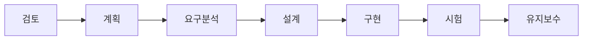
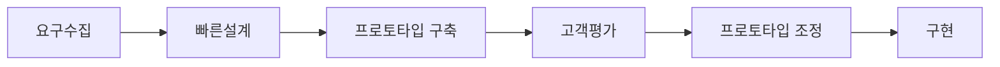
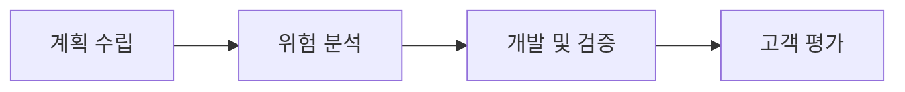
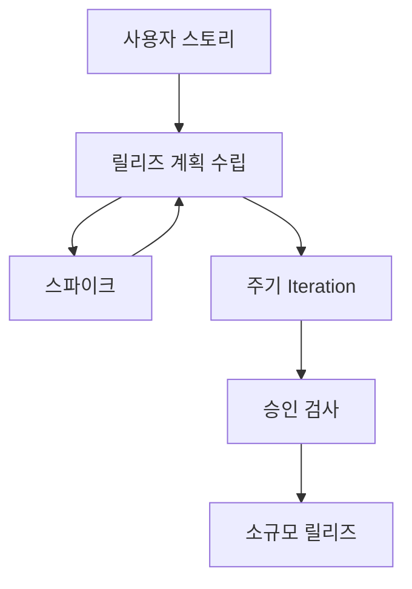

# 요구사항 확인

- [요구사항 확인](#요구사항-확인)
  - [1. 소프트웨어 생명 주기](#1-소프트웨어-생명-주기)
    - [1.1. 폭포수 모형](#11-폭포수-모형)
    - [1.2. 프로토타입 모형](#12-프로토타입-모형)
    - [1.3. 나선형 모형(점진적 모형)](#13-나선형-모형점진적-모형)
    - [1.4 애자일 모형](#14-애자일-모형)
  - [2. 스크럼 기법](#2-스크럼-기법)
    - [2.1. 제품 책임자(Product Owner)](#21-제품-책임자product-owner)
    - [2.2. 스크럼 마스터(Scrum Master)](#22-스크럼-마스터scrum-master)
    - [2.3. 개발팀(Development Team)](#23-개발팀development-team)
    - [2.4. 개발 프로세스](#24-개발-프로세스)
  - [3. XP(eXtreme Programming) 기법](#3-xpextreme-programming-기법)
    - [3.1. XP개발 프로세스](#31-xp개발-프로세스)
    - [3.2. XP의 주요 실천 방법](#32-xp의-주요-실천-방법)
  - [4. 현행 시스템 파악](#4-현행-시스템-파악)
  - [5. 개발 기술 환경 파악](#5-개발-기술-환경-파악)
    - [5.1. OS](#51-os)
    - [5.2. DBMS](#52-dbms)
    - [5.3. WAS(Web Application Service)](#53-wasweb-application-service)
  - [6. 요구사항 정의](#6-요구사항-정의)
  - [7. 요구사항 분석](#7-요구사항-분석)
  - [8. 요구사항 분석 Case와 HIPO](#8-요구사항-분석-case와-hipo)
  - [9. UML(Unified Modeling Language)](#9-umlunified-modeling-language)
  - [10. 주요 UML Diagram](#10-주요-uml-diagram)

## 1. 소프트웨어 생명 주기

**소프트웨어 생명 주기**는 소프트웨어를 개발하기 위해 정의하고 운용, 유지보수 등의 과정을 각 단계별로 나눈 것입니다.
**소프트웨어 공학**은 소프트웨어의 품질과 생산성을 향상시키기 위해 여러가지 방법론과 도구, 관리 기법들을 사용함.

### 1.1. 폭포수 모형

폭포수 모형은 가장 오래되고 폭넓게 사용되는 고전적 생명 주기 모형입니다.   
이 모델에서는 제품의 일부로 메뉴얼을 작성해야 합니다.   
각 단계를 확실히 매듭짓고 그 결과를 철저하게 검토하여 승인 과정을 거친 후 다음 단계를 진행하는 개발 방법론입니다.  

### 1.2. 프로토타입 모형

프로토타입 모형은 사용자의 요구사항을 정확히 파악하기 위해 실제 개발될 소프트웨어에 대한 견본(시제)품을 만들어 최종 결과물을 예측하는 모델입니다.  
시스템의 일부를 만들어 골격 코드로 사용합니다.   
단기간 제작을 목표로 하므로 비효율적인 언어나 알고리즘이 사용될 수 있습니다.  

**주의사항:** 개발 과정에서 새롭게 도출된 요구사항을 충분히 반영할 수 있습니다.

### 1.3. 나선형 모형(점진적 모형)

나선형 모형은 폭포수 모형과 프로토타입 모형에 위험 분석 기능을 추가한 모델입니다.  
여러 번의 소프트웨어 개발 과정을 거쳐 점진적으로 완벽한 최종 소프트웨어를 개발합니다.   
이 모델은 소프트웨어 개발 과정에서 발생할 수 있는 위험을 관리하고 최소화하는 것을 목적으로 합니다.   
핵심 기술에 문제가 있거나 사용자의 요구사항이 이해하기 어려운 경우에 적합합니다. 또한, 유지보수 과정이 필요하지 않습니다.  

### 1.4 애자일 모형

애자일 모형은 고객과의 소통에 초점을 맞춘 방법으로, 좋은 것을 빠르고 낭비 없이 만들기 위해 고객의 요구를 적극 수용합니다.    
짧은 개발 주기를 반복하여 주기마다 만들어지는 결과물에 대한 고객의 평가와 요구를 반영하고, 요구사항에 우선순위를 부여하여 개발을 진행합니다.   
이 모델은 소규모 프로젝트에 고도로 숙달된 개발자와 급변하는 요구사항에 적합합니다.     
애자일 모형에는 스크럼, XP, 칸반, Lean, 크리스탈, FDD(기능 중심 개발), ASD, DAD 등의 종류가 있습니다.

**애자일 4가지 핵심 가치:**
1. 프로세스와 도구보다는 개인과 상호작용에 더 가치를 둔다.
2. 방대한 문서보다는 실행되는 SW에 더 가치를 둔다.
3. 계약 협상보다는 고객과 협업에 더 가치를 둔다.
4. 계획을 따르기 보다는 변화에 반응하는 것에 더 가치를 둔다.

| 구분                | 폭포수 모형                | 애자일                |
|---------------------|---------------------------|-----------------------|
| 새로운 요구사항 반영 | 어려움                     | 지속적으로 반영       |
| 고객과의 의사소통   | 적음                       | 지속적                |
| 테스트              | 마지막에 모든 기능을 테스트 | 반복되는 일정 주기마다 테스트 |
| 개발 중심           | 계획, 문서(메뉴얼)         | 고객                  |

**각 모형별 사용 기준**
요구사항이 불분명 : 프로토타입
완성된 제품만 보길 원함 : 워터폴
고객이 개발 과정에 참여할 때 : 애자일
개발 과정에서 발생할 수 있는 위험 최소화 : 나선형

## 2. 스크럼 기법

### 2.1. 제품 책임자(Product Owner)

이해관계자(StakeHolder) 중 제일 이해가 높고 요구사항을 책임지고 의사결정할 사람.   
주로 개발 의뢰자나 사용자가 담당.  
요구사항이 담긴 백로그를 작성하고 백로그에 대한 우선순위를 지정한다.  
팀원들이 백로그에 스토리(요구사항)를 추가할 순 있지만 우선순위를 지정할 순 없다.  

**이해관계자**: 소프트웨어 개발 의뢰자, 개발자, 사용자 등
**백로그** : 제품 개발에 필요한 요구사항을 모두 모아 우선순위를 부여해 놓은 목록

### 2.2. 스크럼 마스터(Scrum Master)

스크럼 팀이 스크럼을 잘 수행할 수 있도록 객관적인 시각에서 조언을 해주는 가이드 역할.  
일일 스크럼 회의를 주관하여 진행 사항을 점검하고 개발 과정에서 발생된 장애 요소를 공론화하야 처리.

### 2.3. 개발팀(Development Team)

개발자 및 디자이너, 테스터 등 제품 개발을 위해 참여하는 모든 사람이 대상.

### 2.4. 개발 프로세스

- **제품 백로그 (Product Backlog)**:
  요구사항을 우선순위에 따라 나열한 목록.

- **스프린트 계획 회의 (Sprint Planning Meeting)**:
  백로그 중 이번 스프린트에서 수행할 작업을 대상으로 단기 일정을 수립하는 회의.

- **스프린트 (Sprint)**:
  실제 개발 작업을 진행하는 과정으로, 2~4주 정도의 기간 내에 진행됩니다. 개발자는 원하는 Task를 직접 선별해 담당하며, To Do, In Progress, Done 등의 상태를 가집니다.

- **일일 스크럼 회의 (Daily Scrum Meeting)**:
  모든 팀원이 약속된 시간에 15분 정도의 짧은 시간동안 진행 상황을 점검하는 회의입니다. 서서 진행하며 소멸 차트(Burn-down Chart)에 표시됩니다.

- **스프린트 검토 회의 (Sprint Review)**:
  부분 또는 전체 완성 제품이 요구사항에 잘 부합되는지 사용자가 포함된 참석자 앞에서 테스트를 수행하는 회의입니다. 제품책임자는 개선할 사항에 대한 피드백을 정리한 후 다음 스프린트에 반영할 수 있도록 제품 백로그를 업데이트합니다.

- **스프린트 회고 (Sprint Retrospective)**:
  스프린트 주기를 되돌아보며 정해놓은 규칙을 잘 준수했는지, 개선점은 없는지 등을 확인하고 기록하는 회의입니다. 해당 스프린트가 끝난 시점에 수행하거나 일정 주기로 수행됩니다.

**소멸 차트(Burn Down Chart)** : 해당 스프린트에서 수행할 작업의 진행 상황을 확인할 수 있도록 시간의 경과에 따라 남은 작업 시간을 그래프로 표현한 것. 초기에 추정했던 작업 시간은 작업이 진행될수록 점점 줄어듦.  

## 3. XP(eXtreme Programming) 기법

고객의 참여와 개발 과정 반복을 극대화하여 고객의 요구사항에 유연하게 대응.   
짧고 반복적인 주기. 단순한 설계, 고객의 적극적인 참여를 통해 소프트웨어 빠르게 개발.  
릴리즈의 기간을 짧게 반복하면서 고객의 요구사항 반영에 대한 가시성을 높임.  
릴리즈 테스트마다 고객을 직접 참여시키면서 요구한 기능이 제대로 작동하는지 고객이 직접 확인할 수 있음.  
비교적 소규모 인원의 개발 프로젝트에 효과적.  
5가지 핵심 가치 : 의사소통, 단순성, 용기, 존중, 피드백  

**가시성** : 고객에게 일부 기능이 구현될 때마다 확인시켜 요구사항이 잘 반영되고 있음을 알림.

### 3.1. XP개발 프로세스

- **스파이크**:
  요구사항의 신뢰성을 높이고 기술 문제에 대한 위험을 감소시키기 위해 별도로 만드는 프로그램. 처리할 문제 외에 다른 조건은 모두 무시하고 작성.

- **이터레이션**:
  하나의 릴리즈를 더 세분화한 단위. 보통 1~3주 정도의 기간으로 진행됨.

- **승인 검사**:
  릴리즈 단위의 부분 완료 제품이 구현되면 수행하는 테스트. 테스트 도중 발견한 사항은 다음 이터레이션에 포함될 수 있음.

- **소규모 릴리즈**:
  고객의 반응을 기능별로 확인할 수 있어 고객의 요구사항에 좀 더 유연하게 대응 가능한 작은 범위의 릴리즈.

### 3.2. XP의 주요 실천 방법

1. **Pair Programming**
   - 다른 사람과 함께 프로그래밍하는 방법.

2. **Collective Ownership**
   - 개발 코드에 대한 권한과 책임을 공동 소유하는 방식.

3. **Test Driven Development (TDD)**
   - 개발자가 실제 코드를 작성하기 전에 테스트 케이스를 먼저 작성하여 자신이 무엇을 해야 할지를 정확히 파악하는 방법.
   - 테스트가 지속적으로 진행될 수 있도록 자동화된 테스트 도구를 사용.

4. **Whole Team**
   - 개발에 참여하는 구성원은 역할을 가지고 있고, 그 역할에 대해 책임을 가진다.

5. **Continuous Integration**
   - 모듈 단위로 나눠 개발한 코드를 하나의 작업이 마무리될 때까지 지속적으로 통합하는 방식.

6. **Design Improvement**
   - 디자인 개선 또는 리팩토링을 통해 코드를 단순화하고 유연성을 강화하는 방법.

7. **Small Release**
   - 릴리즈 기간을 짧게 반복하여 고객의 요구 변화에 신속히 대응하는 방법.

## 4. 현행 시스템 파악

**1단계**
- **시스템 구성 파악**:
  - 주요 업무를 담당하는 기간 업무와 이를 지원하는 지원 업무를 파악합니다.
- **시스템 기능 파악**:
  - 주요 기능을 하부 기능과 세부 기능으로 구분하여 파악합니다.
- **시스템 인터페이스 파악**:
  - 데이터의 종류, 형식(XML, 고정 포맷, 가변 포맷), 프로토콜(TCP/IP), 연계 유형(EAI,FEP)을 파악합니다.

**2단계**
- **아키텍처 구성 파악**:
  - 사용되는 기술 요소를 최상위 수준에서 계층별로 표현한 아키텍처 구성도를 작성합니다.
- **소프트웨어 구성 파악**:
  - 단위 업무 시스템별로 설치된 소프트웨어 제품명, 용도, 라이선스를 파악합니다.

**3단계**
- **하드웨어 구성 파악**:
  - 단위 업무 시스템이 운용되는 서버의 주요 사양과 수량, 그리고 이중화의 적용 여부를 명시합니다.
- **네트워크 구성 파악**:
  - 서버 위치와 서버 간 네트워크 연결 방식을 통한 네트워크 구성도를 작성합니다.

**이중화** : 운용서버 장애 시 대기 서버로 서비스를 계속 유지할 수 있도록 운용 서버 자료 변경이 예비 서버에서도 동일하게 복제되도록 관리하는 것.

## 5. 개발 기술 환경 파악

OS, DBMS, MiddleWare 등 선정 시 고려사항 기술 & 오픈소스 사용시 주의해야 할 내용 제시
**MiddleWare**: 운영체제와 해당 운영체제에 의해 실행되는 응용프로그램 사이에서 운영체제가 제공하는 서비스 이외에 추가적인 서비스를 제공하는 소프트웨어.

### 5.1. OS
컴퓨터 시스템 자원 관리하고 효율적으로 사용할 수 있도록 환경을 제공하는 소프트웨어

**고려사항**

1.가용성
2.성능
3.기술지원
4.주변기기
5.구축비용

### 5.2. DBMS
사용자와 DB 사이에서 사용자의 요구에 따라 정보 생성해주고 관리해주는 소프트웨어  
기존 파일 시스템이 갖는 데이터의 종속성, 중복성의 문제를 해결하기 위해 제안된 시스템.

**고려사항**

1. 가용성
2. 성능
3. 기술지원
4. 상호호환성
5. 구축비용

### 5.3. WAS(Web Application Service)

정적인 콘텐츠 처리를 하는 웹서버와 달리 사용자 요구에 따라 변하는 동적인 컨텐츠를 다루기 위해 사용되는 미들웨어.  
주로 DB와 연동해 사용.

종류 : Tomcat, GlassFish, JBoss, Jetty, Jeus, Resin, WebLogic, WebSphere
**고려사항**
1. 가용성
2. 성능
3. 기술 지원
4. 구축 비용

## 6. 요구사항 정의

## 7. 요구사항 분석

내용을 입력하세요.

## 8. 요구사항 분석 Case와 HIPO

내용을 입력하세요.

## 9. UML(Unified Modeling Language)

내용을 입력하세요.

## 10. 주요 UML Diagram

내용을 입력하세요.