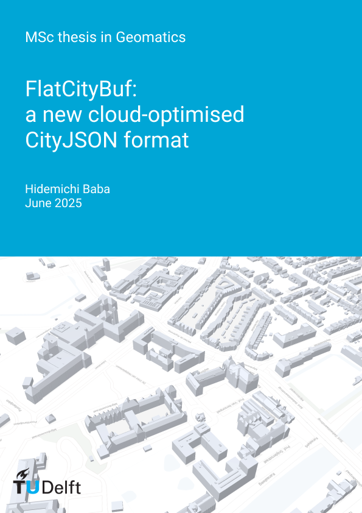

<h1>{{ page.title }} beta</h1>

[{:width="250px"}](https://github.com/cityjson/flatcitybuf)

**FlatCityBuf** is a new cloud-optimised format for 3D city models based on FlatBuffers and CityJSON.

## Key Features

- **Zero-copy data access**: Efficient memory usage without data copying
- **Fast deserialisation**: 9-250× faster than existing formats
- **Compact storage**: 10-30% compression compared to CityJSON
- **Memory efficient**: Uses 2-6× less memory
- **Spatial and attribute indices**: Enables efficient queries to retrieve partial data
- **CityGML compliance**: Adheres to the established CityGML data model

## Performance Benefits

FlatCityBuf demonstrates significant advantages over existing formats:

- **Compression**: Achieves 10-30% compression compared to the already compact CityJSON format
- **Speed**: 9-250× faster deserialisation performance
- **Memory**: 2-6× less memory usage during processing
- **Partial data access**: Efficient queries through spatial and attribute indexing

## Software and Schemas

The schemas and accompanying software for conversion to/from CityJSON are publicly available at [https://github.com/cityjson/flatcitybuf](https://github.com/cityjson/flatcitybuf) under a permissive license.

## MSc thesis related to this topic

[{:width="250px"}](https://repository.tudelft.nl/record/uuid:6727c979-5e46-4fe0-9349-a7803e825d02)

Hidemichi Baba. *FlatCityBuf: a new cloud-optimised CityJSON format
*. MSc thesis in Geomatics, Delft University of Technology. 2025. <small><a href="https://repository.tudelft.nl/record/uuid:6727c979-5e46-4fe0-9349-a7803e825d02"><i class="fas fa-book" title="thesis"></i></a></small> <small><a href="https://github.com/cityjson/flatcitybuf/tree/main"><i class="fab fa-github" title="github"></i></a></small>
