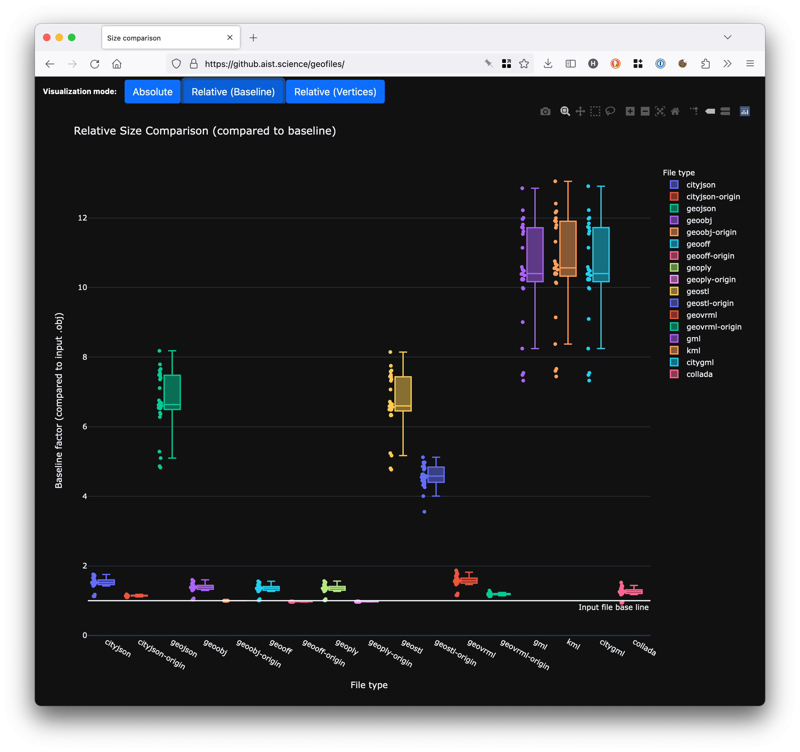

# File size

## Table of contents
{: .no_toc .text-delta }

1. TOC
{:toc}

---

## CityJSON vs CityGML-XML: 7X compression



<table >
  <tr>
    <th>dataset</th>
    <th>CityJSON v2.0</th>
    <th>CityGML-XML v3.0</th>
    <th>textures</th>
    <th>details</th>
    <th>compression</th>
  </tr>
  
    <tr>
      <td><a href="{{ i.url }}">{{ i.name }}</a></td>
      <td>{{ i.json-size }}MB (<a href="https://3d.bk.tudelft.nl/opendata/cityjson/3dcities/v2.0/{{ i.json }}">download)</a></td>
      <td>{{ i.gml-size-wo }}MB (<a href="https://3d.bk.tudelft.nl/opendata/cityjson/3dcities/citygml/{{ i.gml }}">download</a>)</td>
      <td>
        
          <a href="https://3d.bk.tudelft.nl/opendata/cityjson/3dcities/citygml/{{ i.textures }}">[ZIP]</a>
        
          none
        
      </td>
      <td>{{ i.details }}</td>
      <td><b>{{ i.gml-size-wo | divided_by: i.json-size | round: 1 }}X</b></td>
    </tr>
  
</table>

<i class="fas fa-exclamation-circle"></i> Observe that the file size doesn't take into account the size of the textures files (PNG, JPG, etc) since CityJSON refers to the same ones.

<i class="fas fa-exclamation-circle"></i> CityGML-XML files have all the carriage returns, tabs and spaces removed ([with this script](https://github.com/cityjson/misc-example-code/blob/master/misc/remove-cr.py)), for a fair estimation of the compression factor. 

<i class="fas fa-exclamation-circle"></i> CityJSON files do not contain CR or spaces or any formatting.

- - -

## CityJSON compared to traditional computer graphic formats

This very nice study ([evaluation of file formats in the context of geo-referenced 3D geometries](https://github.com/FHOOEAIST/geofiles)) compares several file formats for 3D geometries, with a focus on geographical datasets.

The outcome is that CityJSON is nearly as compact as much simpler formats (OBJ, STL, OFF), and it still allows different CRS, textures, complex attributes, complex geometries, etc.

The [summary graph](https://github.aist.science/geofiles/) is particulary nice, click to get an interactive graph!

